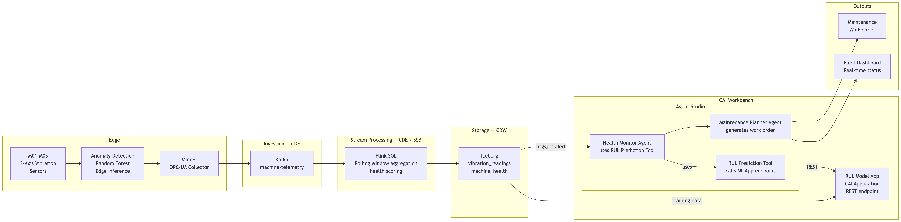

# Building the Predictive Maintenance Workflow (UC1)

## Overview

In this lab you build a **two-agent sequential pipeline** in Agent Studio that turns a
machine-health alert from a CNC machining shop into a prioritised **maintenance work
order**. The pipeline reads vibration and health history from the Iceberg lakehouse,
calls a **traditional ML model** (a Random Forest RUL regressor) through a custom tool,
and drafts the work order — all starting from data already seeded in Iceberg.

The machine learning model is **not** an LLM: it is a scikit-learn regressor trained on
the demo data, served as a CAI Application REST endpoint, and exposed to the agent as the
**RUL Prediction Tool**. This is the core pattern of the lab — *agents orchestrate, a
classical ML model predicts.*

```
┌────────────────────────────────────────────────────────────────────────────────┐
│        PREDICTIVE MAINTENANCE — CNC MACHINING (UC1)                            │
├────────────────────────────────────────────────────────────────────────────────┤
│                                                                                │
│  Input: {machine_id}, {alert_timestamp}, {health_score}                       │
│          │                                                                     │
│          ▼                                                                     │
│  ┌────────────────────┐   ← iceberg-mcp-server (NL-to-SQL)                    │
│  │     AGENT 1        │     query vibration_readings + machine_health          │
│  │  Health Monitor    │   ← RUL Prediction Tool (REST → CAI Application)       │
│  │                    │     predict rul_hours + confidence                     │
│  └─────────┬──────────┘     Output: severity + RUL + evidence                  │
│            ▼                                                                   │
│  ┌────────────────────┐   ← Artifact Files Read/Write Tool                     │
│  │     AGENT 2         │    map failure mode → maintenance action              │
│  │  Maintenance        │    draft work order JSON + fleet narrative            │
│  │  Planner            │    Output: work_order_<machine_id>.json               │
│  └────────────────────┘                                                        │
│                                                                                │
│  ML model trained offline:  vibration_readings + machine_health + rul_predictions │
│                             → RandomForestRegressor → rul_model.pkl            │
└────────────────────────────────────────────────────────────────────────────────┘
```



**How to read Figure 1**

| Region in the diagram | What it represents | Runs on |
|---|---|---|
| **Edge → Kafka → Flink** | MiniiFi collects 3-axis vibration from M01–M03; Flink rolls it into 5-minute health windows | Pre-built (out of demo scope) |
| **Iceberg (`vibration_readings`, `machine_health`)** | The lakehouse tables the agent queries; seeded from `uc1_demo_data/` | CDW |
| **RUL Model App (CAI Application)** | The trained Random Forest served behind a REST endpoint | CAI Workbench |
| **Agent Studio (Health Monitor → Maintenance Planner)** | The two-agent workflow you build in this lab | CAI Agent Studio |
| **Outputs (Fleet Dashboard, Work Order)** | The work order JSON and fleet status narrative the agents produce | Artifact Files / dashboard |

Full agent/task copy-paste blocks are in **Step 4 (agents)** and **Step 5 (tasks)** below.
YAML import: [`../extra_materials/uc1_predictive_maintenance/agents.yaml`](../extra_materials/uc1_predictive_maintenance/agents.yaml) + [`tasks.yaml`](../extra_materials/uc1_predictive_maintenance/tasks.yaml).

---

## ⚠️ Understand the Scope Before You Build

Read this before touching Agent Studio.

- **The demo starts at Iceberg.** Edge collection (MiniiFi/OPC-UA), Kafka ingestion, and
  Flink stream processing are assumed pre-built. You seed `vibration_readings` and
  `machine_health` directly from the bundled CSVs.
- **The ML model is classical, not generative.** The RUL prediction comes from a
  scikit-learn `RandomForestRegressor` trained on the demo data — served as a REST
  endpoint and called by the agent. The LLM only orchestrates and explains.
- **Two agents, sequential.** Health Monitor produces an assessment; Maintenance Planner
  consumes it and produces the work order. No loops, no parallel branches.

---

## Prerequisites

| Prerequisite | Detail |
|---|---|
| Iceberg tables | `vibration_readings`, `machine_health`, `rul_predictions` seeded in `iot_uc1_db` |
| MCP server | `iceberg-mcp-server` registered and pointed at `iot_uc1_db` |
| RUL Model App | `iot_uc1_model/` deployed as a CAI Application (REST endpoint live) |
| RUL Prediction Tool | `iot_uc1_model/tool.py` registered in Agent Studio, pointed at the app URL |
| Agent Studio workflow | **Sequential** process; 2 agents, 2 tasks |

### Workflow Input Variables

| Variable | Example | Purpose |
|---|---|---|
| `machine_id` | `M02` | Target CNC machine |
| `alert_timestamp` | `2025-06-24T14:30:00Z` | Timestamp of the `machine_health` alert |
| `health_score` | `38.5` | Health score that triggered the investigation |

---

## Step 1 — Seed the Iceberg tables

The demo data is generated deterministically (`random.seed(42)`) and seeds three tables.

```bash
cd uc1_demo_data

# (Re)generate the CSVs — optional, they are already bundled
python generate_demo_data_uc1.py
# → vibration_readings.csv (4,320), machine_health.csv (288), rul_predictions.csv (19)

# Create the Iceberg tables in iot_uc1_db
python create_impala_tables_uc1.py

# Load the CSVs into Iceberg
python load_data_to_impala_uc1.py
```

The three tables and their embedded scenarios:

| Table | Rows | Description |
|---|---|---|
| `vibration_readings` | 4,320 | 1-min, per-machine, per-axis RMS + peak (mm/s) |
| `machine_health` | 288 | 5-min health score, anomaly score, edge flag, per-axis RMS |
| `rul_predictions` | 19 | Historical RUL model outputs (hours, risk, confidence) |

**Embedded failure scenarios** (the demo anchors):

| Machine | Scenario | Signature |
|---|---|---|
| **M02** | Spindle bearing **CRITICAL** | Z-axis RMS spikes to ~3.9 mm/s from 14:00; health crashes to **38.5** at 14:30 → RUL 6.5h |
| **M03** | Edge anomaly **HIGH** | `edge_alert_flag=true` at 11:40–11:50; X-axis +1.2 mm/s → RUL 18h |
| **M01** | Tool wear **MEDIUM** | Gradual health decline 85→58 over the shift |

---

## Step 2 — Train the RUL model

The Random Forest RUL regressor is trained offline on the seeded data. The trained
`rul_model.pkl` is already bundled — re-train only if you change the data.

```bash
cd iot_uc1_model
pip install -r requirements.txt
python train_rul_model.py
# → Hold-out MAE / RMSE printed; rul_model.pkl + feature_list.json written
```

**Features** (engineered from `machine_health`): per-axis RMS, avg/max RMS, anomaly
score, health score, Z/X ratio, and a rolling 3-window health slope.
**Label**: `rul_hours` from the nearest `rul_predictions` row (±10 min, interpolated).

---

## Step 3 — Deploy the RUL Model App + register the tool

### Deploy the CAI Application

```bash
cd iot_uc1_model
# Local smoke test
python run_app.py     # serves POST /predict and GET /health on :8080

# Deploy as a CAI Application (run as a CAI Job)
python deploy_app.py  # creates/updates "UC1 RUL Prediction Service"
```

Confirm the endpoint with the M02 CRITICAL scenario:

```bash
curl -X POST <app-url>/predict \
  -H "Content-Type: application/json" \
  -d '{"machine_id":"M02","health_score":38.5,"vibration_rms_x":1.06,
       "vibration_rms_y":1.09,"vibration_rms_z":3.69,"anomaly_score":1.0}'
# → {"rul_hours": 6.5, "confidence": 0.94, "risk_level": "CRITICAL", ...}
```

### Register the RUL Prediction Tool in Agent Studio

Register [`iot_uc1_model/tool.py`](../iot_uc1_model/tool.py) as a custom tool. Its
`UserParameters` take the deployed app `endpoint_url` (and optional `api_key`); its
`ToolParameters` expose `action=predict_rul|health_check` plus the health features.

---

## Step 4 — Create the agents

Create a **Sequential** workflow with two agents. Copy-paste from
[`agents.yaml`](../extra_materials/uc1_predictive_maintenance/agents.yaml):

### Agent 1 — Health Monitor Agent
- **Tools:** `iceberg-mcp-server`, RUL Prediction Tool
- **Role:** Investigate the alert, pull the vibration trend, call the RUL model, classify severity.

### Agent 2 — Maintenance Planner Agent
- **Tools:** Artifact Files Read/Write Tool
- **Role:** Map the failure mode to a maintenance action and draft the work order JSON.

---

## Step 5 — Create the tasks

Copy-paste from [`tasks.yaml`](../extra_materials/uc1_predictive_maintenance/tasks.yaml):

| Task | Agent | Output |
|---|---|---|
| `health_assessment` | Health Monitor | Severity + RUL + evidence rows |
| `work_order_generation` | Maintenance Planner | Work order JSON + fleet narrative |

`work_order_generation` takes `health_assessment` as **context** so the planner sees the
monitor's full assessment.

---

## Step 6 — Run the demo

Set the workflow inputs and run a Test session:

```
machine_id      = M02
alert_timestamp = 2025-06-24T14:30:00Z
health_score    = 38.5
```

**What to show:**

1. **Iceberg query** — Health Monitor pulls ~60 minutes of M02 vibration/health history.
2. **RUL prediction** — the RUL Prediction Tool returns `rul_hours=6.5`, `confidence=0.94`,
   `risk_level=CRITICAL` (a classical ML call inside the agent reasoning trace).
3. **Work order** — Maintenance Planner drafts an immediate bearing-replacement work
   order with a downtime window and writes `work_order_M02.json`.

---

## Demo Scenarios

| Scenario | Inputs | Expected agent outcome |
|---|---|---|
| **M02 Spindle Bearing (CRITICAL)** | `M02`, `2025-06-24T14:30:00Z`, `38.5` | RUL ~6.5h, CRITICAL → immediate bearing replacement |
| **M03 Edge Anomaly (HIGH)** | `M03`, `2025-06-24T11:45:00Z`, `52.0` | edge flag, RUL ~18h, HIGH → stop-run + spindle inspection |
| **M01 Tool Wear (MEDIUM)** | `M01`, `2025-06-24T15:55:00Z`, `58.0` | gradual wear, RUL ~42h, MEDIUM → tool change at shift end |

---

## Verification

| Check | How | Expected |
|---|---|---|
| Model serves | `curl <app-url>/health` | `{"status":"ok","model":"rul_regressor","loaded":true}` |
| Tool works | `python iot_uc1_model/tool.py --user-params '{"endpoint_url":"http://localhost:8080"}' --tool-params '{"action":"predict_rul","machine_id":"M02","health_score":38.5,"vibration_rms_x":1.06,"vibration_rms_y":1.09,"vibration_rms_z":3.69,"anomaly_score":1.0}'` | `RUL Prediction for M02: 6.5h ... CRITICAL` |
| Iceberg seeded | `SELECT COUNT(*) FROM iot_uc1_db.machine_health` | 288 |
| Workflow runs | Agent Studio Test session, M02 inputs | Two-step trace ending in `work_order_M02.json` |

---

## Source of truth

Workshop materials are maintained in the **SP_hol** repository under
`extra_materials/iot_use_cases/` and synced to
`Handson_labs/ARTC_iot_use_cases_lab_07_July/` for delivery.
