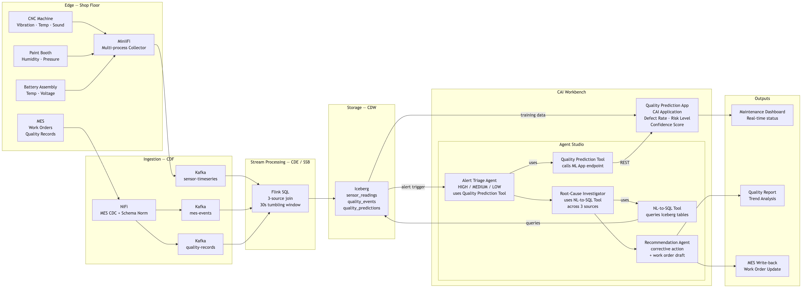

# Building the Predictive Quality Management Workflow (UC2)

## Overview

In this lab you build a **three-agent sequential pipeline** in Agent Studio that turns a
quality-prediction alert from a bike-manufacturing line into a **corrective action and a
draft MES work-order update**. The pipeline confirms the alert with a **traditional ML
model** (an XGBoost defect-rate regressor + risk classifier), correlates three originally
heterogeneous data sources now unified in Iceberg, and recommends the fix — all starting
from data already seeded in Iceberg.

As in UC1, the prediction model is **classical ML, not an LLM**: scikit-learn / XGBoost
models trained on the demo data, served as a CAI Application REST endpoint, and exposed to
the agent as the **Quality Prediction Tool**. The agents orchestrate and reason; the model
predicts.

```
┌────────────────────────────────────────────────────────────────────────────────┐
│        PREDICTIVE QUALITY MANAGEMENT — BIKE MANUFACTURING (UC2)                │
├────────────────────────────────────────────────────────────────────────────────┤
│                                                                                │
│  Input: {machine_id}, {alert_timestamp}, {defect_rate}, {risk_level}          │
│          │                                                                     │
│          ▼                                                                     │
│  ┌────────────────────┐  ← Quality Prediction Tool (REST → CAI Application)    │
│  │     AGENT 1        │    re-score sensor snapshot; confirm severity          │
│  │  Alert Triage      │    Output: HIGH / MEDIUM / INVESTIGATE + source routing│
│  └─────────┬──────────┘                                                        │
│            ▼                                                                   │
│  ┌────────────────────┐  ← NL-to-SQL Tool (Iceberg)                            │
│  │     AGENT 2         │    query sensor_readings + quality_events             │
│  │  Root-Cause         │    find leading-indicator drift                       │
│  │  Investigator       │    Output: root-cause hypothesis + evidence           │
│  └─────────┬──────────┘                                                        │
│            ▼                                                                   │
│  ┌────────────────────┐  ← Artifact Files Read/Write Tool                      │
│  │     AGENT 3         │    map cause → corrective action                      │
│  │  Recommendation     │    draft MES work-order update                        │
│  └────────────────────┘    Output: work_order_<machine_id>.json               │
│                                                                                │
│  ML model trained offline:  sensor_readings + quality_predictions             │
│                             → XGBoost regressor + classifier → quality_*.pkl   │
└────────────────────────────────────────────────────────────────────────────────┘
```



**How to read Figure 1**

| Region in the diagram | What it represents | Runs on |
|---|---|---|
| **Edge + MES → Kafka + NiFi** | Sensors via MiniiFi and MES records via NiFi CDC across three Kafka lanes | Pre-built (out of demo scope) |
| **Flink 3-source join** | Real-time join of sensor, event, and quality streams into windowed predictions | Pre-built (out of demo scope) |
| **Iceberg (`sensor_readings`, `quality_events`, `quality_predictions`)** | The unified lakehouse tables the agent queries; seeded from `uc2_demo_data/` | CDW |
| **Quality Model App (CAI Application)** | The trained XGBoost regressor + classifier served behind a REST endpoint | CAI Workbench |
| **Agent Studio (Triage → Root-Cause → Recommendation)** | The three-agent workflow you build in this lab | CAI Agent Studio |
| **Outputs (Dashboard, Quality Report, MES write-back)** | The corrective action and work-order JSON the agents produce | Artifact Files / MES |

Full agent/task copy-paste blocks are in **Step 4 (agents)** and **Step 5 (tasks)** below.
YAML import: [`../extra_materials/uc2_predictive_quality/agents.yaml`](../extra_materials/uc2_predictive_quality/agents.yaml) + [`tasks.yaml`](../extra_materials/uc2_predictive_quality/tasks.yaml).

---

## ⚠️ Understand the Scope Before You Build

- **The demo starts at Iceberg.** Edge collection, the three Kafka lanes, NiFi MES CDC,
  and the Flink 3-source join are assumed pre-built. You seed `sensor_readings`,
  `quality_events`, and `quality_predictions` directly from the bundled CSVs.
- **The ML model is classical, not generative.** Defect rate and risk level come from an
  XGBoost regressor + classifier trained on the demo data, served as a REST endpoint.
- **Three agents, sequential.** Triage → Root-Cause → Recommendation, each consuming the
  previous step's output as context.
- **`sensor_readings` is narrow.** One row per (machine, metric, timestamp). The
  investigator must pivot by metric to read a per-sensor time series.

---

## Prerequisites

| Prerequisite | Detail |
|---|---|
| Iceberg tables | `sensor_readings`, `quality_events`, `quality_predictions` seeded in `iot_uc2_db` |
| MCP server | `iceberg-mcp-server` registered and pointed at `iot_uc2_db` |
| NL-to-SQL tool | Pointed at the three `iot_uc2_db` tables |
| Quality Model App | `iot_uc2_model/` deployed as a CAI Application (REST endpoint live) |
| Quality Prediction Tool | `iot_uc2_model/tool.py` registered in Agent Studio, pointed at the app URL |
| Agent Studio workflow | **Sequential** process; 3 agents, 3 tasks |

### Workflow Input Variables

| Variable | Example | Purpose |
|---|---|---|
| `machine_id` | `CNC-01` | Target machine (CNC-01 / PAINT-01 / BAT-01) |
| `alert_timestamp` | `2025-06-24T10:15:00Z` | Timestamp of the `quality_predictions` alert |
| `defect_rate` | `0.21` | Predicted defect rate that triggered the alert |
| `risk_level` | `HIGH` | Predicted risk level |

---

## Step 1 — Seed the Iceberg tables

```bash
cd uc2_demo_data

# (Re)generate the CSVs — optional, they are already bundled
python generate_demo_data_uc2.py
# → sensor_readings.csv (1,152), quality_events.csv (78), quality_predictions.csv (426)

python create_impala_tables_uc2.py
python load_data_to_impala_uc2.py
```

| Table | Rows | Description |
|---|---|---|
| `sensor_readings` | 1,152 | 5-min, narrow format (one row per machine/metric/timestamp) |
| `quality_events` | 78 | 9-min work-order quality checks, defects, reworks, scraps |
| `quality_predictions` | 426 | 5-min per-machine defect rate, risk level, confidence |

**Embedded quality scenarios** (the demo anchors):

| Machine | Scenario | Signature |
|---|---|---|
| **CNC-01** | Frame Welding Crisis (**HIGH**) | Vibration + temperature spike 10:10–10:25; defect_rate 0.19–0.22; `WELD-001` defects |
| **PAINT-01** | Humidity drift (**MEDIUM**) | Humidity climbs 45%→61% over 13:00–15:00 |
| **BAT-01** | Battery thermal anomaly (**INVESTIGATE**) | Triangular +3.9°C temperature spike ~09:30 |

---

## Step 2 — Train the quality models

The XGBoost regressor (defect rate) and classifier (risk level) are trained offline on the
seeded data. The trained `.pkl` files are already bundled — re-train only if you change the
data.

```bash
cd iot_uc2_model
pip install -r requirements.txt
python train_quality_model.py
# → Regressor MAE/RMSE + Classifier accuracy printed
# → quality_regressor.pkl, quality_classifier.pkl, feature_list.json, risk_encoder.json
```

**Features** (pivoted wide from `sensor_readings`): `vibration_rms`, `temperature`,
`sound_db`, `humidity`, `pressure`, `voltage` (missing metrics per machine filled with 0).
**Labels**: `defect_rate` (regression) and `risk_level` (classification: LOW/MEDIUM/HIGH/INVESTIGATE).

---

## Step 3 — Deploy the Quality Model App + register the tool

### Deploy the CAI Application

```bash
cd iot_uc2_model
python run_app.py     # serves POST /predict and GET /health on :8080
python deploy_app.py  # creates/updates "UC2 Quality Prediction Service"
```

Confirm with the CNC-01 welding-crisis scenario:

```bash
curl -X POST <app-url>/predict \
  -H "Content-Type: application/json" \
  -d '{"machine_id":"CNC-01","process_type":"cnc","vibration_rms":2.1,
       "temperature":52.3,"sound_db":82.0}'
# → {"defect_rate": 0.22, "risk_level": "HIGH", "confidence": 0.81, ...}
```

### Register the Quality Prediction Tool

Register [`iot_uc2_model/tool.py`](../iot_uc2_model/tool.py) as a custom tool, pointed at
the deployed app `endpoint_url`. Its `ToolParameters` expose
`action=predict_quality|health_check` plus the per-machine sensor metrics.

---

## Step 4 — Create the agents

Create a **Sequential** workflow with three agents. Copy-paste from
[`agents.yaml`](../extra_materials/uc2_predictive_quality/agents.yaml):

### Agent 1 — Alert Triage Agent
- **Tools:** Quality Prediction Tool, `iceberg-mcp-server`
- **Role:** Confirm the alert with the model, classify severity, route the investigation.

### Agent 2 — Root-Cause Investigator
- **Tools:** NL-to-SQL Tool, `iceberg-mcp-server`
- **Role:** Pivot sensor history, find the leading-indicator drift, tie it to logged defects.

### Agent 3 — Recommendation Agent
- **Tools:** Artifact Files Read/Write Tool
- **Role:** Map the root cause to a corrective action and draft the MES work-order update.

---

## Step 5 — Create the tasks

Copy-paste from [`tasks.yaml`](../extra_materials/uc2_predictive_quality/tasks.yaml):

| Task | Agent | Output |
|---|---|---|
| `alert_triage_task` | Alert Triage | Confirmed severity + source routing |
| `root_cause_investigation` | Root-Cause Investigator | Root-cause hypothesis + evidence |
| `recommendation_action` | Recommendation Agent | Corrective action + work order JSON |

Each task takes the previous task as **context**, forming the sequential chain.

---

## Step 6 — Run the demo

Set the workflow inputs and run a Test session:

```
machine_id      = CNC-01
alert_timestamp = 2025-06-24T10:15:00Z
defect_rate     = 0.21
risk_level      = HIGH
```

**What to show:**

1. **Model confirmation** — Alert Triage calls the Quality Prediction Tool; it returns
   `defect_rate≈0.22`, `risk_level=HIGH` (a classical ML call inside the reasoning trace).
2. **Multi-source correlation** — Root-Cause Investigator pivots `sensor_readings` and
   finds vibration + temperature rising together, correlated with `WELD-001` defects in
   `quality_events` → worn welding tip.
3. **Corrective action** — Recommendation Agent drafts a production-stop + welding-tip-change
   work order and writes `work_order_CNC-01.json`.

---

## Demo Scenarios

| Scenario | Inputs | Expected agent outcome |
|---|---|---|
| **Frame Welding Crisis (HIGH)** | `CNC-01`, `2025-06-24T10:15:00Z`, `0.21`, `HIGH` | Worn welding tip → production stop + tool change |
| **Paint Booth Humidity (MEDIUM)** | `PAINT-01`, `2025-06-24T14:30:00Z`, `0.10`, `MEDIUM` | Humidity drift → HVAC adjustment before next shift |
| **Battery Anomaly (INVESTIGATE)** | `BAT-01`, `2025-06-24T09:30:00Z`, `0.11`, `INVESTIGATE` | Thermal spike → cooling-system inspection + charge-cycle correlation |

---

## Verification

| Check | How | Expected |
|---|---|---|
| Model serves | `curl <app-url>/health` | `{"status":"ok","model":"quality_predictor","loaded":true}` |
| Tool works | `python iot_uc2_model/tool.py --user-params '{"endpoint_url":"http://localhost:8080"}' --tool-params '{"action":"predict_quality","machine_id":"CNC-01","process_type":"cnc","vibration_rms":2.1,"temperature":52.3,"sound_db":82.0}'` | `Quality Prediction for CNC-01: defect_rate=... risk=HIGH` |
| Iceberg seeded | `SELECT COUNT(*) FROM iot_uc2_db.sensor_readings` | 1152 |
| Workflow runs | Agent Studio Test session, CNC-01 inputs | Three-step trace ending in `work_order_CNC-01.json` |

---

## Source of truth

Workshop materials are maintained in the **SP_hol** repository under
`extra_materials/iot_use_cases/` and synced to
`Handson_labs/ARTC_iot_use_cases_lab_07_July/` for delivery.
