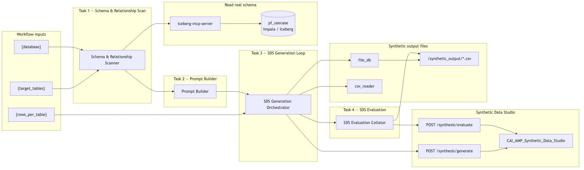

# Demo B — Agent Studio ⇄ Synthetic Data Studio

Agent Studio orchestrates live Impala schema discovery via the `iceberg-mcp-server` MCP
and delegates synthetic data generation and quality evaluation to a deployed Synthetic
Data Studio (SDS) CAI Application through the `synthetic_data_studio_tool`.
The four-agent sequential pipeline scans real schemas, builds structured generation
prompts, enforces FK referential integrity across tables, and collects LLM-as-judge
quality scores — all in a single synchronous run.

---

## Workflow Overview

```
┌───────────────────────────────────────────────────────────────────────────┐
│        DEMO B — AGENT STUDIO + SYNTHETIC DATA STUDIO (D2 PIPELINE)       │
├───────────────────────────────────────────────────────────────────────────┤
│                                                                           │
│  Inputs: {target_tables}, {rows_per_table}, {database}                   │
│           │                                                               │
│           ▼                                                               │
│  ┌─────────────────────┐                                                  │
│  │  AGENT 1            │  ← iceberg-mcp-server                           │
│  │  Schema &           │    DESCRIBE / COUNT / profile / FK inference    │
│  │  Relationship       │    Output: schema manifest + relationship map   │
│  │  Scanner            │                                                 │
│  └──────────┬──────────┘                                                  │
│             │                                                             │
│             ▼                                                             │
│  ┌─────────────────────┐                                                  │
│  │  AGENT 2            │  ← LLM only (no tools)                          │
│  │  Prompt Builder     │    schema_json + sample_values_json + prompt    │
│  └──────────┬──────────┘    Output: table_prompts[] per table            │
│             │                                                             │
│             ▼                                                             │
│  ┌─────────────────────┐                                                  │
│  │  AGENT 3            │  ← synthetic_data_studio_tool (action=generate) │
│  │  SDS Generation     │    POST /synthesis/freeform in FK order         │
│  │  Orchestrator       │    Maintains fk_pools map across tables         │
│  └──────────┬──────────┘    Output: /synthetic_output/<table>_syn.json  │
│             │                                                             │
│             ▼                                                             │
│  ┌─────────────────────┐                                                  │
│  │  AGENT 4            │  ← synthetic_data_studio_tool (action=evaluate) │
│  │  SDS Evaluation     │    POST /synthesis/evaluate_freeform            │
│  │  Collator           │    Output: 1–5 row scores + ML-readiness verdict│
│  └─────────────────────┘                                                  │
│                                                                           │
└───────────────────────────────────────────────────────────────────────────┘
```



---

## Task Definitions

### Task 1 — Schema & Relationship Scan

**Description**
For each table in `{target_tables}` in the `{database}` database, use the
`iceberg-mcp-server` to call `get_schema()`, run `DESCRIBE` and `SELECT COUNT(*)`,
profile key columns (top-20 categoricals, min/max/avg numerics), and flag PII-risk
columns. Infer FK relationships from column-name conventions
(`cfcif` for BWC, `acct_no` for RBK) without requiring live JOIN validation.
Derive a topological generation order — parents before children.

**Expected Output**
A combined schema manifest and relationship map JSON containing:
`database`, `rows_per_table`, `tables` (with column-level profiles), `generation_order`,
`relationships`, and table-type classifications (`master`, `child`, `transaction`, `lookup`).

**Success Criteria**

- All columns returned by `DESCRIBE` appear in the manifest (no columns silently dropped).
- At least two FK edges are inferred: `cfmast.cfcif → cfacct.cfcif` and `cfacct.acct_no → tltx.<join_col>`.
- `generation_order` lists `cfmast` before `cfacct` before `tltx`.
- PII-risk columns are flagged; no real row values are exported.

---

### Task 2 — Prompt Building

**Description**
For each table in `generation_order` from Task 1, construct `schema_json`,
`sample_values_json`, and `custom_prompt` payloads ready for the
`synthetic_data_studio_tool`. FK columns (any column listed as `parent_column` or
`child_column` in `relationships`) are non-negotiable inclusions.
Minimum semantic core: ≥ 4 columns for master tables, ≥ 6 for account tables,
≥ 7 for transaction tables.
Do not embed parent FK value lists in the prompts — Agent 3 injects them at generate time.

**Expected Output**
A `table_prompts[]` array where each entry contains:
`table`, `schema_json`, `sample_values_json`, `fk_pool_columns_json` (for parent tables),
`num_rows`, and `custom_prompt`.

**Success Criteria**

- Every FK column from Task 1 `relationships` is present in the corresponding `schema_json`.
- `fk_pool_columns_json` is set on parent tables (`cfmast`: `["cfcif"]`; `cfacct`: `["acct_no"]`).
- No parent FK value pools are embedded in prompts.
- `num_rows` matches `{rows_per_table}` from workflow inputs.

---

### Task 3 — SDS Generation

**Description**
Process `generation_order` from Task 1 exactly once, table by table.
Maintain two internal structures: `done_tables` (initially empty) and `fk_pools`
(a dictionary keyed as `"table.column"`).
For each table: resolve FK constraints from `fk_pools`, call
`synthetic_data_studio_tool` with `action=generate`, immediately store returned
`fk_key_pools` for parent tables, and record `eval_import_path`
(the SDS-side file path) for Task 4.
Never generate the same table twice; never call the tool before all parents are done.

**Expected Output**
A `generated_tables[]` array with per-table entries:
`table`, `rows`, `file` (local Agent Studio copy at `/synthetic_output/`),
`eval_import_path` (SDS-side filename), `fk_pools_stored`, `fk_constraints_applied`,
plus a `generation_log` summary string.

**Success Criteria**

- Exactly three generate calls, one per table, in `generation_order` sequence.
- Parent pools stored: `eda_bwc_cfmast_d_sg.cfcif`, `eda_bwc_cfacct_d_sg.acct_no`.
- Child FK constraints applied: `cfacct` receives `cfcif` pool; `tltx` receives `acct_no` pool.
- `eval_import_path` is a non-empty SDS-side filename (e.g. `freeform_data_gpt-4o-mini_<ts>_test.json`), not the local `/synthetic_output/` path.

---

### Task 4 — SDS Evaluation

**Description**
For each table generated in Task 3, call `synthetic_data_studio_tool` with
`action=evaluate`, passing `eval_import_path` (from Task 3) as `import_path`
and the matching `schema_json` / `sample_values_json` from Task 2.
Do not pass the local `output_path` (`/synthetic_output/...`) — it resides on
the Agent Studio host and SDS cannot reach it.
Aggregate row-level 1–5 scores per table, flag any table below an average of 3,
and collate into a final quality report.

**Expected Output**
An `evaluation_summary` object (`overall_verdict`, `tables_evaluated`,
`tables_passed`, `tables_flagged`, `dataset_ready_for_training`) and a
`table_scorecards[]` array with per-table `average_score`, `min_score`, `max_score`,
`flagged`, and representative `sample_justifications`.

**Success Criteria**

- Exactly three evaluate calls using SDS-side `eval_import_path` values, not local paths.
- Each scorecard contains row-level scores and at least one `sample_justification`.
- Tables with average score < 3 are explicitly flagged.
- Report states whether the dataset passes the SDS demo quality gate.

---

## Agent Definitions

### Agent 1 — Schema & Relationship Scanner

| Field | Value |
|---|---|
| **Name** | `Schema & Relationship Scanner` |
| **Role** | `Banking Lakehouse Schema Profiler and FK Inference Specialist` |

**Backstory**

A banking data analyst who reads Impala schemas via the `iceberg-mcp-server`, runs
lightweight statistical queries (`DESCRIBE`, `COUNT`, `GROUP BY` top-20, `MIN/MAX/AVG`),
and infers foreign-key relationships from column-name conventions. BWC tables share
`cfcif`/`cif_no` as the customer key; RBK tables share `acct_no`. Flags PII-risk columns
and never exports real values — only aggregated statistics and representative codes.

**Goal**

Profile every table in `{target_tables}`, infer FK relationships from naming conventions,
produce a topological generation order (parents before children), and output a combined
schema manifest and relationship map JSON.

**Output Format**

```json
{
  "database": "pf_usecase",
  "rows_per_table": 10,
  "tables": {
    "eda_bwc_cfmast_d_sg": {
      "row_count": 45000,
      "columns": [
        {"name": "cfcif",    "type": "string",    "nullable": false, "pii_risk": true,  "null_rate": 0.0},
        {"name": "cfbrnn",   "type": "string",    "nullable": true,  "pii_risk": false, "top_values": ["001","002","SGP"]},
        {"name": "cfname",   "type": "string",    "nullable": true,  "pii_risk": true,  "null_rate": 0.01},
        {"name": "cfopen_dt","type": "timestamp", "nullable": true,  "pii_risk": false, "min": "2015-01-01", "max": "2024-12-31"}
      ]
    }
  },
  "generation_order": [
    {"table": "eda_bwc_cfmast_d_sg", "type": "master",      "depends_on": [],                          "fk_pools": ["cfcif"]},
    {"table": "eda_bwc_cfacct_d_sg", "type": "child",       "depends_on": ["eda_bwc_cfmast_d_sg"],    "fk": "cfcif", "fk_pools": ["acct_no"]},
    {"table": "eda_rbk_tltx_d",      "type": "transaction", "depends_on": ["eda_bwc_cfacct_d_sg"],    "fk": "acct_no"}
  ],
  "relationships": [
    {"parent_table": "eda_bwc_cfmast_d_sg", "parent_column": "cfcif",   "child_table": "eda_bwc_cfacct_d_sg", "child_column": "cfcif",   "confidence": "inferred"},
    {"parent_table": "eda_bwc_cfacct_d_sg", "parent_column": "acct_no", "child_table": "eda_rbk_tltx_d",      "child_column": "acct_no", "confidence": "inferred"}
  ]
}
```

---

### Agent 2 — Prompt Builder

| Field | Value |
|---|---|
| **Name** | `Prompt Builder` |
| **Role** | `Synthetic Data Prompt Engineer` |

**Backstory**

A prompt engineer specialised in tabular synthetic data who translates column profiles
into explicit per-column generation rules, describes each table's business context from
its source-system prefix, and provides 3–5 synthetic example rows constructed from
observed distributions (never real rows). Ensures the prompt instructs SDS to emit
JSON row objects with exactly the declared column keys.

**Goal**

For each table in `generation_order`, produce `schema_json`, `sample_values_json`,
`fk_pool_columns_json`, `num_rows`, and `custom_prompt` payloads ready for
`synthetic_data_studio_tool`.

**Output Format**

```json
{
  "rows_per_table": 10,
  "table_prompts": [
    {
      "table": "eda_bwc_cfmast_d_sg",
      "schema_json": "[{\"name\":\"cfcif\",\"type\":\"string\",\"pii_risk\":true},{\"name\":\"cfbrnn\",\"type\":\"string\"},{\"name\":\"cfname\",\"type\":\"string\",\"pii_risk\":true},{\"name\":\"cfopen_dt\",\"type\":\"timestamp\"}]",
      "sample_values_json": "{\"cfbrnn\":{\"top_values\":[\"001\",\"002\",\"SGP\"]},\"cfopen_dt\":{\"min\":\"2015-01-01\",\"max\":\"2024-12-31\"}}",
      "fk_pool_columns_json": "[\"cfcif\"]",
      "num_rows": 10,
      "custom_prompt": "Generate synthetic PII-free customer master records for a Singapore retail bank. cfcif: surrogate format SYN-CIF-000001. Output a JSON array of row objects only."
    },
    {
      "table": "eda_bwc_cfacct_d_sg",
      "schema_json": "[{\"name\":\"acct_no\",\"type\":\"string\",\"pii_risk\":true},{\"name\":\"cfcif\",\"type\":\"string\",\"pii_risk\":true},{\"name\":\"acct_type\",\"type\":\"string\"},{\"name\":\"bal_amt\",\"type\":\"decimal\"},{\"name\":\"ccy\",\"type\":\"string\"},{\"name\":\"status\",\"type\":\"string\"}]",
      "fk_pool_columns_json": "[\"acct_no\"]",
      "num_rows": 10,
      "custom_prompt": "Generate synthetic PII-free account records. cfcif values come from the FK pool. acct_no: surrogate format SYN-ACCT-0000000001."
    },
    {
      "table": "eda_rbk_tltx_d",
      "schema_json": "[{\"name\":\"acct_no\",\"type\":\"string\",\"pii_risk\":true},{\"name\":\"txn_id\",\"type\":\"string\"},{\"name\":\"txn_amt\",\"type\":\"decimal\"},{\"name\":\"ccy\",\"type\":\"string\"},{\"name\":\"txn_dt\",\"type\":\"timestamp\"},{\"name\":\"txn_type\",\"type\":\"string\"},{\"name\":\"status\",\"type\":\"string\"}]",
      "num_rows": 10,
      "custom_prompt": "Generate synthetic PII-free transaction records. The FK account column must use only values from the FK pool. txn_id: surrogate format SYN-TXN-0000000001."
    }
  ]
}
```

---

### Agent 3 — SDS Generation Orchestrator

| Field | Value |
|---|---|
| **Name** | `SDS Generation Orchestrator` |
| **Role** | `SDS Generation Orchestrator` |

**Backstory**

Processes `generation_order` exactly once, table by table, like a checklist. Tracks a
`done_tables` list and an internal `fk_pools` map keyed as `"table.column"`. Before
calling the tool for any table checks that the table is not already in `done_tables`.
After the tool returns, immediately adds the table to `done_tables` and stores
`fk_key_pools` from the response. Passes FK pool values forward to child table prompts
via `fk_values_json` (single FK) or `fk_constraints_json` (multiple FKs). Always passes
`num_rows = {rows_per_table}` exactly and sets a human-readable `dataset_name` label for
each run visible in the Synthetic Data Studio UI.

**Goal**

Process `generation_order` once, in order, calling `synthetic_data_studio_tool` with
`action=generate` once per table. Store parent FK pools for child tables. Record
`eval_import_path` (SDS-side filename) per table for Task 4. Stop when all tables are done.

**Output Format**

```json
{
  "rows_per_table": 10,
  "fk_pools_keys": ["eda_bwc_cfmast_d_sg.cfcif", "eda_bwc_cfacct_d_sg.acct_no"],
  "generated_tables": [
    {
      "table": "eda_bwc_cfmast_d_sg",
      "rows": 10,
      "file": "/synthetic_output/eda_bwc_cfmast_d_sg_synthetic.json",
      "eval_import_path": "freeform_data_gpt-4o-mini_<ts>_test.json",
      "fk_pools_stored": ["cfcif"],
      "fk_constraints_applied": 0
    },
    {
      "table": "eda_bwc_cfacct_d_sg",
      "rows": 10,
      "file": "/synthetic_output/eda_bwc_cfacct_d_sg_synthetic.json",
      "eval_import_path": "freeform_data_gpt-4o-mini_<ts>_test.json",
      "fk_pools_stored": ["acct_no"],
      "fk_constraints_applied": 1
    },
    {
      "table": "eda_rbk_tltx_d",
      "rows": 10,
      "file": "/synthetic_output/eda_rbk_tltx_d_synthetic.json",
      "eval_import_path": "freeform_data_gpt-4o-mini_<ts>_test.json",
      "fk_pools_stored": [],
      "fk_constraints_applied": 1
    }
  ],
  "generation_log": "Generated 3 tables. FK constraints applied on 2 child tables from fk_pools map."
}
```

---

### Agent 4 — SDS Evaluation Collator

| Field | Value |
|---|---|
| **Name** | `SDS Evaluation Collator` |
| **Role** | `SDS LLM-as-Judge Quality Lead` |

**Backstory**

Calls `synthetic_data_studio_tool` with `action=evaluate` per table. SDS reads the row
file from its own filesystem, so passes each table's `eval_import_path` (the
`sds_export_path` returned by Task 3) — never the Agent Studio local `output_path`.
Passes `schema_json` and `sample_values_json` from Task 2 so the tool builds a
schema-aware rubric. Aggregates SDS row-level scores (1–5), flags tables below
average 3, and summarises whether the dataset is ready for ML training.

**Goal**

Evaluate every generated table through SDS using the SDS-side file path, collate
per-table scorecards, and produce a final quality report.

**Output Format**

```json
{
  "evaluation_summary": {
    "overall_verdict": "PASS",
    "tables_evaluated": 3,
    "tables_passed": 3,
    "tables_flagged": 0,
    "dataset_ready_for_training": true
  },
  "table_scorecards": [
    {
      "table": "eda_bwc_cfmast_d_sg",
      "rows_evaluated": 10,
      "average_score": 4.2,
      "min_score": 3,
      "max_score": 5,
      "flagged": false,
      "sample_justifications": [
        "Score 4/5. Strong synthetic row: cfcif uses SYN-CIF-000001 format, cfbrnn sampled from observed branches. SG banking realism is good."
      ]
    },
    {
      "table": "eda_bwc_cfacct_d_sg",
      "rows_evaluated": 10,
      "average_score": 4.0,
      "min_score": 3,
      "max_score": 5,
      "flagged": false,
      "sample_justifications": [
        "Score 4/5. acct_no surrogate format correct, cfcif drawn from parent pool, balance and currency plausible for SG retail banking."
      ]
    },
    {
      "table": "eda_rbk_tltx_d",
      "rows_evaluated": 10,
      "average_score": 3.8,
      "min_score": 3,
      "max_score": 5,
      "flagged": false,
      "sample_justifications": [
        "Score 4/5. txn_id surrogate format SYN-TXN-... correct, FK account column matches parent pool, amount and currency values are plausible."
      ]
    }
  ]
}
```

---

## Workflow Summary

| Stage | Task | Agent | Tool | Input | Output |
|---|---|---|---|---|---|
| 1 | Schema & Relationship Scan | Schema & Relationship Scanner | `iceberg-mcp-server` (`get_schema`, `execute_query`) | `{target_tables}`, `{database}` | Schema manifest + relationship map + `generation_order` |
| 2 | Prompt Building | Prompt Builder | None (LLM only) | Task 1 manifest | `table_prompts[]`: `schema_json`, `sample_values_json`, `fk_pool_columns_json`, `custom_prompt` per table |
| 3 | SDS Generation | SDS Generation Orchestrator | `synthetic_data_studio_tool` (`action=generate`) | Task 1 order + Task 2 prompts + `{rows_per_table}` | `/synthetic_output/<table>_synthetic.json` (local) + `eval_import_path` (SDS-side) per table |
| 4 | SDS Evaluation | SDS Evaluation Collator | `synthetic_data_studio_tool` (`action=evaluate`) | Task 2 schema + Task 3 `eval_import_path` per table | Per-table 1–5 scorecards + ML-readiness verdict |

---

## Run Inputs

| Parameter | Value | Notes |
|---|---|---|
| `target_tables` | `eda_bwc_cfmast_d_sg,eda_bwc_cfacct_d_sg,eda_rbk_tltx_d` | Comma-separated; order determines FK scan starting point |
| `rows_per_table` | `10` | Suitable for a live demo; tool safety cap is 500; reliable sync range is 25–100 |
| `database` | `pf_usecase` | Impala database hosting the source tables |

---

## Required Tools

### `synthetic_data_studio_tool`

A custom REST API tool registered in the Agent Studio Tools Catalog at
`tools/synthetic_data_studio_tool/`. Bridges Agent Studio to a deployed
Synthetic Data Studio CAI Application via two actions:

| Action | Endpoint | What it does |
|---|---|---|
| `generate` | `POST /synthesis/freeform` | Sends a structured prompt to SDS, receives a JSON array of synthetic rows, writes a local copy to `/synthetic_output/<table>_synthetic.json`, returns FK key pools and `eval_import_path` |
| `evaluate` | `POST /synthesis/evaluate_freeform` | Passes an SDS-side file path and a schema-aware rubric to the SDS LLM-as-judge; returns per-row 1–5 scores |

**Key `UserParameters`** (set once on the tool in Agent Studio):

| Parameter | Description |
|---|---|
| `sds_base_url` | Base URL of the deployed Synthetic Data Studio CAI Application |
| `api_key` | `CDSW_APIV2_KEY` used as Bearer auth to the SDS app |
| `model_id` | Model passed through to SDS (e.g. `gpt-4o-mini`) |
| `inference_type` | SDS inference backend: `openai` \| `openai_compatible` \| `CAII` \| `aws_bedrock` \| `gemini` |
| `caii_endpoint` | Required only for `inference_type: CAII` or `openai_compatible`; leave empty for direct OpenAI |
| `timeout_seconds` | HTTP timeout in seconds; default `300` (generation can be slow for larger row counts) |

**`DEMO_MODE_MAX_ROWS` cap:** The tool enforces a hard ceiling of 500 rows per
synchronous generate call (`DEMO_MODE_MAX_ROWS = 500`). Requests above this cap
are silently reduced. For this demo, `rows_per_table = 10` stays well within both
the cap and the practical synchronous HTTP timeout window.

**Filesystem note:** The tool writes a local copy of generated rows to
`/synthetic_output/<table>_synthetic.json` on the Agent Studio host. The SDS
evaluate endpoint reads a **different** file on the SDS application host — the
path returned as `eval_import_path` in the generate response. Task 4 must use
`eval_import_path`, not the local `output_path`.

### `iceberg-mcp-server`

An MCP server pre-registered in Agent Studio that provides Impala connectivity via
two tools used by Agent 1:

| Tool | Purpose |
|---|---|
| `get_schema` | Returns the column list for a given database table |
| `execute_query` | Runs arbitrary SQL (used for `DESCRIBE`, `SELECT COUNT(*)`, profiling queries) |

Agent 1 connects to the `pf_usecase` database in read-only mode — it profiles schema
metadata and column distributions but never exports real row values.

---

## Usage Notes

This demo follows the **D2 synchronous path**: SDS generates rows inside the HTTP
request and returns them in the response body. This keeps the pipeline fully
interactive and requires no job polling, but it bounds practical row volume to
roughly 25–100 rows per table for reliable runs.

**D2 is a stakeholder and integration showcase, not a production training pipeline.**
Specifically:

- **Row volume** is bounded by synchronous HTTP timeout, not by the tool cap.
  Do not use D2 to generate training datasets at scale.
- **Column scope** is controlled by the prompt Agent 2 constructs — SDS freeform
  generates only the columns listed in `schema_json`. Wide tables such as
  `eda_rbk_tltx_d` (≈896 columns) are represented by a semantic core subset.
- **FK integrity** is enforced by injecting parent pool values into the SDS prompt
  (`fk_values_json` / `fk_constraints_json`) — best-effort for demo row counts,
  not deterministic post-generation patching.
- **Evaluation verdict** (`dataset_ready_for_training: true`) reflects the SDS
  LLM-as-judge plausibility rubric on a small sample. It does **not** certify
  column parity, statistical fidelity, or FK completeness at scale.

For production ML training data (10k–100k+ rows, full column parity, reproducible
seed, programmatic FK enforcement, and KS/chi-square statistical validation) use
the [D3 deterministic workflow](../synthetic_data_lab/synthetic_data_d3_workflow.md).

!!! note
    For the full step-by-step build guide with Agent Studio UI screenshots, task
    description templates, FK verification beats, and troubleshooting reference,
    see the in-depth lab:
    [D2 workflow](../synthetic_data_lab/synthetic_data_d2_workflow.md).
    For a product overview of Synthetic Data Studio, see
    [Synthetic Data Studio](../studios/synthetic_data_studio.md).
    For tool installation and `UserParameters` reference, see
    [synthetic_data_studio_tool setup](../tools/synthetic_data_studio_tool.md).
