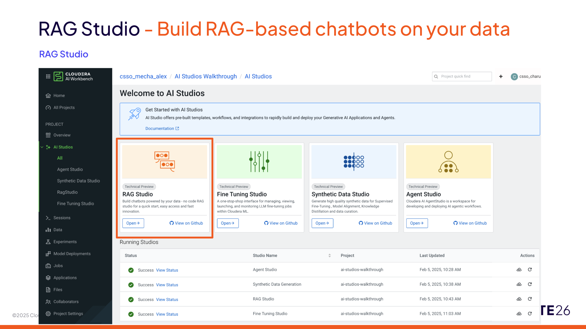
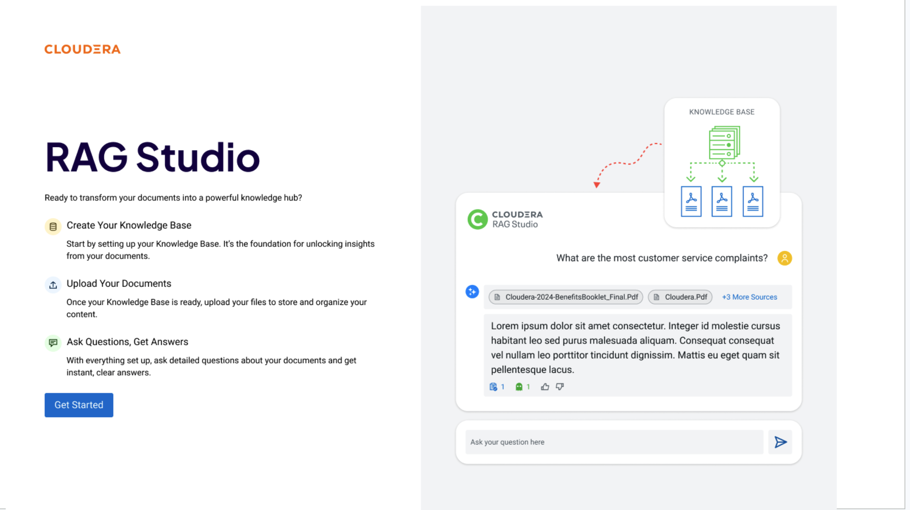

# RAG Studio

Build retrieval-augmented chatbots on your enterprise data with Cloudera RAG Studio.

---

## Overview

RAG Studio provides a UI-first workflow for building knowledge-base chatbots without
writing retrieval or embedding code. It covers the full lifecycle from document ingestion
to chat interaction to quality analytics:

- A single entry point to create knowledge bases, upload documents, and start chatting
- Seamless progression from prototype to production-grade deployment
- Support for both non-technical business users and ML engineering teams

---

## Customer Use Cases

Enterprise teams vary in technical depth. RAG Studio serves all of them:

- **Non-technical users** can build domain chatbots (HR policy, product FAQs, compliance
  guidance) without any code
- **ML teams** can rapidly prototype retrieval pipelines and compare chunking strategies,
  embedding models, and rerankers — all from the UI
- **Enterprises** deploy secure, scalable AI on their own data and infrastructure using
  Cloudera AI Inference (CAII)

---

## Three-step workflow

1. **Create your Knowledge Base** — configure chunk size, embedding model, vector store,
   and optional summarization model
2. **Upload your documents** — drag-and-drop or API-push PDF, Word, Excel, CSV, PowerPoint,
   Markdown, JSON, and image files
3. **Ask questions, get answers** — chat immediately; every answer cites the source chunks
   it was grounded on

---

## Quickstart

### 1. Open the app

On first launch RAG Studio checks that CAII endpoints (LLM, embeddings, optional reranker)
are configured. If not, it redirects to **Settings → Studio Settings** to set them up.

### 2. Create a knowledge base

Go to **Knowledge Bases → Create Knowledge Base** and fill in:

| Field | Example |
|---|---|
| Name | `UOB Compliance Docs` |
| Chunk size (tokens) | `512` |
| Embedding model | `Text Embedding Ada 002` |
| Summarization model | `gpt-4o` (optional) |

Click **Save**. Advanced options include distance metric (Cosine) and chunk overlap (10%).

### 3. Upload documents

Open the knowledge base, go to **Manage**, drag-and-drop files, then click **Start Upload**.
Files are chunked, embedded, and indexed immediately. Supported formats include PDF (`.pdf`),
Word (`.docx`), Excel (`.xlsx`), CSV (`.csv`), PowerPoint (`.pptx`), Markdown (`.md`),
JSON (`.json`), and images (`.jpg`, `.png`).

### 4. Start a chat

Go to **Chats**, type a question, and press Enter. On first send a session is created
automatically. Use **Chat Settings** to preselect knowledge base(s), response model, and
reranking model before sending.

### 5. Tune settings (optional)

From **Chat Settings** in the chat header, adjust: session name, knowledge bases, response
model, reranker, max docs retrieved, HyDE, summary-based filtering, and tool calling.

---

## Why RAG Studio?

### Flexible

Powered by IBM Docling, RAG Studio ingests images, PDFs, and most file types with
sophisticated preprocessing. Connect any AI provider — CAII, OpenAI, Azure, AWS Bedrock —
or use custom models via the Cloudera Platform.

### Fast

Non-technical team members can DIY a chatbot for any use case without writing code. ML
teams with crowded backlogs prototype and iterate quickly — swap embedding models, chunk
sizes, and rerankers from the UI alone.

### Smart

Built-in bleeding-edge retrieval techniques (HyDE, O-RAG, Metadata-Augmented RAG) improve
answer accuracy automatically as research evolves. Automated quality alerts flag low
relevance or faithfulness scores so you know when your knowledge base needs attention.

### Custom

Full control over every model in the pipeline: embedding, inference, reranking, and
summarization. Use CAII-hosted models, external providers, or custom endpoints.

---

## Advanced RAG Techniques

### 1. Metadata-Augmented RAG

Standard vector search retrieves text chunks that may lack document-level context
(a "Page 4" chunk that says "the project" without naming which project).
Metadata-Augmented RAG addresses this by:

- **Precision filtering** — chunks are tagged with metadata (Document Type, Effective Date,
  Product Version) so the system can pre-filter the search space. A 2024 policy cannot
  accidentally override a 2026 update.
- **Contextual enrichment** — LLMs enrich chunks with metadata (e.g. a hidden field
  summarising the whole document) before indexing, giving the retriever global awareness
  while operating on local text.
- **Self-improving loops** — new metadata fields (Factuality Score, User Satisfaction)
  are added over time, letting the chatbot prioritise historically successful chunks.

### 2. O-RAG (Ontological/Ontology-Grounded RAG)

Vector similarity understands that "car" is close to "vehicle" but not the hierarchical
relationship between "Engine Component" and "Maintenance Protocol". O-RAG solves this:

- **Conceptual clarity** — a domain ontology ensures that "Tier 1 Incident" retrieves
  documents matching the legal or technical definition, not any document containing "Tier".
- **Multi-hop reasoning** — O-RAG follows ontological paths (Regulation → Geography →
  Logistics) to gather a complete picture when a query spans multiple concepts.

### 3. HyDE (Hypothetical Document Embeddings)

Users ask short, vague questions; documents contain long, technical answers. These look
different to a similarity model. HyDE bridges the gap:

- **Hypothetical answer generation** — the LLM imagines what a perfect answer looks like.
  This hypothetical text contains the technical jargon present in real documents.
- **Document-to-document search** — by searching with a hypothetical document rather than
  a raw question, cosine similarity between query and target improves significantly.

---

## Next steps

- Run the RAG demo: [Demo A — Agent + RAG](../demos/agent_rag_demo.md)
- Register the tool in Agent Studio: [RAG Studio Tool](../tools/rag_studio_tool.md)
