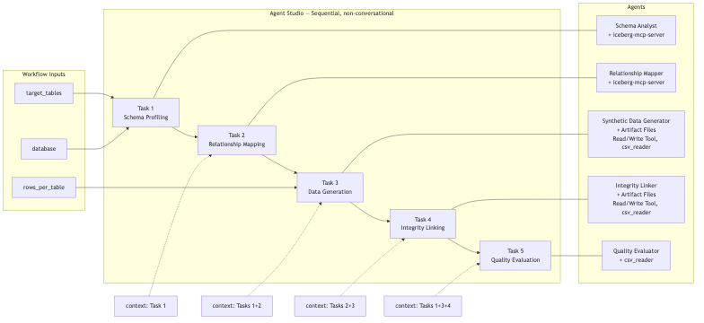

# Building the Synthetic Data Generation Workflow (Direction 1)

## Overview

In this lab you build a **five-agent sequential pipeline** that generates PII-free
synthetic training data for the `pf_usecase` lakehouse **entirely inside Agent Studio**
— no Synthetic Data Studio, no external generation service.

The pipeline scans live Impala schemas, infers FK relationships with SQL validation,
generates CSV files locally, **patches child FK columns by rewriting CSVs** (Agent 4),
and produces a statistical quality scorecard.

```
┌────────────────────────────────────────────────────────────────────────────────┐
│        SYNTHETIC DATA GENERATION — PURELY AGENT STUDIO (D1)                    │
├────────────────────────────────────────────────────────────────────────────────┤
│                                                                                │
│  Input: {target_tables}, {rows_per_table}, {database}                         │
│          │                                                                     │
│          ▼                                                                     │
│  ┌──────────────────┐                                                          │
│  │   AGENT 1        │  ← iceberg-mcp-server                                   │
│  │  Schema Analyst  │    DESCRIBE, COUNT, profile key columns, PII flags       │
│  └────────┬─────────┘    Output: schema manifest JSON                          │
│           ▼                                                                    │
│  ┌──────────────────┐                                                          │
│  │   AGENT 2        │  ← iceberg-mcp-server                                   │
│  │  Relationship    │    FK inference + JOIN validation + generation order    │
│  │  Mapper          │    Output: relationships + wide_tables manifest         │
│  └────────┬─────────┘                                                         │
│           ▼                                                                    │
│  ┌──────────────────┐                                                          │
│  │   AGENT 3        │  ← Artifact Files Read/Write Tool, csv_reader                                  │
│  │  Synthetic Data  │    Generate rows per column rules → CSV on disk          │
│  │  Generator       │    Output: /synthetic_output/<table>_synthetic.csv      │
│  └────────┬─────────┘                                                         │
│           ▼                                                                    │
│  ┌──────────────────┐                                                          │
│  │   AGENT 4        │  ← Artifact Files Read/Write Tool, csv_reader                                  │
│  │  Integrity       │    Read parent CSV → patch child FK → validate orphans  │
│  │  Linker          │    Output: corrected CSVs + fk_validation report         │
│  └────────┬─────────┘                                                         │
│           ▼                                                                    │
│  ┌──────────────────┐                                                          │
│  │   AGENT 5        │  ← Artifact Files Read/Write Tool, csv_reader             │
│  │  Quality         │    Read session CSVs → schema/distribution/PII/FK checks  │
│  │  Evaluator       │    Output: per-table scorecard                            │
│  └──────────────────┘                                                         │
│                                                                                │
└────────────────────────────────────────────────────────────────────────────────┘
```


**How to read Figure 1**

| Region in the diagram | What it represents | Runs on |
|---|---|---|
| **Workflow inputs** | `{target_tables}`, `{rows_per_table}`, `{database}` — set at run time | Agent Studio UI |
| **Tasks 1–2 → iceberg-mcp-server → pf_usecase** | Schema profiling and FK validation via SQL (`DESCRIBE`, `COUNT`, join-count queries). Reads aggregated stats only — never exports real row values | Agent Studio + Impala |
| **Task 3 → Artifact Files Read/Write Tool + csv_reader** | LLM-driven row generation written as session artifact CSVs | Agent Studio session store |
| **Task 4 → Artifact Files Read/Write Tool + csv_reader** | **Deterministic FK patch** — reads parent CSV, overwrites child FK column, validates zero orphans | Agent Studio session store |
| **Task 5 → Artifact Files Read/Write Tool + csv_reader** | Read session CSVs; statistical evaluation against schema manifest and FK report | Agent Studio session store |

Unlike D2, there is **no SDS integration surface**. All generation and FK enforcement
happens on the Agent Studio side via CSV read/write.

Source files for all figures: `../extra_materials/synthetic_data_workflow_d1/` (`.mmd`
sources). Instruction embeds use PNGs from `../images/synthetic_data_workflow_d1/`.
Re-render: `./render_mermaid.sh` in the extra_materials folder.

Full agent/task copy-paste blocks are in **Step 3 (agents)** and **Step 4 (tasks)** below.
YAML import: `../extra_materials/synthetic_data_workflow_d1/agents.yaml` + `tasks.yaml`.

---

## ⚠️ Understand the Scope Before You Build

Read this section before touching Agent Studio. D1 is an **ML training path inside
Agent Studio**, not a stakeholder SDS demo and not a production batch pipeline.

| | D1 |
|---|---|
| **IS** | Agent Studio–only path — 1k–10k rows, FK patch via CSV overwrite, statistical evaluation. No SDS dependency. |
| **IS NOT** | Full 896-column parity on wide tables in one pass. Guaranteed reproducibility. Unlimited scale. |
| **Best for** | ML engineers who need scoped training data with FK integrity and PII-safe surrogates. |
| **For SDS demos** | Use **Direction 2** — [`synthetic_data_d2_workflow.md`](synthetic_data_d2_workflow.md) |
| **For production volume** | Use **Direction 3** — [`synthetic_data_d3_workflow.md`](synthetic_data_d3_workflow.md) |

### Not suitable for production ML training

D1 is a **workshop direction only**. Do not use it to deliver production training datasets.

| Why not | Detail |
|---|---|
| **Non-reproducible generation** | Agent 3 writes cell values via LLM inference. Re-running produces different data even with the same `{rows_per_table}`. Production needs `--seed`-fixed faker/SDV code (D3). |
| **No full column parity** | Wide tables synthesise a semantic subset only; remaining columns are NULL-defaulted. ML pipelines expecting all 896 `DESCRIBE` columns will fail schema checks. |
| **Volume & timeout limits** | `{target_tables}=all` at 1000 rows exceeds practical Agent Studio session limits. Production uses CML Jobs and `batch-generate` (D3). |
| **Session-bound artefacts** | CSVs live in the Test session Artifact Files tab, not in versioned project paths (`/home/cdsw/artifacts/`) that Jobs and downstream pipelines consume. |
| **Agent-driven FK patch** | Agent 4 CSV overwrite is stronger than D2 prompts but still LLM-orchestrated — not the deterministic `pandas` enforcement in D3 scripts. |
| **Evaluation not CI-gatable** | Agent 5 produces a conversational scorecard, not a `--strict` scipy report with PASS/FAIL gates suitable for release pipelines. |

When stakeholders ask for **real training data**, point them to [D3 deterministic mode](synthetic_data_d3_workflow.md).

### Limitation 1 — Wide tables use populate + default (not full DESCRIBE parity)

`eda_rbk_tltx_d` has ~896 columns. D1 profiles a semantic subset and generates only
columns listed in `wide_tables[].columns_to_populate`; the rest are NULL-defaulted.


Agent 5 reports `schema_fidelity: PARTIAL` for wide tables — **that is expected and
acceptable** for D1. Full column parity is **Direction 3** scope.

### Limitation 2 — FK columns must exist in the CSV before Agent 4 can patch

Agent 4 reads and overwrites CSV files. If Agent 3 never wrote the child FK column,
Agent 4 cannot fix it. Agent 2 must list **every FK column from `relationships`** in
`columns_to_populate` for wide tables.

### Limitation 3 — Confirm join column names with SQL (do not assume `acct_no`)

Banking schemas use varied account-key stems (`cfanos`, `tlxtno`, etc.). Agent 2 must
validate each candidate FK with:

```sql
SELECT COUNT(DISTINCT a.<parent_col>)
FROM pf_usecase.<parent> a
JOIN pf_usecase.<child> b ON a.<parent_col> = b.<child_col>
```

### Limitation 4 — LLM non-determinism and Agent Studio timeouts

Row values differ between runs. Running `{target_tables}=all` at `{rows_per_table}=1000`
may hit timeouts. **Start scoped:**

| Variable | First-run value |
|---|---|
| `target_tables` | `eda_bwc_cfmast_d_sg,eda_bwc_cfacct_d_sg,eda_rbk_tltx_d` |
| `rows_per_table` | `100` |
| `database` | `pf_usecase` |

### What makes an acceptable D1 run

| Bar | Required |
|---|---|
| FK columns in CSV headers | Every column in `relationships` appears in generated CSV |
| FK orphan count = 0 | Agent 4 `fk_validation`: all `orphan_count_after: 0` |
| PII safety PASS | No NRIC/email/phone regex hits |
| `schema_fidelity` | PASS on master/account; PARTIAL acceptable on wide transaction table |
| Row count | Matches `{rows_per_table}` (lookup tables 50–200 exempt) |

---

## Diagram quick reference

| Figure | File | Consult when |
|---|---|---|
| **Figure 1** | `architecture.png` | Full pipeline — which agent uses Impala vs file I/O |
| **Figure 2** | `wide_table_strategy.png` | Explaining partial column fill on `eda_rbk_tltx_d` |
| **Figure 3** | `fk_integrity_flow.png` | How Agent 4 patches FKs by rewriting CSVs |
| **Figure 4** | `final_workflow.png` | Verifying Agent Studio UI wiring — 5 tasks, context links |

**Suggested demo narrative:**

1. **Figure 1** — "Five agents, one Impala read path, local CSVs — no SDS."
2. **Figure 4** — "Sequential tasks with context chaining."
3. **Figure 3** — "D1's advantage over D2: Agent 4 rewrites child CSVs, not prompt hints."
4. **Figure 2** — "Wide tables are intentionally partial — D3 for full parity."

---

## Prerequisites

### 1. Iceberg MCP — iceberg-mcp-server

Registered in Agent Studio from Part 1 of the workshop.

| Parameter | Value |
|---|---|
| **IMPALA_HOST** | `hue-impala-gateway.datalake.bdqdgc.c0.cloudera.site` |
| **IMPALA_PORT** | `443` |
| **IMPALA_USER** | Provided by instructor |
| **IMPALA_PASSWORD** | Provided by instructor |
| **IMPALA_DATABASE** | `pf_usecase` |

Verify connectivity (optional):

```bash
python scripts/test_impala_connection.py
```

### 2. File I/O tools — Artifact Files Read/Write Tool and csv_reader

| Tool | Used by | Purpose |
|---|---|---|
| **Artifact Files Read/Write Tool** | Agents 3, 4, 5 | Write and read CSV artifacts in the **current workflow session** |
| **csv_reader** | Agents 3, 4, 5 | Parse CSV contents after Artifact Files Read/Write Tool returns a readable path |

Attach **Artifact Files Read/Write Tool** to Agents 3, 4, and **5**.

> **Session artifact paths:** Each Test run gets a unique session folder, e.g.
> `agent-studio/studio-data/workflows/<workflow_name>/session/<session_id>/`.
> Agents 3–4 write CSVs there via the Artifact Files Read/Write Tool — they appear in
> the Test UI **Artifact Files** tab for download. **Do not** read `/synthetic_output/`
> with `csv_reader` alone in Task 5; that path is not where session artifacts live.
> Task 5 must use the **same Artifact Files Read/Write Tool** (and optionally
> `csv_reader` on the path the tool returns) to read files Agents 3–4 wrote.

### 3. YAML reference (optional import)

| File | Location |
|---|---|
| `agents.yaml` | `../extra_materials/synthetic_data_workflow_d1/agents.yaml` |
| `tasks.yaml` | `../extra_materials/synthetic_data_workflow_d1/tasks.yaml` |

You may import via `crewai_yaml_importer` or build manually in the UI (Steps below).

---

## Step 1: Create the Workflow

In Agent Studio: **Agentic Workflows** → **Create Workflow** → **New Workflow**

| Field | Value |
|---|---|
| **Workflow Name** | `Synthetic Data Generation D1` |
| **Process type** | **Sequential** |

---

## Step 2: Configure Workflow Settings

| Toggle | Setting |
|---|---|
| **Is Conversational** | **OFF** |
| **Manager Agent** | **OFF** |

### Workflow input variables

Add **exactly three** input variables. Do not add `parent`, `column`, `parent_table`,
`parent_column`, `child_column`, `table`, `target_tables_echo`, or any FK-related
variable — FK linking is inferred in Task 2 and handled internally by Agents 3–4.

| Variable | Default | Description |
|---|---|---|
| `target_tables` | `eda_bwc_cfmast_d_sg,eda_bwc_cfacct_d_sg,eda_rbk_tltx_d` | Comma-separated table names |
| `rows_per_table` | `100` | Rows per table (start at 100) |
| `database` | `pf_usecase` | Impala database |

> **Template rule:** Agent Studio treats any name written in curly braces as a workflow
> input. Only `{target_tables}`, `{rows_per_table}`, and `{database}` may appear in
> curly braces — in backstory, goal, task **Description**, or **Expected Output**.
> Never brace-wrap FK or task-output field names (parent_table, parent_column, column,
> table, target_tables_echo). Use angle brackets for path placeholders
> (e.g. `/synthetic_output/<table>_synthetic.csv`). Do not embed JSON objects in task
> **Description** fields; put JSON examples only in **Expected Output**.

---

## Step 3: Add All Five Agents

Create each agent below. Attach tools before moving to the next agent.

### Agent 1 — Schema Analyst

| Field | Value |
|---|---|
| **Name** | `Schema Analyst` |
| **Role** | `Database Schema Profiling Specialist` |
| **LLM Model** | `gpt-4o (Default)` |

**Backstory:**
```
You are an expert data analyst for banking data warehouses. You read Impala schemas
via iceberg-mcp-server, run lightweight statistical queries, and produce schema profiles.
Flag PII-risk columns (cif, name, email, phone, addr, mobile, nric). Never export real
row values — only aggregated statistics and representative codes.
```

**Goal:**
```
Profile every table in {target_tables}: DESCRIBE, COUNT, MIN/MAX/AVG, GROUP BY top-20.
For wide tables (>200 cols) profile key columns plus id/no/date/amt/ccy/status/type/code.
Output a JSON schema manifest.
```

**MCP:** `iceberg-mcp-server` — add `get_schema` and `execute_query`.

---

### Agent 2 — Relationship Mapper

| Field | Value |
|---|---|
| **Name** | `Relationship Mapper` |
| **Role** | `Data Modelling and FK Inference Specialist` |
| **LLM Model** | `gpt-4o (Default)` |

**Backstory:**
```
You infer FK relationships from column names and validate every candidate with a JOIN
COUNT query. Never assume acct_no for RBK transaction tables — confirm cfanos, tlxtno, or
other stems via DESCRIBE + SQL. Produce generation_order (parents before children) and
wide_tables.columns_to_populate as a list of column NAMES (not a count).
```

**Goal:**
```
Using the schema manifest from Task 1: infer FKs, validate with SQL, classify table
types, output generation_order + relationships + wide_tables manifest.
```

**MCP:** `iceberg-mcp-server`

---

### Agent 3 — Synthetic Data Generator

| Field | Value |
|---|---|
| **Name** | `Synthetic Data Generator` |
| **Role** | `PII-Free Tabular Data Generation Specialist` |
| **LLM Model** | `gpt-4o (Default)` |

**Backstory:**
```
You generate PII-free banking synthetic data and physically write each table to disk
using the Artifact Files Read/Write Tool. Writing to disk is MANDATORY — generating
data in memory and reporting it in text is NOT sufficient. For each table you must:
(a) generate the rows, (b) format them as a CSV string (header + rows), (c) call the
Artifact Files Read/Write Tool to write the file to /synthetic_output/<table>_synthetic.csv,
(d) call csv_reader to confirm the file exists and has the correct row count.
Use SYN-CIF-* for customer IDs, SYN-ACCT-* for account keys. Every CSV header must
include ALL FK columns from relationships. For wide tables populate only
columns_to_populate; NULL the rest. Never skip any table in the target_tables_echo
checklist — wide and transaction tables are the most common omissions.
```

**Goal:**
```
For EVERY table in the target_tables_echo list from Task 2:
  1. Generate rows in memory.
  2. CALL Artifact Files Read/Write Tool → write CSV to /synthetic_output/<table>_synthetic.csv.
  3. CALL csv_reader → confirm file exists, row count correct.
  4. Log file path and fk_columns_written.
missing_tables must be empty when done.
```

**Tools:** `Artifact Files Read/Write Tool`, `csv_reader`

---

### Agent 4 — Integrity Linker

| Field | Value |
|---|---|
| **Name** | `Integrity Linker` |
| **Role** | `Referential Integrity Enforcement Specialist` |
| **LLM Model** | `gpt-4o (Default)` |

**Backstory:**
```
You enforce FK integrity by reading parent CSVs, extracting key pools, overwriting child
FK columns, and validating orphan_count=0. You read and rewrite actual CSV files using
Artifact Files Read/Write Tool and csv_reader — do not rely on prompt instructions alone.
```

**Goal:**
```
For each relationship: read parent CSV → extract pool → patch child FK column → validate
→ overwrite child CSV. Output fk_validation report with orphan_count_after=0 for PASS.
```

**Tools:** `Artifact Files Read/Write Tool`, `csv_reader`


**How to read Figure 3**

| Step | Action |
|---|---|
| Task 3 | Parent and child CSVs written to `/synthetic_output/` |
| Task 4 read | Agent 4 reads parent CSV via `Artifact Files Read/Write Tool` / `csv_reader` |
| Task 4 patch | Child FK column overwritten with samples from parent key pool |
| Task 4 validate | `orphan_count_after` must be `0` for every relationship |
| Task 4 save | Corrected child CSV written back to disk |

This is **stronger than D2** (prompt-only FK hints) but still agent-driven — not compiled
code like D3's `enforce_fk()`.

---

### Agent 5 — Quality Evaluator

| Field | Value |
|---|---|
| **Name** | `Quality Evaluator` |
| **Role** | `Synthetic Data Statistical Quality Evaluator` |
| **LLM Model** | `gpt-4o (Default)` |

**Backstory:**
```
You evaluate synthetic CSVs against the schema manifest and FK validation report.
CSVs live in the current workflow session artifact store (written by Tasks 3–4 via
the Artifact Files Read/Write Tool) — NOT at a bare /synthetic_output/ filesystem path.
Always CALL the Artifact Files Read/Write Tool to read each <table>_synthetic.csv
(use paths from Task 3 generated_tables[].file, or list session artifacts and match
*_synthetic.csv). Then use csv_reader only if the tool returns a local path you can
parse. Check schema fidelity, distribution fidelity, PII safety, referential integrity,
and row counts. PARTIAL schema_fidelity is acceptable on wide tables when only
columns_to_populate were written.
```

**Goal:**
```
For each table in target_tables_echo: read its CSV via Artifact Files Read/Write Tool,
evaluate against the Task 1 manifest and Task 4 fk_validation, produce per-table
scorecards and overall PASS/FAIL. Set dataset_ready_for_training=true only if all
tables PASS (PARTIAL on wide-table schema_fidelity is OK).
```

**Tools:** `Artifact Files Read/Write Tool`, `csv_reader`

---

## Step 4: Add All Five Tasks

Click **Save & Next** to advance to **Add Tasks**. Create one task per agent in order.
Assign each task to its corresponding agent using the **Select Agent** dropdown.

> Agent Studio requires **two fields** for every task: **Description** (what to do) and
> **Expected Output** (the JSON shape the agent must return). Copy each block below into
> the matching UI field — do not merge them into a single field.

Set **Context** as shown for each task.

### Task 1 — Schema Profiling
**Agent:** Schema Analyst | **Context:** *(none)*

Copy the following into the task **Description** field:

```
For each table in {target_tables} in {database}, use iceberg-mcp-server:
1. DESCRIBE {database}.<table> — columns, types, nullability
2. SELECT COUNT(*) — row count
3. GROUP BY top-20 on categoricals; MIN/MAX/AVG on numerics
4. Flag PII-risk columns (cif, name, email, phone, addr, mobile, nric) as pii_risk=true

For wide tables (>200 columns): profile key columns plus any column containing
id, no, date, amt, ccy, status, type, code — but list ALL columns from DESCRIBE
in the manifest.

Echo {rows_per_table} in the output JSON.
```

**Expected Output** (copy into the **Expected Output** field):

```json
{
  "database": "pf_usecase",
  "rows_per_table": 100,
  "tables": {
    "eda_bwc_cfmast_d_sg": {
      "row_count": 45000,
      "columns": [
        {
          "name": "cfcif",
          "type": "string",
          "nullable": false,
          "pii_risk": true,
          "top_values": null,
          "min": null,
          "max": null,
          "avg": null,
          "null_rate": 0.0
        },
        {
          "name": "cfbrnn",
          "type": "string",
          "nullable": true,
          "pii_risk": false,
          "top_values": ["001", "002", "003"],
          "null_rate": 0.02
        }
      ]
    }
  },
  "total_tables_profiled": 3,
  "pii_flagged_columns": 12
}
```

---

### Task 2 — Relationship Mapping
**Agent:** Relationship Mapper | **Context:** Task 1

Copy the following into the task **Description** field:

```
Using the schema manifest from Task 1:
1. Infer FK candidates from exact column name matches and banking naming conventions
2. Validate EACH candidate with JOIN COUNT SQL — do not assume column names
3. Classify tables: master, child, transaction, lookup
4. Produce generation_order (parents before children) — EVERY table in {target_tables} must appear
5. For wide_tables: columns_to_populate MUST list every FK column from relationships
   plus semantic core (>=4 master, >=6 account, >=7 transaction column names)

MANDATORY COLUMN RULES (same bar as D2 — do not skip):
A. FK columns are non-negotiable. Any column in relationships (parent_column or
   child_column) MUST appear in columns_to_populate for that table.
   - eda_bwc_cfacct_d_sg: cfcif (child FK) AND account key column (cfanos or acct_no)
   - eda_rbk_tltx_d: the confirmed account join column from DESCRIBE + JOIN SQL
B. Minimum semantic core (column names, not counts only):
   - Master: PK/CIF + branch + name + open date (>= 4)
   - Account: account key + cfcif + type + balance + ccy + status (>= 6)
   - Transaction: account FK + txn id + amount + ccy + date + type + status (>= 7)
C. Confirm eda_rbk_tltx_d join column — RBK tables often use cfanos or tlxtno, not acct_no.
D. Emit target_tables_echo: comma-split list of every table in {target_tables} for Task 3 checklist.

Example wide_tables entry (no JSON in this field — see Expected Output for full JSON):
  table=eda_rbk_tltx_d, total_columns=896,
  columns_to_populate=[cfanos, cfcif, tlxtno, txn_dt, txn_amt, ccy_cd, txn_type, status_cd]
```

**Expected Output** (copy into the **Expected Output** field):

```json
{
  "generation_order": [
    {"table": "eda_bwc_cfmast_d_sg", "type": "master", "depends_on": [], "fk": null},
    {"table": "eda_bwc_cfacct_d_sg", "type": "child", "depends_on": ["eda_bwc_cfmast_d_sg"], "fk": "cfcif"},
    {"table": "eda_rbk_tltx_d", "type": "transaction", "depends_on": ["eda_bwc_cfacct_d_sg"], "fk": "cfanos"}
  ],
  "relationships": [
    {
      "parent_table": "eda_bwc_cfmast_d_sg",
      "parent_column": "cfcif",
      "child_table": "eda_bwc_cfacct_d_sg",
      "child_column": "cfcif",
      "confidence": "high",
      "validated_count": 44982
    },
    {
      "parent_table": "eda_bwc_cfacct_d_sg",
      "parent_column": "cfanos",
      "child_table": "eda_rbk_tltx_d",
      "child_column": "cfanos",
      "confidence": "high",
      "validated_count": 128450
    }
  ],
  "lookup_tables": ["eda_bwc_cfzpct_d"],
  "transaction_tables": ["eda_rbk_tltx_d"],
  "target_tables_echo": ["eda_bwc_cfmast_d_sg", "eda_bwc_cfacct_d_sg", "eda_rbk_tltx_d"],
  "wide_tables": [
    {
      "table": "eda_rbk_tltx_d",
      "total_columns": 896,
      "columns_to_populate": ["cfanos", "cfcif", "tlxtno", "txn_dt", "txn_amt", "ccy_cd", "txn_type", "status_cd"]
    }
  ]
}
```

---

### Task 3 — Data Generation
**Agent:** Synthetic Data Generator | **Context:** Tasks 1, 2

Copy the following into the task **Description** field:

```
Process every table in target_tables_echo from Task 2 in generation_order.

For EACH table T (repeat until all tables done):

STEP A — Generate rows in memory
  - {rows_per_table} rows, using column rules:
    * PII IDs → SYN-CIF-000001 format; account keys → SYN-ACCT-0000000001
    * Amounts → log-normal within profiled [min, max]
    * Categoricals → sample from top_values frequencies
    * FK columns → include in EVERY row; Task 4 will overwrite with parent pool values
    * Wide tables → populate ONLY wide_tables[].columns_to_populate; all other columns NULL
  - Minimum column sets (use columns_to_populate from Task 2 for tltx):
    * cfmast: cfcif, cfbrnn, cfname, cfopen_dt (and all other manifest columns)
    * cfacct: cfanos (or confirmed account key), cfcif, acct_type, bal_amt, ccy, status
    * tltx: account FK col, tlxtno, txn_amt, ccy_cd, txn_dt, txn_type, status_cd

STEP B — Build CSV string
  - First row: comma-separated column header
  - Remaining rows: one data row per line
  - Include ALL FK columns in the header even if values are placeholder

STEP C — CALL Artifact Files Read/Write Tool
  - Write the CSV string to: /synthetic_output/<T>_synthetic.csv
  - This step is MANDATORY. Generating rows without calling the tool means NO FILE EXISTS.

STEP D — CALL csv_reader to verify
  - Read /synthetic_output/<T>_synthetic.csv
  - Confirm: file exists, row count = {rows_per_table}, FK columns in header
  - If file is missing or row count is 0: retry STEP C before moving on

STEP E — Record in log
  - file: /synthetic_output/<T>_synthetic.csv
  - rows: {rows_per_table}
  - fk_columns_written: [list of FK columns in header]
  - columns_populated / columns_defaulted count

Advance to next table. When all tables in target_tables_echo are done, output the JSON.
```

**Expected Output** (copy into the **Expected Output** field):

```json
{
  "target_tables_requested": 3,
  "tables_generated_count": 3,
  "missing_tables": [],
  "generated_tables": [
    {
      "table": "eda_bwc_cfmast_d_sg",
      "rows": 100,
      "file": "/synthetic_output/eda_bwc_cfmast_d_sg_synthetic.csv",
      "columns_populated": 82,
      "columns_defaulted": 0,
      "fk_columns_written": ["cfcif"]
    },
    {
      "table": "eda_bwc_cfacct_d_sg",
      "rows": 100,
      "file": "/synthetic_output/eda_bwc_cfacct_d_sg_synthetic.csv",
      "columns_populated": 32,
      "columns_defaulted": 0,
      "fk_columns_written": ["cfcif", "cfanos"]
    },
    {
      "table": "eda_rbk_tltx_d",
      "rows": 100,
      "file": "/synthetic_output/eda_rbk_tltx_d_synthetic.csv",
      "columns_populated": 8,
      "columns_defaulted": 888,
      "fk_columns_written": ["cfanos"]
    }
  ],
  "generation_log": "3/3 CSVs written in FK order; eda_rbk_tltx_d wide-table partial populate."
}
```

---

### Task 4 — Integrity Linking
**Agent:** Integrity Linker | **Context:** Tasks 2, 3

Copy the following into the task **Description** field:

```
For every entry in relationships from Task 2:
1. Read parent CSV from /synthetic_output/<parent>_synthetic.csv
2. Extract unique parent_column values into a key pool
3. Read child CSV; overwrite child_column with random samples from pool
4. Validate orphan_count = 0
5. Overwrite child CSV using Artifact Files Read/Write Tool

For many-to-many bridge tables: generate membership counts using Poisson(lambda=3).
```

**Expected Output** (copy into the **Expected Output** field):

```json
{
  "fk_validation": [
    {
      "parent_table": "eda_bwc_cfmast_d_sg",
      "parent_column": "cfcif",
      "child_table": "eda_bwc_cfacct_d_sg",
      "child_column": "cfcif",
      "orphan_count_before": 100,
      "orphan_count_after": 0,
      "status": "PASS"
    },
    {
      "parent_table": "eda_bwc_cfacct_d_sg",
      "parent_column": "cfanos",
      "child_table": "eda_rbk_tltx_d",
      "child_column": "cfanos",
      "orphan_count_before": 100,
      "orphan_count_after": 0,
      "status": "PASS"
    }
  ],
  "tables_updated": ["eda_bwc_cfacct_d_sg", "eda_rbk_tltx_d"],
  "bridge_tables_created": [],
  "overall_status": "PASS"
}
```

---

### Task 5 — Quality Evaluation
**Agent:** Quality Evaluator | **Context:** Tasks 1, 3, 4

Copy the following into the task **Description** field:

```
Evaluate all generated CSVs from Tasks 3–4. Files are session artifacts — NOT on a
bare /synthetic_output/ filesystem path.

STEP 1 — Resolve file list
  - From Task 3 output: use generated_tables[].file for each table (preferred).
  - Fallback: for each table in target_tables_echo, expect <table>_synthetic.csv.
  - If unsure: CALL Artifact Files Read/Write Tool to list artifacts in the current
    session and match files ending in _synthetic.csv.

STEP 2 — Read each CSV (mandatory)
  - For EACH file: CALL Artifact Files Read/Write Tool to read the CSV content.
    Use the exact path from Task 3 generated_tables[].file when available.
  - Do NOT call csv_reader with /synthetic_output/... alone — that path is not where
    session artifacts live. csv_reader is only for parsing after the artifact tool
    returns a readable path.

STEP 3 — Evaluate each table in target_tables_echo
  1. completeness_check — CSV read succeeded (missing → FAIL)
  2. schema_fidelity — PASS / PARTIAL (wide) / FAIL
  3. distribution_fidelity — top-3 categoricals, numeric mean within 20% of profile
  4. pii_safety — no NRIC/email/phone patterns in string cells
  5. referential_integrity — use Task 4 fk_validation (any FAIL → dataset FAIL)
  6. row_count_check — matches {rows_per_table} (lookup 50-200 exempt)

OUTPUT FORMAT (required for Test UI readability):
Return a markdown report with headers and tables (not a single JSON blob).
Use this structure:

# Synthetic Data Quality Report — D1

## Executive Summary
| Field | Value |
| overall_verdict | PASS or FAIL |
| tables_requested | 3 |
| csv_files_found | 3 |
| dataset_ready_for_training | true or false |

## Files Generated
| Table | CSV file | Rows | Columns in header | FK columns present |
(one row per table; flag MISSING if CSV absent or unreadable)

## FK Chain (from Task 4)
| Parent → Child | Column | orphan_count_after | Status |

## Per-Table Scorecards
### <table_name>
| Criterion | Result | Notes |
(schema_fidelity, distribution_fidelity, pii_safety, referential_integrity, row_count_check)

## Issues & Recommendations
- Bullet list; CRITICAL if any target table CSV is missing or unreadable

After the markdown, append a fenced ```json block with evaluation_summary and table_scorecards.

If any target table CSV cannot be read via Artifact Files Read/Write Tool,
overall_verdict = FAIL and dataset_ready_for_training = false.
PARTIAL schema_fidelity on wide tables is OK when FK and PII pass.
```

**Expected Output** (copy into the **Expected Output** field):

```markdown
# Synthetic Data Quality Report — D1

## Executive Summary
| Field | Value |
|---|---|
| overall_verdict | PASS |
| tables_requested | 3 |
| csv_files_found | 3 |
| tables_passed | 3 |
| dataset_ready_for_training | true |

## Files Generated
| Table | CSV file | Rows | Columns in header | FK columns present |
|---|---|---:|---:|---|
| eda_bwc_cfmast_d_sg | eda_bwc_cfmast_d_sg_synthetic.csv | 100 | 12 | cfcif |
| eda_bwc_cfacct_d_sg | eda_bwc_cfacct_d_sg_synthetic.csv | 100 | 10 | cfcif, cfanos |
| eda_rbk_tltx_d | eda_rbk_tltx_d_synthetic.csv | 100 | 8 | cfanos |

## FK Chain (from Task 4)
| Parent → Child | Join column | orphan_count_after | Status |
|---|---|---:|---|
| cfmast → cfacct | cfcif | 0 | PASS |
| cfacct → tltx | cfanos | 0 | PASS |

## Per-Table Scorecards
### eda_bwc_cfmast_d_sg
| Criterion | Result | Notes |
|---|---|---|
| schema_fidelity | PASS | |
| distribution_fidelity | PASS | |
| pii_safety | PASS | |
| referential_integrity | PASS | parent table |
| row_count_check | PASS | 100 rows |

### eda_bwc_cfacct_d_sg
| Criterion | Result | Notes |
|---|---|---|
| schema_fidelity | PASS | |
| referential_integrity | PASS | cfcif ⊆ cfmast |

### eda_rbk_tltx_d
| Criterion | Result | Notes |
|---|---|---|
| schema_fidelity | PARTIAL | 8/896 cols populated (expected) |
| referential_integrity | PASS | cfanos ⊆ cfacct |

## Issues & Recommendations
- None — all 3 target CSVs present with FK columns in headers.

```json
{
  "evaluation_summary": {
    "overall_verdict": "PASS",
    "tables_evaluated": 3,
    "tables_passed": 3,
    "tables_failed": 0,
    "csv_files_found": 3,
    "dataset_ready_for_training": true
  },
  "table_scorecards": [
    {
      "table": "eda_bwc_cfmast_d_sg",
      "schema_fidelity": "PASS",
      "distribution_fidelity": "PASS",
      "pii_safety": "PASS",
      "referential_integrity": "PASS",
      "row_count_check": "PASS",
      "verdict": "PASS"
    },
    {
      "table": "eda_bwc_cfacct_d_sg",
      "schema_fidelity": "PASS",
      "distribution_fidelity": "PASS",
      "pii_safety": "PASS",
      "referential_integrity": "PASS",
      "row_count_check": "PASS",
      "verdict": "PASS"
    },
    {
      "table": "eda_rbk_tltx_d",
      "schema_fidelity": "PARTIAL",
      "distribution_fidelity": "PARTIAL",
      "pii_safety": "PASS",
      "referential_integrity": "PASS",
      "row_count_check": "PASS",
      "verdict": "PASS",
      "notes": "Wide table: 8 columns populated; FK cfanos present."
    }
  ]
}
```
```

Once all five tasks are added:



**How to read Figure 4**

| Element | Verify |
|---|---|
| Sequential, non-conversational | Fixed task order |
| Task 2 context → Task 1 | Schema manifest available for FK inference |
| Task 3 context → Tasks 1+2 | Generation uses manifest + relationships |
| Task 4 context → Tasks 2+3 | FK patch uses relationships + generated CSVs |
| Task 5 context → Tasks 1+3+4 | Evaluation uses manifest, CSVs, FK report |
| Agents 1–2 + iceberg-mcp-server | Only schema tasks touch Impala |
| Agents 3–5 + Artifact Files Read/Write Tool | CSV write (3–4), read (5), FK patch (4) on session artifact store |

---

## Step 5: Configure Tool Parameters

### iceberg-mcp-server (Agents 1 and 2)

Same Impala credentials as D2 prerequisites.

### Artifact Files Read/Write Tool / csv_reader (Agents 3, 4, 5)

No extra UserParameters unless your deployment requires a base path override.

**Task 5 read rule:** Attach **Artifact Files Read/Write Tool** to Agent 5. Session
CSVs are under `studio-data/workflows/<workflow>/session/<session_id>/` — visible in
the Test UI **Artifact Files** tab. Task 5 must read through the artifact tool using
paths from Task 3 `generated_tables[].file`, not `csv_reader` on `/synthetic_output/` alone.

---

## Step 6: Run the Workflow

```
target_tables  = eda_bwc_cfmast_d_sg,eda_bwc_cfacct_d_sg,eda_rbk_tltx_d
rows_per_table = 100
database       = pf_usecase
```

A scoped first run typically takes **5–15 minutes** (five LLM tasks + Impala queries +
CSV generation). Sequence: Task 1 → 2 → 3 → 4 → 5.

---

## Step 7: Verify the FK Chain

After Task 4 completes, verify programmatic FK integrity — D1's key differentiator vs D2.

### Beat 0 — Artifact file count

In the Test UI **Artifact Files** tab, confirm **3 CSVs** (one per target table):

```
eda_bwc_cfmast_d_sg_synthetic.csv
eda_bwc_cfacct_d_sg_synthetic.csv
eda_rbk_tltx_d_synthetic.csv
```

If only 2 CSVs appear, Task 3 skipped the transaction table — re-run with the updated Task 3 description.

### Beat 1 — Task 2 `relationships` array

Confirm edges like:

```
eda_bwc_cfmast_d_sg.cfcif  →  eda_bwc_cfacct_d_sg.cfcif
eda_bwc_cfacct_d_sg.cfanos →  eda_rbk_tltx_d.cfanos   (confirm actual column names)
```

### Beat 2 — Task 4 `fk_validation`

Every entry must show:

```json
{"orphan_count_after": 0, "status": "PASS"}
```

If `orphan_count_after > 0`, re-run Task 4 or fix Task 2 join column names.

### Beat 3 — Spot-check CSVs

Open child CSV and confirm every FK value appears in the parent CSV for that column.

### Beat 4 — Task 5 scorecard

| Table | Expected |
|---|---|
| `eda_bwc_cfmast_d_sg` | schema_fidelity PASS |
| `eda_bwc_cfacct_d_sg` | schema_fidelity PASS, referential_integrity PASS |
| `eda_rbk_tltx_d` | schema_fidelity **PARTIAL** (expected), referential_integrity PASS |

---

## Troubleshooting

| Symptom | Likely cause | Fix |
|---|---|---|
| Task 5 reports all CSVs missing but Artifact Files tab shows them | Agent 5 used csv_reader on `/synthetic_output/` instead of Artifact Files Read/Write Tool | Attach artifact tool to Agent 5; re-paste Agent 5 Backstory/Goal and Task 5 Description |
| Workflow shows extra inputs (parent_table, table, column, target_tables_echo) | Agent/task text contains brace-wrapped field names or inline JSON like `{"table":...}` in a **Description** field | Delete extra inputs; re-paste Description/Expected Output from Step 4 (only 3 inputs allowed) |
| `Template variable '…' not found` | Same as above — Agent Studio parsed a name in curly braces that is not a workflow input | Search agent backstory/goal and task fields for stray `{…}`; remove or rephrase without braces |
| Agent 4 cannot patch FK | FK column missing from child CSV header | Add column to Task 2 `columns_to_populate`; re-run Task 3 |
| Only 2 CSVs / missing eda_rbk_tltx_d | Agent 3 stopped after master+account | Re-run Task 3 with updated description: must write all tables in `target_tables_echo` |
| CSVs too simple (FK cols only) | Task 2 semantic core too thin | Expand `columns_to_populate` with >=6 account / >=7 transaction columns |
| orphan_count_after > 0 | Wrong parent/child column in relationships | Re-run Task 2 with JOIN validation SQL |
| Wide table FAIL schema | Too few columns in CSV | Expand `columns_to_populate` in Task 2 |
| PII regex hits in Task 5 | Real-looking NRIC/email in generated text | Regenerate with SYN-* surrogate rules in Task 3 |
| Timeout on `target_tables=all` | Too many tables for one session | Stay scoped or move to D3 |

---

## When to use D2 or D3 instead

| Need | Direction |
|---|---|
| Stakeholder SDS demo, ≤25 rows, LLM judge | **D2** — [`synthetic_data_d2_workflow.md`](synthetic_data_d2_workflow.md) |
| Full schema parity, 10k+ rows, reproducible CML Jobs | **D3** — [`synthetic_data_d3_workflow.md`](synthetic_data_d3_workflow.md) |

---

## Related files

| File | Purpose |
|---|---|
| `../extra_materials/synthetic_data_workflow_d1/agents.yaml` | Agent definitions (YAML import) |
| `../extra_materials/synthetic_data_workflow_d1/tasks.yaml` | Task definitions (YAML import) |
| `../extra_materials/synthetic_data_workflow_d1/agents.yaml` | Agent Studio import |
| `../extra_materials/synthetic_data_workflow_d1/tasks.yaml` | Task definitions |
| `../images/synthetic_data_workflow_d1/*.png` | Rendered diagrams |
