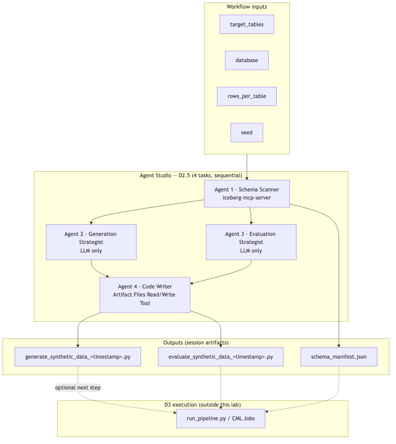
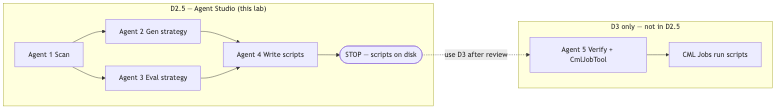
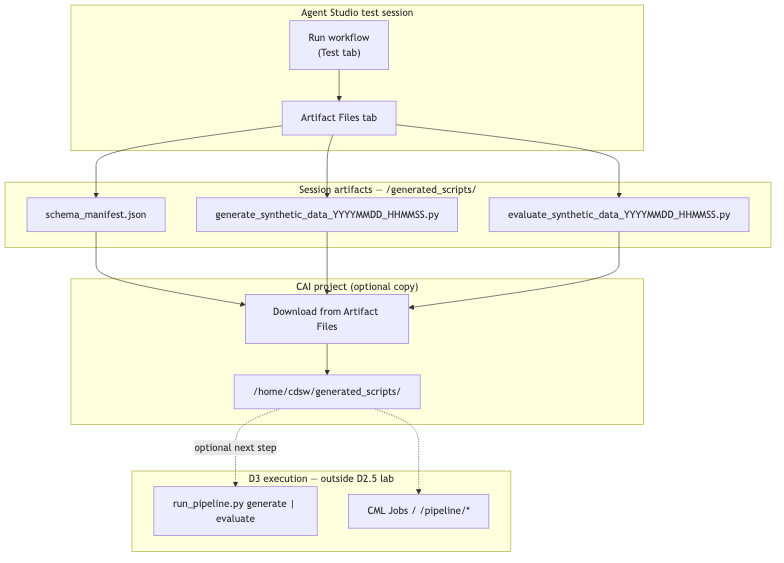
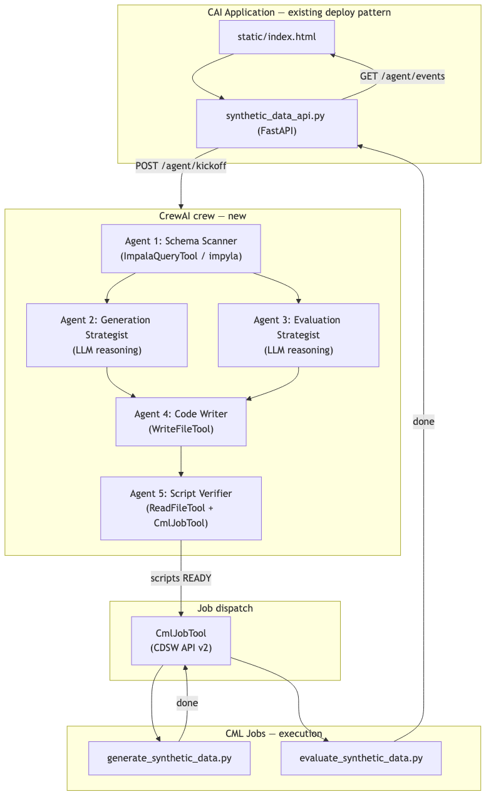

# Synthetic Data Generation — Direction 2.5 Hands-On Lab

**Agent Studio script authoring** — same logical pipeline as [Direction 3](synthetic_data_d3_workflow.md) agentic mode, but runs entirely in the **Agent Studio UI** and **stops after writing Python scripts**. You do not run the scripts or dispatch CML Jobs from the workflow itself.

This lab uses **Agent Studio only**. It does **not** use the [CAI Workbench MCP Server](https://github.com/cloudera/CAI_Workbench_MCP_Server). Schema profiling uses **`iceberg-mcp-server`** attached to Agent 1 (same as D1/D2).

| Direction | Where it runs | Generates | Executes scripts? |
|---|---|---|---|
| **D2** | Agent Studio + SDS | JSON rows via SDS API | SDS evaluates rows |
| **D2.5** (this lab) | Agent Studio only | `generate_*.py` + `evaluate_*.py` | **No** — stop at script files |
| **D3 agentic** | CAI App `/agent/*` | Same scripts via CrewAI | Yes — CML Jobs (optional) |
| **D3 deterministic** | `run_pipeline.py` / `/pipeline/*` | CSVs from existing scripts | Yes |

## Diagrams





Diagram PNGs: `../images/synthetic_data_workflow_d2_5/`.

**How to read Figure 1**

| Region | What it represents |
|---|---|
| **Workflow inputs** | `target_tables`, `database`, `rows_per_table`, `seed` |
| **Agents 1–4** | Same logical steps as D3 agentic mode (scan → two strategists → code writer) |
| **Session artifacts** | `schema_manifest.json` + timestamped `.py` files via Artifact Files |
| **D3 execution (dashed)** | Optional — not part of this lab; use D3 after downloading scripts |

Companion docs:
- `../extra_materials/synthetic_data_workflow_d2_5/agents.yaml` — Agent Studio import
- `../extra_materials/synthetic_data_workflow_d2_5/tasks.yaml` — Task definitions
- [`synthetic_data_d3_workflow.md`](synthetic_data_d3_workflow.md) — run scripts after this lab

---

## Scope

| | D2.5 |
|---|---|
| **IS** | Agent Studio workshop — profile schema via `iceberg-mcp-server`, plan strategies, **author timestamped Python scripts** |
| **IS NOT** | CAI Workbench MCP, CML Job dispatch, SDS integration, or the CrewAI app (`/agent/*`) |
| **Best for** | Learning the D3 agentic pipeline interactively in Agent Studio before production automation |
| **Next step** | Download artifacts and run scripts manually or via [D3 deterministic mode](synthetic_data_d3_workflow.md) |

### Not suitable for production ML training

D2.5 **does not produce training data**. It is an Agent Studio workshop that stops after
script authoring — by design.

| Why not | Detail |
|---|---|
| **No data output** | The workflow ends at timestamped `.py` files and `schema_manifest.json`. No CSVs, no eval report, no rows for model training. |
| **No execution path** | Scripts are not run, CML Jobs are not dispatched, and there is no `--seed` reproducibility run inside this lab. |
| **LLM-authored code requires review** | Generated scripts may differ from the D3 reference implementation and need human validation before any production use. |
| **Session-bound artefacts** | Outputs must be downloaded from Artifact Files and uploaded to a CAI project — not written directly to production paths. |
| **Teaching step, not delivery** | D2.5 exists to learn the D3 agentic design interactively. Production delivery always requires [D3](synthetic_data_d3_workflow.md). |

> D2.5 → download scripts → **D3 deterministic** is the intended path to production.
> Skipping D3 means you have code on disk but no training dataset.

### Pipeline steps (matches D3 agentic Agents 1–4)

| Step | Agent | Tool | Output |
|---|---|---|---|
| 1. Scan | Schema Scanner | `iceberg-mcp-server` + Artifact Files | `schema_manifest.json` |
| 2. Plan generation | Generation Strategist | LLM only | Strategy JSON |
| 3. Plan evaluation | Evaluation Strategist | LLM only | Evaluation plan JSON |
| 4. Write scripts | Code Writer | **Artifact Files Read/Write Tool** | `generate_synthetic_data_<timestamp>.py`, `evaluate_synthetic_data_<timestamp>.py` |

> D3 adds **Agent 5 (Script Verifier + CmlJobTool)** to verify and run scripts. D2.5 intentionally omits that step (see Figure 2).

### Diagram quick reference

| Figure | File | Consult when |
|---|---|---|
| **Figure 1** | `architecture.png` | Overall Agent Studio pipeline |
| **Figure 2** | `stop_boundary.png` | Explaining why this lab does not run scripts or CML Jobs |
| **Figure 3** | `final_workflow.png` | Wiring agents, tasks, and context links in Agent Studio |
| **Figure 4** | `script_artifacts.png` | Collecting outputs from the Artifact Files tab |
| **Figure 5** | D3 `agentic_architecture.png` | Comparing D2.5 scope to full D3 agentic mode |

---

# Agent Studio script authoring

## Prerequisites

### 1. Iceberg MCP — `iceberg-mcp-server`

Registered in Agent Studio (same as D1/D2).

| Parameter | Example |
|---|---|
| **IMPALA_HOST** | `hue-impala-gateway.datalake.….cloudera.site` |
| **IMPALA_PORT** | `443` |
| **IMPALA_USER** | Your workload user |
| **IMPALA_PASSWORD** | Your password |
| **IMPALA_DATABASE** | `pf_usecase` |

Optional connectivity check:

```bash
python synthetic_data_workflow_d3/test_impala_connection.py
```

### 2. Artifact Files Read/Write Tool

| Agent | Tool | Purpose |
|---|---|---|
| Schema Scanner | Artifact Files Read/Write Tool | Persist `schema_manifest.json` |
| Code Writer | Artifact Files Read/Write Tool | **Required** — write both `.py` scripts |

Agents 1 and 4 **must** call the tool to write files. Text-only output is not sufficient.

### 3. YAML import (optional)

```bash
# From project root, if crewai_yaml_importer is available:
crewai_yaml_importer \
  --agents extra_materials/synthetic_data_workflow_d2_5/agents.yaml \
  --tasks  extra_materials/synthetic_data_workflow_d2_5/tasks.yaml
```

Or build manually in the UI using the steps below.

---

## B1 — Create the workflow

In Agent Studio: **Agentic Workflows** → **Create Workflow** → **New Workflow**

| Field | Value |
|---|---|
| **Workflow Name** | `Synthetic Data Generation D2.5` |
| **Process type** | **Sequential** |

---

## B2 — Workflow settings

| Toggle | Setting |
|---|---|
| **Is Conversational** | **OFF** |
| **Manager Agent** | **OFF** |

### Input variables

Add **exactly four** variables:

| Variable | Default | Description |
|---|---|---|
| `target_tables` | `eda_bwc_cfmast_d_sg,eda_bwc_cfacct_d_sg,eda_rbk_tltx_d` | Comma-separated table names or `all` |
| `database` | `pf_usecase` | Impala database |
| `rows_per_table` | `1000` | Default `--rows` for the generate script |
| `seed` | `42` | Default `--seed` for reproducibility |

> **Template rule:** Only `{target_tables}`, `{database}`, `{rows_per_table}`, and `{seed}` may appear in curly braces in agent/task text. Use angle brackets for placeholders in expected output examples.

---

## B3 — Add four agents

Create each agent below. Attach tools before moving to the next agent.

> Every agent must have **Name**, **Role**, **Backstory**, and **Goal** filled in the Agent Studio UI. Copy the blocks below verbatim.

### Agent 1 — Schema and Relationship Scanner

| Field | Value |
|---|---|
| **Name** | `Schema and Relationship Scanner` |
| **Role** | `Schema and Relationship Scanner` |
| **LLM Model** | `gpt-4o` (or instructor default) |

**Backstory** (copy into the **Backstory** field):

```
You are an expert data analyst who reads Impala schemas via iceberg-mcp-server.
You run DESCRIBE, COUNT(*), GROUP BY top-N on categorical columns, and MIN/MAX/AVG
only on numeric or timestamp columns (never AVG on strings). You flag PII-risk
columns by name patterns and infer FK relationships from column-name overlaps.
You never export real row values — only aggregated statistics and representative
codes. You work with any database schema, not just banking schemas.
```

**Goal** (copy into the **Goal** field):

```
Profile every target table in {target_tables} in the {database} data lakehouse,
infer foreign-key relationships and a safe generation order, and produce a
schema_manifest.json artefact that the code-writing agent uses to author
deterministic Python scripts.
```

**Tools / MCP:** `iceberg-mcp-server` — add **`get_schema`** and **`execute_query`**. **Artifact Files Read/Write Tool**

---

### Agent 2 — Python Generation Strategist

| Field | Value |
|---|---|
| **Name** | `Python Generation Strategist` |
| **Role** | `Python Generation Strategist` |
| **LLM Model** | `gpt-4o` |

**Backstory** (copy into the **Backstory** field):

```
You are a synthetic data engineer. For lookup tables you use faker with manual
code-description pairs. For customer/account masters you use SDV SingleTablePreset.
For time-series transaction tables you use SDV PARSynthesizer. You specify when
faker.providers.bank, .person, or .address are needed, and when Luhn-valid card
numbers or SWIFT BIC codes are required. Output a generation strategy JSON that
is database-agnostic.
```

**Goal** (copy into the **Goal** field):

```
Map each table to the most suitable Python generation approach (faker, SDV
SingleTablePreset, SDV PARSynthesizer) and identify special column rules for the
script author.
```

**Tools / MCP:** None — LLM reasoning only.

---

### Agent 3 — Statistical Evaluation Strategist

| Field | Value |
|---|---|
| **Name** | `Statistical Evaluation Strategist` |
| **Role** | `Statistical Evaluation Strategist` |
| **LLM Model** | `gpt-4o` |

**Backstory** (copy into the **Backstory** field):

```
You are a statistician who validates synthetic data fidelity. You select KS tests
for numeric distributions, chi-squared for categoricals, Pearson correlation
diffs for relationships, pandas.merge for FK completeness, regex scans for PII
leakage, and temporal coherence checks. Output an evaluation plan JSON valid for
any schema.
```

**Goal** (copy into the **Goal** field):

```
Design the statistical test plan for the evaluate_synthetic_data.py script:
which tests (KS, chi-squared, null-rate, FK integrity, PII regex, temporal)
apply to which table types.
```

**Tools / MCP:** None — LLM reasoning only.

---

### Agent 4 — Python Script Writer

| Field | Value |
|---|---|
| **Name** | `Python Script Writer` |
| **Role** | `Python Script Writer` |
| **LLM Model** | `gpt-4o` (prefer larger context if available) |

**Backstory** (copy into the **Backstory** field):

```
You are a senior Python engineer who writes clean, reproducible data pipelines.
You embed GENERATION_ORDER and STRATEGY_MAP from prior tasks, implement per-table
generator functions, enforce FK relationships with pandas, and produce an
evaluation script with statistical tests and a Markdown report. Both scripts have
argparse CLIs and read all schema logic from schema_manifest.json at runtime.
You MUST call the Artifact Files Read/Write Tool to persist both files — listing
paths in text output alone is not sufficient. Do not run or execute the scripts.
```

**Goal** (copy into the **Goal** field):

```
Write two complete, executable, fixed-seed Python scripts with timestamped
filenames (generate_synthetic_data_YYYYMMDD_HHMMSS.py and
evaluate_synthetic_data_YYYYMMDD_HHMMSS.py) to /generated_scripts/ using the
Artifact Files Read/Write Tool. Do not run the scripts.
```

**Tools / MCP:** **Artifact Files Read/Write Tool** (required)

---

## B4 — Add four tasks (sequential)

Click **Save & Next** to advance to **Add Tasks**. Create one task per agent in order.
Assign each task to its corresponding agent using the **Select Agent** dropdown.

> Agent Studio requires **two fields** for every task: **Description** (what to do) and
> **Expected Output** (what the agent must return). Copy each block below into the
> matching UI field — do not merge them into a single field.

Set **Context** as shown for each task.

### Task 1 — Schema Relationship Scan

**Agent:** Schema and Relationship Scanner | **Context:** *(none)*

**Description** (copy into the **Description** field):

```
Profile the tables in {target_tables} in database {database}. For each table:

1. DESCRIBE the table — record EVERY column name, type, nullable.
2. SELECT COUNT(*) for row count.
3. For key columns (ids, dates, amounts, currencies, codes): GROUP BY top-20 for
   string/varchar columns; MIN/MAX/AVG only for numeric/timestamp types from
   DESCRIBE (skip AVG on strings).
4. Flag PII-risk columns by name patterns (cif, name, email, phone, addr, mobile, nric).
5. Infer FK relationships from column-name matches; validate with JOIN COUNT queries.
6. For wide tables (>200 cols), add wide_tables with columns_to_populate as a JSON
   array of column names to actively synthesise.

Write schema_manifest.json to /generated_scripts/schema_manifest.json using the
Artifact Files Read/Write Tool.

Input variables: {target_tables}, {database} (default pf_usecase),
{rows_per_table} (default 1000), {seed} (default 42).
```

**Expected Output** (copy into the **Expected Output** field):

```
Confirmation that schema_manifest.json was written via Artifact Files Read/Write
Tool, plus a summary of tables profiled, FK relationships, and generation_order.
columns_to_populate must be a list of column names, not an integer.
```

---

### Task 2 — Generation Strategy

**Agent:** Python Generation Strategist | **Context:** Task 1

**Description** (copy into the **Description** field):

```
Using the schema manifest from the scan task, plan the Python generation approach
per table category:
- Lookup/reference: faker + manual code-description pairs
- Master/account: faker + SDV SingleTablePreset
- Transaction: SDV PARSynthesizer (time-series aware)
- Other: faker with appropriate providers

Identify special column rules: Luhn card numbers, SWIFT BIC, surrogate IDs,
locale-specific names/addresses. Output a generation strategy JSON.
```

**Expected Output** (copy into the **Expected Output** field):

```
{
  "strategy_map": [
    {"table": "<name>", "category": "lookup|master|account|transaction",
     "library": "faker|sdv_preset|sdv_par", "providers": ["bank","person","address"],
     "special_columns": [{"column": "<c>", "rule": "<rule>"}]}
  ]
}
```

---

### Task 3 — Evaluation Strategy

**Agent:** Statistical Evaluation Strategist | **Context:** Task 1

**Description** (copy into the **Description** field):

```
Using the schema manifest, design the evaluation test plan for each table type:
- Numeric columns: KS test (scipy)
- Categorical columns: chi-squared (scipy)
- Multi-column: Pearson correlation matrix diff
- Null rates: absolute difference per column
- FK integrity: pandas merge orphan count
- PII leakage: regex scan (NRIC, phone, email)
- Temporal: no future dates, created < updated where applicable

Output an evaluation plan JSON for the evaluate script author.
```

**Expected Output** (copy into the **Expected Output** field):

```
{
  "evaluation_plan": [
    {"table": "<name>", "tests": ["ks","chi2","null_rate","fk_integrity","pii_regex","temporal"]}
  ]
}
```

---

### Task 4 — Code Writing

**Agent:** Python Script Writer | **Context:** Tasks 1, 2, 3

**Description** (copy into the **Description** field):

```
Write two complete Python scripts using the Artifact Files Read/Write Tool.
Use timestamped filenames in this format (replace TS with current UTC timestamp
YYYYMMDD_HHMMSS):

/generated_scripts/generate_synthetic_data_TS.py
/generated_scripts/evaluate_synthetic_data_TS.py

generate script requirements:
- Reads schema_manifest.json at runtime (--manifest flag)
- Embeds GENERATION_ORDER and STRATEGY_MAP from the generation strategy task
- Per-table generator functions using faker/SDV per strategy
- FK enforcement: sample child FK values from parent key pools
- Wide-table parity: all manifest columns present; only columns_to_populate
  are actively synthesised; others get NULL/type-default
- argparse CLI: --manifest, --rows, --output, --tables, --seed
- Default rows from {rows_per_table}, default seed from {seed}

evaluate script requirements:
- Implements tests from the evaluation plan
- Reports Cols(gen/manifest) per table
- Produces Markdown scorecard; optional HTML via ydata-profiling
- PASS/FAIL FK integrity, PII scan, ML readiness summary
- argparse CLI: --manifest, --synthetic, --report, --strict

Both scripts must have if __name__ == "__main__" entrypoints and pin dependencies
in a header comment. Scripts must be database-agnostic.

You MUST call Artifact Files Read/Write Tool twice (once per script). Do not claim
files were written without tool confirmation. Do NOT execute the scripts.
```

**Expected Output** (copy into the **Expected Output** field):

```
Artifact Files Read/Write Tool confirmations for both timestamped script paths,
plus a JSON listing: script paths, tables covered, and libraries used.
```

Reference implementation shape: `synthetic_data_workflow_d3/generate_synthetic_data.py` and `evaluate_synthetic_data.py`.

Once all four tasks are added:

**How to read Figure 3**

| Element | Verify |
|---|---|
| Sequential, non-conversational | Fixed task order; no manager agent |
| Task 2 context → Task 1 | Generation strategy uses schema manifest |
| Task 3 context → Task 1 | Evaluation plan uses schema manifest |
| Task 4 context → Tasks 1+2+3 | Code writer embeds scan + both strategy outputs |
| Agent 1 + iceberg-mcp-server | Only scan task queries Impala live |
| Agents 1 & 4 + Artifact Files | Manifest and both `.py` scripts persisted to session store |

---

## B5 — Run the workflow

1. Open **Test** tab.
2. Set inputs (start scoped):

| Variable | First-run value |
|---|---|
| `target_tables` | `eda_bwc_cfmast_d_sg,eda_bwc_cfacct_d_sg,eda_rbk_tltx_d` |
| `database` | `pf_usecase` |
| `rows_per_table` | `100` |
| `seed` | `42` |

3. Click **Run**. Expect four task completions (scan → two strategy tasks → code writing).

---

## B6 — Collect outputs

Open the **Artifact Files** tab in the test session.



| File | Location |
|---|---|
| Schema manifest | `/generated_scripts/schema_manifest.json` |
| Generate script | `/generated_scripts/generate_synthetic_data_<timestamp>.py` |
| Evaluate script | `/generated_scripts/evaluate_synthetic_data_<timestamp>.py` |

Download all three. To run them later in a CAI project session, copy to:

```bash
mkdir -p /home/cdsw/generated_scripts
# Upload downloaded artifacts to /home/cdsw/generated_scripts/
ls -la /home/cdsw/generated_scripts/
```

## B7 — Acceptance criteria

| Check | Pass condition |
|---|---|
| Manifest written | `schema_manifest.json` exists in Artifact Files |
| Scripts written | Both timestamped `.py` files exist (tool confirmation in Task 4 log) |
| Scripts not executed in workflow | No CSV output from the Agent Studio run alone |
| Generate script | Has `argparse`, `--manifest`, `--rows`, `--seed`, `if __name__` block |
| Evaluate script | Has `--manifest`, `--synthetic`, `--report`, `--strict` |
| FK coverage | `generation_order` in manifest covers all `{target_tables}` |

Review scripts manually. When ready, run them with D3 deterministic mode or invoke them directly in a CAI project session (see below).

---

## Optional — Run scripts after D2.5

This lab stops at script authoring. To execute generated scripts, use an existing CAI project with `synthetic_data_workflow_d3/` uploaded, or follow [D3 setup](synthetic_data_d3_workflow.md).

**Deterministic D3 path** (bundled `run_pipeline.py`):

```bash
export MANIFEST_PATH=/home/cdsw/generated_scripts/schema_manifest.json
export OUTPUT_DIR=/home/cdsw/artifacts/synthetic_output
export REPORT_PATH=/home/cdsw/artifacts/eval_report.md

python synthetic_data_workflow_d3/run_pipeline.py generate \
  --manifest "$MANIFEST_PATH" \
  --target-tables eda_bwc_cfmast_d_sg,eda_bwc_cfacct_d_sg,eda_rbk_tltx_d \
  --rows 1000 --seed 42 --output "$OUTPUT_DIR"

python synthetic_data_workflow_d3/run_pipeline.py evaluate \
  --manifest "$MANIFEST_PATH" \
  --output "$OUTPUT_DIR" \
  --report "$REPORT_PATH" \
  --strict --use-scipy
```

Or invoke your **agent-authored** scripts directly:

```bash
python /home/cdsw/generated_scripts/generate_synthetic_data_<timestamp>.py \
  --manifest /home/cdsw/generated_scripts/schema_manifest.json \
  --rows 1000 --seed 42 \
  --output /home/cdsw/artifacts/synthetic_output
```

> Agent-authored scripts may differ from the bundled D3 reference scripts. Install deps from the script header comments (`pip install faker pandas scipy …`).

---

## Choosing D2.5 vs D3 agentic



| Question | D2.5 | D3 `/agent/*` |
|---|---|---|
| Where does it run? | Agent Studio UI only | CAI Application (`synthetic_data_crew.py`) |
| Need automatic CML Job dispatch? | No | Yes (Agent 5 / auto-dispatch) |
| Want to edit scripts before any execution? | Yes | Scripts run unless credentials missing |
| Production automation | Use D3 after script review | Use D3 agentic end-to-end |

---

## Troubleshooting

| Symptom | Fix |
|---|---|
| Task 1 AVG errors on string columns | Non-fatal — re-run; ensure task text says MIN/MAX/AVG only on numeric/timestamp types |
| Task 4 lists script paths but no files in Artifact Files | Agent did not call Artifact Files Read/Write Tool — re-run Task 4 or entire workflow; strengthen Agent 4 backstory |
| `Template variable '…' not found` | Remove stray `{…}` braces from agent/task text; only the four workflow inputs are allowed |
| Workflow timeout on `all` tables | Reduce scope: 3-table FK chain first; increase timeout or use smaller `rows_per_table` |
| Scripts fail when run manually | Review imports and manifest paths; compare with D3 reference scripts; install missing packages |
| Want fully automated verify + run | Use [D3 agentic mode](synthetic_data_d3_workflow.md) (`/agent/kickoff`) instead |

---

## Related labs

| Lab | Doc |
|---|---|
| D3 CML Job reference | [`CML_JOBS.md`](CML_JOBS.md) |
| D1 — Agent Studio CSV generation | [`synthetic_data_d1_workflow.md`](synthetic_data_d1_workflow.md) |
| D2 — Agent Studio + SDS | [`synthetic_data_d2_workflow.md`](synthetic_data_d2_workflow.md) |
| D3 — Production pipeline + CAI App | [`synthetic_data_d3_workflow.md`](synthetic_data_d3_workflow.md) |
