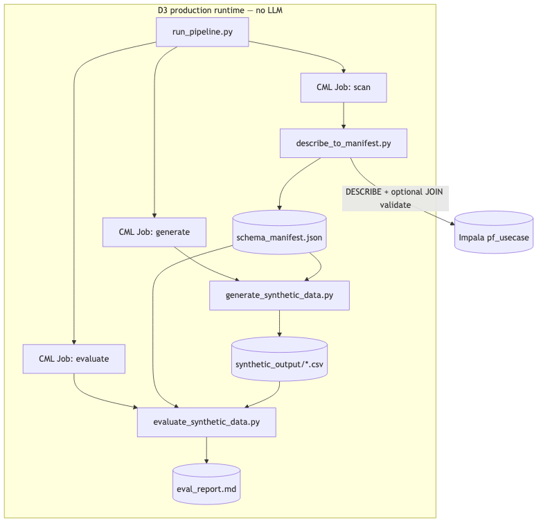
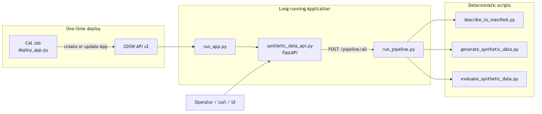
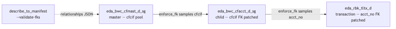

# Synthetic Data Generation — Direction 3 Hands-On Lab

Production path for **ML training data**: two complementary execution modes in the same CAI Application.

> **D3 is the only production direction.** D1, D2, and D2.5 are Agent Studio workshops
> for learning and demos — they lack reproducible scale, full schema parity, deterministic
> FK enforcement, and CI-gatable evaluation. See
> [SYNTHETIC_DATA_WORKFLOWS_SUMMARY.md § Why only D3 is suitable for production](SYNTHETIC_DATA_WORKFLOWS_SUMMARY.md#why-only-d3-is-suitable-for-production).

| Mode | Trigger | LLM? | Best for |
|---|---|---|---|
| **Deterministic** | `run_pipeline.py` / `/pipeline/*` | No | Scripts exist; known schema; reproducible |
| **Agentic** (new) | `synthetic_data_crew.py` / `/agent/*` | Yes (CrewAI) | Unknown schema; new database; automated script authoring |

The agentic mode is **database-agnostic** — the crew reads any schema, authors generation and evaluation scripts tailored to it, and dispatches CML Jobs to run them. You do not need to know the column names in advance.

## Diagrams









Diagram PNGs: `../images/synthetic_data_workflow_d3/`

Companion docs:
- [`D3_AGENTIC_REDESIGN_PLAN.md`](D3_AGENTIC_REDESIGN_PLAN.md) — agentic redesign plan
- [`CML_JOBS.md`](CML_JOBS.md) — Job definitions
- `../synthetic_data_app/README.md` — CAI App deploy

---

## Files to upload into the CAI project

If you are deploying from scratch (not cloning the git repo), upload the following files.
The Application expects both folders at the **CAI project root** (siblings of each other).

```
synthetic_data_app/
│   ├── run_app.py                ← CAI Application entry point (set as Application script)
│   ├── deploy_app.py             ← CAI Job script — registers the Application via API v2
│   ├── synthetic_data_api.py     ← FastAPI server (/pipeline/* + /agent/*)
│   ├── synthetic_data_crew.py    ← CrewAI 5-agent crew (agentic mode only)
│   ├── requirements.txt          ← fastapi, crewai, impyla, etc.
│   └── static/
│       └── index.html            ← Web UI
synthetic_data_workflow_d3/
    ├── run_pipeline.py           ← CLI orchestrator
    ├── describe_to_manifest.py   ← Step 1 · Scan
    ├── generate_synthetic_data.py← Step 2 · Generate
    ├── evaluate_synthetic_data.py← Step 3 · Evaluate
    ├── test_impala_connection.py ← Connection test helper
    ├── requirements.txt          ← faker, pandas, impyla, scipy, etc.
    └── schema_manifest.sample.json ← Offline demo manifest (no Impala needed)
```

> If the project is already a clone of the SP_hol git repository all files are present.
> Only environment variables and the deploy Job need to be configured.

---

## CAI Application — step-by-step launch

### Step 1 — Create or open a CAI Workbench project

Use **Python 3.11 runtime** (PBJ standard: `ml-runtime-pbj-jupyterlab-python3.11-standard:2026.04.1-b7`).
The project must have network access to Impala CDW.

### Step 2 — Upload files

Ensure both folders are present as described above.

### Step 3 — Set Project Environment Variables

In **Project → Settings → Environment Variables** add at minimum:

#### Deterministic mode (always required)

| Variable | Example value | Used by |
|---|---|---|
| `IMPALA_HOST` | `hue-impala-gateway.datalake.…:443` | scan |
| `IMPALA_USER` | `qishuai` | scan |
| `IMPALA_PASS` | `P@ssw0rd.` | scan |
| `IMPALA_DB` | `pf_usecase` | scan |
| `TARGET_TABLES` | `eda_bwc_cfmast_d_sg,eda_bwc_cfacct_d_sg,eda_rbk_tltx_d` | all |
| `ROWS` | `1000` | generate |
| `SEED` | `42` | generate |
| `MANIFEST_PATH` | `/home/cdsw/artifacts/schema_manifest.json` | all |
| `OUTPUT_DIR` | `/home/cdsw/artifacts/synthetic_output` | generate, evaluate |
| `REPORT_PATH` | `/home/cdsw/artifacts/eval_report.md` | evaluate |
| `PIPELINE_DIR` | `/home/cdsw/synthetic_data_workflow_d3` | app startup |

#### Agentic mode (only needed for `/agent/*`)

| Variable | Example value | Used by |
|---|---|---|
| `LLM_API_BASE_URL` | `https://api.openai.com/v1` | crew LLM (OpenAI-compatible chat API) |
| `LLM_API_KEY` | `sk-...` | crew LLM |
| `LLM_MODEL` | `gpt-4o` | crew LLM |
| `CAI_WORKBENCH_HOST` | `https://ml-xxxx.cloudera.site` | CmlJobTool |
| `CAI_WORKBENCH_API_KEY` | `<workbench API v2 key>` | CmlJobTool (defaults to `CDSW_APIV2_KEY`) |
| `CDSW_PROJECT_ID` | Auto-set on CAI Workbench (optional override) | CmlJobTool |
| `OUTPUT_SCRIPTS_DIR` | `/home/cdsw/generated_scripts` | Agent 4 writes scripts here |

> Deprecated aliases still read by the crew: `CAI_BASE_URL`, `CAI_URL`, `CAI_API_KEY`, `CAI_MODEL`, `CAI_WORKBENCH_PROJECT_ID`.

### Step 4 — Create the deploy Job

In **Project → Jobs → New Job**:

| Setting | Value |
|---|---|
| **Name** | `Deploy Synthetic Data App` |
| **Script** | `synthetic_data_app/deploy_app.py` |
| **Runtime** | Python 3.11 PBJ standard |
| **Resources** | 1 CPU / 4 GB RAM |
| **Kernel** | `python3` |

### Step 5 — Run the deploy Job

Click **Run**. The Job calls CDSW API v2 to register (or update) the Application and exits in under a minute.
Check the Job log for:

```
App Script : /home/cdsw/synthetic_data_app/run_app.py
Application created: <id>
Application URL : https://<workbench>/synthetic-data-<project_id>
```

If the Application fails with `Startup script 'run_app.py' does not exist`, the registration still points at the old script path — re-run this deploy Job after syncing the latest `deploy_app.py`.

### Step 6 — Open the Application

Go to **Project → Applications**. Click the **Synthetic Data Pipeline** URL.
The web UI loads with two sections: **Deterministic Pipeline** and **Agentic Pipeline**.

### Step 7 — Run the pipeline

Via the UI, or with curl:

```bash
export APP_URL="https://<workbench>/synthetic-data-<project_id>"

# Run deterministic end-to-end (scan + generate + evaluate)
curl -X POST "$APP_URL/pipeline/all" \
  -H "Content-Type: application/json" \
  -d '{
    "target_tables": "eda_bwc_cfmast_d_sg,eda_bwc_cfacct_d_sg,eda_rbk_tltx_d",
    "rows": 1000,
    "seed": 42
  }'

# Poll events while running
curl "$APP_URL/api/workflow/events?since=0"

# Download the evaluation report
curl "$APP_URL/artifacts/report" -o eval_report.md
```

---

## Overview

| Step | Script | Output |
|---|---|---|
| 1. Scan | `describe_to_manifest.py` | `schema_manifest.json` |
| 2. Generate | `generate_synthetic_data.py` | `synthetic_output/*.csv` |
| 3. Evaluate | `evaluate_synthetic_data.py` | `eval_report.md` |

Orchestrator (deterministic): `run_pipeline.py scan | generate | evaluate | all | batch-generate`

**Agentic flow** (all five steps handled by the crew):

| Agent | Role | Tool |
|---|---|---|
| 1. Schema Scanner | DESCRIBE + FK validation | `ImpalaQueryTool` |
| 2. Generation Strategist | Pick faker / SDV strategy | LLM reasoning |
| 3. Evaluation Strategist | Design KS/chi²/PII tests | LLM reasoning |
| 4. Code Writer | Write scripts to disk | `WriteFileTool` |
| 5. Script Verifier | Verify + dispatch CML Jobs | `ReadFileTool` + `CmlJobTool` |

---

## Prerequisites

1. **CAI Workbench project** with Python 3.11 runtime.
2. **Impala credentials**: `IMPALA_HOST`, `IMPALA_USER`, `IMPALA_PASS`, `IMPALA_DB` (for live scan and agentic mode).
3. **For agentic mode**: `LLM_API_BASE_URL`, `LLM_API_KEY`, `LLM_MODEL`, `CAI_WORKBENCH_HOST`, `CDSW_PROJECT_ID`.
4. **Local-only demo (deterministic):** bundled `schema_manifest.sample.json` (no Impala or LLM required).

```bash
# Deterministic mode deps
cd synthetic_data_workflow_d3
pip install -r requirements.txt

# Agentic mode adds crewai
cd synthetic_data_app
pip install -r requirements.txt
```

---

## Lab 1 — Local demo (3-table FK chain)

### Step 1: Generate

```bash
python run_pipeline.py generate \
  --manifest schema_manifest.sample.json \
  --target-tables eda_bwc_cfmast_d_sg,eda_bwc_cfacct_d_sg,eda_rbk_tltx_d \
  --rows 1000 --seed 42 \
  --output /home/cdsw/artifacts/synthetic_output
```

### Step 2: Evaluate

```bash
python run_pipeline.py evaluate \
  --manifest schema_manifest.sample.json \
  --output /home/cdsw/artifacts/synthetic_output \
  --report /home/cdsw/artifacts/eval_report.md \
  --target-tables eda_bwc_cfmast_d_sg,eda_bwc_cfacct_d_sg,eda_rbk_tltx_d \
  --strict --use-scipy
```

### Acceptance criteria

- 3/3 tables **PASS**
- FK orphan count = 0 on `cfcif` and `acct_no` edges
- `eda_rbk_tltx_d` schema **PARTIAL** (10 populated / 10 defaulted — expected for wide-table demo)
- Re-run with same `--seed 42` → identical CSVs

---

## Lab 2 — Live Impala scan + pipeline

Set environment variables in your CAI project, then:

```bash
export TARGET_TABLES=eda_bwc_cfmast_d_sg,eda_bwc_cfacct_d_sg,eda_rbk_tltx_d
export ROWS=1000
export SEED=42
export MANIFEST_PATH=/home/cdsw/artifacts/schema_manifest.json
export OUTPUT_DIR=/home/cdsw/artifacts/synthetic_output
export REPORT_PATH=/home/cdsw/artifacts/eval_report.md

python run_pipeline.py all --validate-fks --profile-stats --strict
```

Review inferred FK relationships in the manifest before trusting generate output.

---

## Lab 3 — Deploy CAI Application (deterministic + agentic)

1. Copy `synthetic_data_app/` and `synthetic_data_workflow_d3/` into your project root.
2. Set env vars — see `synthetic_data_app/README.md` for the full list (includes LLM + Workbench vars for agentic mode).
3. Create a **Job** running `deploy_app.py`.
4. Open the Application URL — the UI shows both **Deterministic Pipeline** and **Agentic Pipeline** sections.

Deterministic endpoint:

```bash
curl -X POST "$APP_URL/pipeline/all" \
  -H "Content-Type: application/json" \
  -d '{"target_tables": "eda_bwc_cfmast_d_sg,eda_bwc_cfacct_d_sg,eda_rbk_tltx_d", "rows": 1000}'
```

Agentic endpoint (database-agnostic — works with any schema):

```bash
# Start crew async
curl -X POST "$APP_URL/agent/kickoff" \
  -H "Content-Type: application/json" \
  -d '{"target_database": "my_custom_db", "target_tables": "all", "rows_per_table": 1000}'

# Poll events
curl "$APP_URL/agent/events?since=0"
```

---

## Lab 3b — Agentic crew without the Application

Run the crew directly as a CLI or CML Job:

```bash
cd synthetic_data_app
export LLM_API_BASE_URL=https://api.openai.com/v1
export LLM_API_KEY=sk-...
export LLM_MODEL=gpt-4o
export IMPALA_HOST=...

python synthetic_data_crew.py \
  --database pf_usecase \
  --tables eda_bwc_cfmast_d_sg,eda_bwc_cfacct_d_sg,eda_rbk_tltx_d \
  --rows 1000 --seed 42 \
  --scripts-dir /home/cdsw/generated_scripts \
  --output-dir /home/cdsw/synthetic_output
```

The crew will: scan schema → plan generation → plan evaluation → write scripts → verify → dispatch CML Jobs (if Workbench env vars are set) or print instructions for manual Job creation.

---

## Lab 4 — Full pf_usecase scale-out (73 tables)

```bash
export TARGET_TABLES=all
python run_pipeline.py scan --validate-fks --profile-stats

# Run as parallel CML Jobs (one per prefix):
python run_pipeline.py batch-generate

python run_pipeline.py evaluate --strict --use-scipy
```

See `CML_JOBS.md` for per-prefix Job definitions (`eda_bwc_`, `eda_rbk_`, …).

---

## Choosing between deterministic and agentic mode

| Question | Answer | Mode |
|---|---|---|
| Are scripts already written and working for this schema? | Yes | Deterministic |
| Is this a new database you have not profiled before? | Yes | Agentic |
| Do you need fully reproducible bit-identical output? | Yes | Deterministic |
| Do you need the LLM to handle column naming it has never seen? | Yes | Agentic |
| Do you have LLM / Workbench API credentials? | No | Deterministic only |

The agentic crew writes timestamped scripts into `output_scripts_dir` (e.g. `generate_synthetic_data_20250621_193045.py` and matching `evaluate_synthetic_data_*.py`). After the crew runs once, you can **switch to deterministic mode** and run those scripts directly with `run_pipeline.py` for faster, reproducible subsequent runs.

## Optional — Agent Studio authoring workshop (D2.5)

Use **[Direction 2.5](synthetic_data_d2_5_workflow.md)** for the same scan → strategy → script pipeline **inside Agent Studio**, stopping after script generation (no CML Jobs).

The 5-agent YAML in `synthetic_data_workflow_d3/agents.yaml` + `tasks.yaml` is a reference spec; the trimmed **D2.5** import lives in `extra_materials/synthetic_data_workflow_d2_5/`. Production automation uses **agentic mode in `synthetic_data_crew.py`** (CAI Application `/agent/*`) or deterministic `run_pipeline.py`.

---

## Troubleshooting

| Symptom | Fix |
|---|---|
| Evaluate FAIL on missing 4th table | Pass `--target-tables` matching what you generated |
| FK orphans | Re-scan with `--validate-fks`; fix `relationships` join column |
| Wide table schema FAIL | Expected: `PARTIAL` when using `columns_to_populate` |
| Job exit code 1 | Check `--strict` evaluate output; missing CSV or FK failure |
| Agentic: `crewai not installed` | `pip install -r synthetic_data_app/requirements.txt` |
| Agentic: `ImpalaQueryTool ERROR` | Set `IMPALA_HOST`, `IMPALA_USER`, `IMPALA_PASS` env vars |
| Agentic: `CmlJobTool: missing credentials` | Re-run deploy Job so `CAI_WORKBENCH_HOST`, `CAI_WORKBENCH_API_KEY`, and `CDSW_PROJECT_ID` are injected. Check `/agent/events` for `CML credentials:` line. |
| Agentic: crew completes but `NOT_DISPATCHED` | Scripts may exist at `/home/cdsw/generated_scripts/` — crew now auto-dispatches after Agent 5. Re-sync `synthetic_data_crew.py` and re-run; or run scripts manually via deterministic `/pipeline/*`. |
| Agentic: schema scan AVG errors on string columns | Non-fatal — scanner now skips AVG on non-numeric columns. Re-sync `synthetic_data_crew.py`. |
| Agentic: crew stalls on code_writing task | LLM may need a larger context model; check `LLM_MODEL` |
| Application: `Startup script 'run_app.py' does not exist` | Re-run the deploy Job (`synthetic_data_app/deploy_app.py`). The app must use `/home/cdsw/synthetic_data_app/run_app.py`, not bare `run_app.py`. |
| pip dependency conflict warnings (`packaging`, `protobuf`, `requests`) | Re-sync `synthetic_data_app/constraints-cai.txt` and restart. Harmless if the app prints `Dependencies ready.` and starts. |
| `ModuleNotFoundError: No module named 'synthetic_data_api'` | CAI runs apps in a Jupyter kernel where `__file__` is unset. Re-sync `run_app.py` (uses `APP_DIR=/home/cdsw/synthetic_data_app`) and re-run deploy Job. |
