# Part 1: Adding Tools and MCP Servers in Agent Studio

## Overview

Before building agentic workflows, you need to set up the building blocks:

1. **Deploy ChromaDB** — a vector database that persists agent memory across sessions
2. **Register LightMem MCP Server** — an MCP server that gives agents semantic memory (store, retrieve)
3. **Add PaddleOCR Tool** — a custom tool that agents can call to extract text from images

```
┌──────────────────────────────────────────────────────────────────────────┐
│                         AGENT STUDIO SETUP                               │
├──────────────────────────────────────────────────────────────────────────┤
│                                                                          │
│   CAI Job ──────► ChromaDB Application (standalone, persistent)         │
│                          │                                               │
│                          ▼                                               │
│   MCP Servers ──────► LightMem MCP (add_memory / retrieve_memory)       │
│                                                                          │
│   Tools Catalog ──► PaddleOCR Tool (image → extracted text)             │
│                                                                          │
└──────────────────────────────────────────────────────────────────────────┘
```

---

## Prerequisites

- Access to Cloudera AI (CAI) project with Agent Studio
- Access to create CAI Jobs and Applications

---

## Section A: Deploy ChromaDB Vector Database

The LightMem MCP server needs a ChromaDB vector database for persistent memory storage. Each participant deploys their own ChromaDB instance using a unique `app_suffix`.

### Step A.1: Create a New CAI Job

In your CAI project, go to **Jobs** > **New Job**.

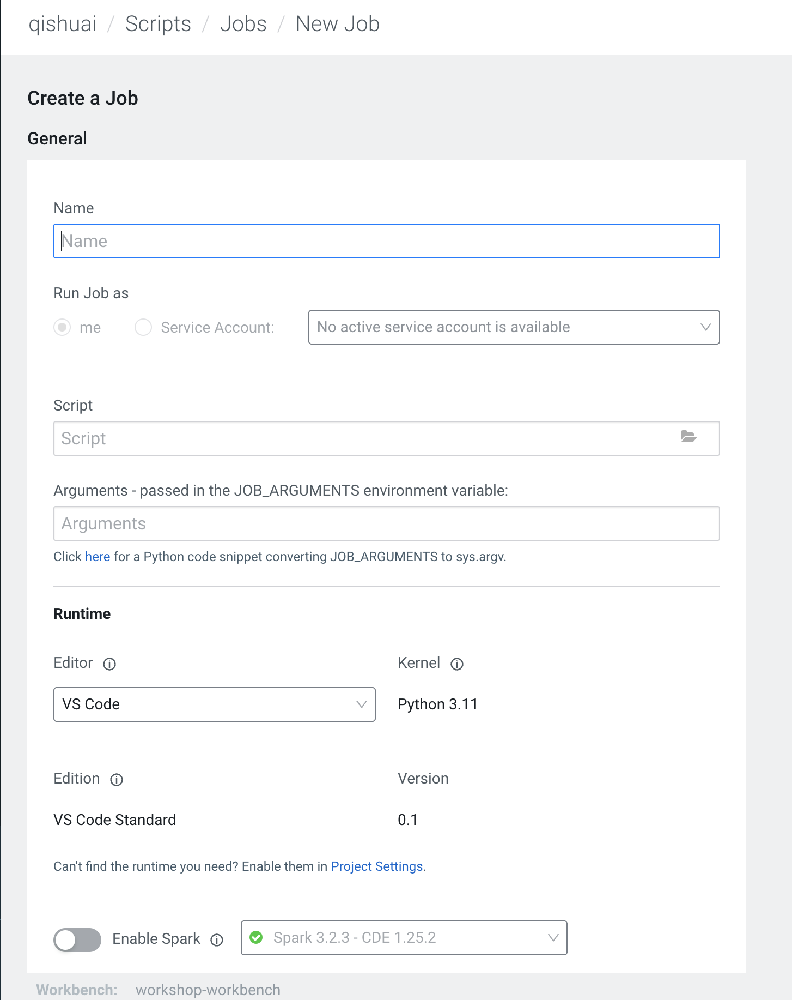

You will see the **Create a Job** form with fields for Name, Script, and Runtime.

### Step A.2: Fill in the Job Configuration

Set the following values:

| Field | Value |
|-------|-------|
| **Name** | `Deploy Chroma` |
| **Script** | `chroma_cai_app/deploy_chroma.py` |
| **Editor** | VS Code |
| **Kernel** | Python 3.11 |

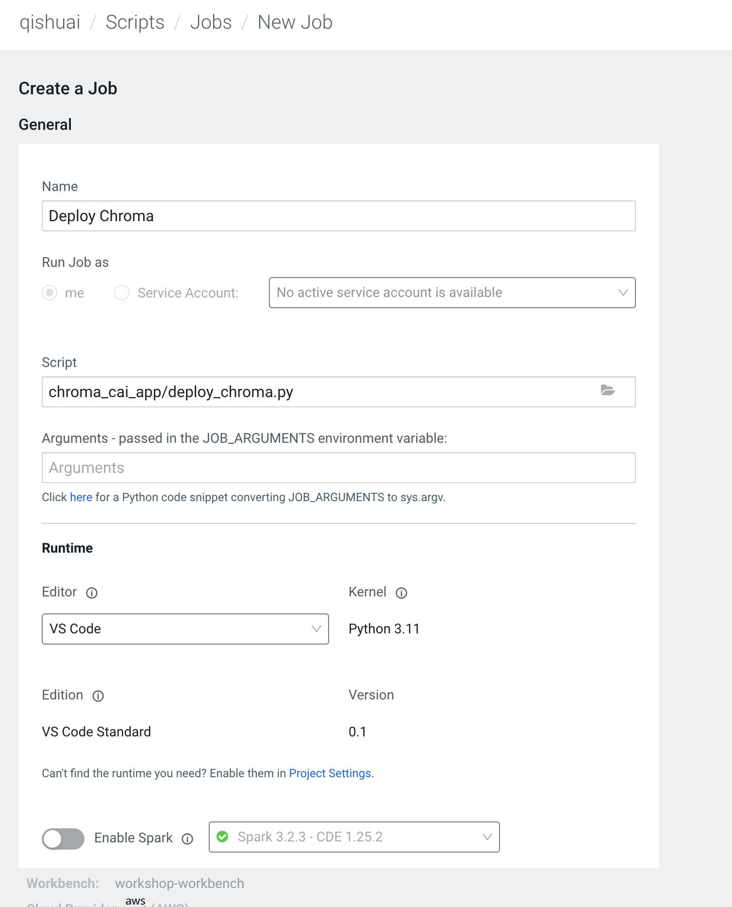

> The deploy script (`deploy_chroma.py`) creates and launches a ChromaDB instance as a standalone CAI Application. It reads an `app_suffix` environment variable to generate a unique application name, allowing multiple participants to run their own isolated databases.

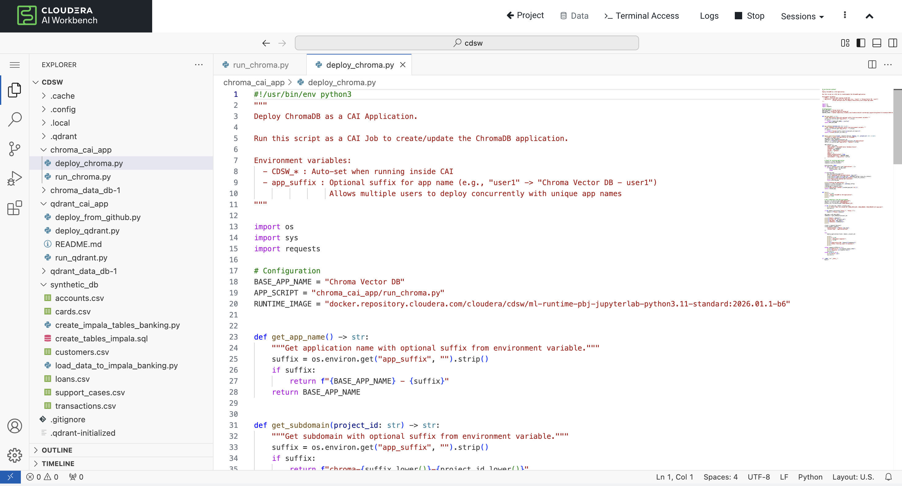

### Step A.3: Add the `app_suffix` Environment Variable

Before running the job, add an environment variable to give your ChromaDB instance a unique name.

1. Scroll down to the **Environment Variables** section
2. Click **Add Environment Variable**
3. Fill in the dialog:

| Field | Value |
|-------|-------|
| **Name** | `app_suffix` |
| **Value** | A unique identifier for you (e.g., `db-2`, your initials) |

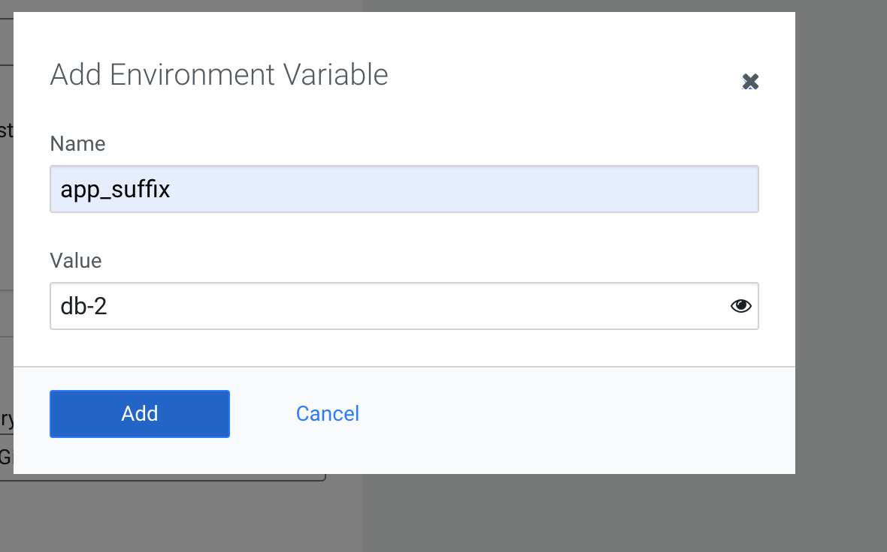

> **Important:** Use a suffix that is unique to you. This prevents your Chroma application from conflicting with other participants' instances.

### Step A.4: Run the Job and Verify

1. Click **Run** (or **Create and Run**) to launch the job
2. Wait for the job to complete successfully
3. Go to **Applications** in your CAI project

You should see your ChromaDB application listed and running:

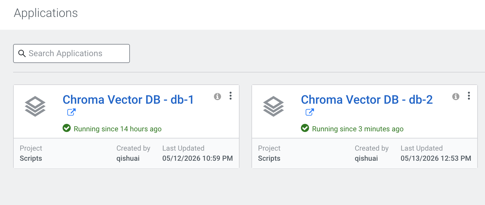

The application is named `Chroma Vector DB - <your_suffix>`. Note its URL — you will need it when configuring the LightMem MCP server.

---

## Section B: Register the LightMem MCP Server

With ChromaDB running, register the LightMem MCP server in Agent Studio so workflows can use memory functions.

### Step B.1: Open MCP Servers in Agent Studio

1. In Agent Studio, click **Tools Catalog** in the top navigation
2. Click the **MCP Servers** tab
3. Click **Register** (or **+ Add MCP Server**)

### Step B.2: Paste the MCP Server Configuration

In the **Register MCP Server** dialog, paste the following JSON:

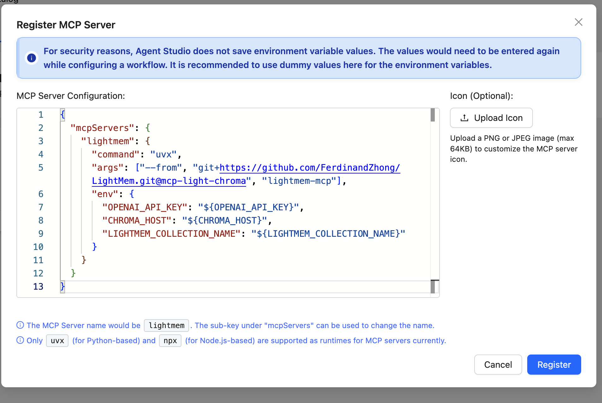

```json
{
  "mcpServers": {
    "lightmem": {
      "command": "uvx",
      "args": ["--from", "git+https://github.com/FerdinandZhong/LightMem.git@mcp-light-chroma", "lightmem-mcp"],
      "env": {
        "OPENAI_API_KEY": "${OPENAI_API_KEY}",
        "CHROMA_HOST": "${CHROMA_HOST}",
        "LIGHTMEM_COLLECTION_NAME": "${LIGHTMEM_COLLECTION_NAME}"
      }
    }
  }
}
```

> **Note:** Agent Studio does not save environment variable values for security reasons. Use placeholder values (like `${VAR_NAME}`) here — actual values are entered when configuring a specific workflow.

**Environment Variable Reference:**

| Variable | Required | Purpose |
|----------|----------|---------|
| `OPENAI_API_KEY` | Yes | API key for the LLM/embedding provider used by LightMem |
| `CHROMA_HOST` | Yes | URL of your running ChromaDB application (from Section A) |
| `LIGHTMEM_COLLECTION_NAME` | No | Collection name for memory storage (default: `lightmem_memory`) |

### Step B.3: Click Register

Click the **Register** button. Agent Studio will validate the configuration and add the MCP server to your catalog.

### Step B.4: Verify the Registered MCP Server

After registering, you can view the MCP server details to confirm it was added correctly:

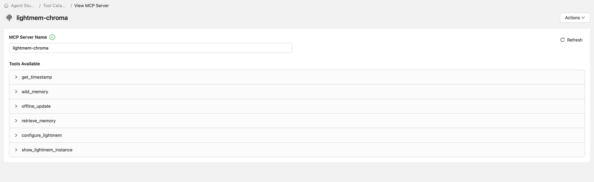

The registered server (`lightmem-chroma`) exposes the following tools that agents can use:

| Tool | Description |
|------|-------------|
| `add_memory` | Store a new memory entry (user input + assistant reply) |
| `retrieve_memory` | Semantic search over stored memories |
| `get_timestamp` | Get the current timestamp for memory metadata |
| `configure_lightmem` | Update LightMem runtime configuration |
| `show_lightmem_instance` | Display the current LightMem instance details |
| `offline_update` | Batch update memory entries offline |

---

## Section C: Add the PaddleOCR Tool to the Tools Catalog

Now add a custom tool that lets agents extract text from images using PaddleOCR.

### Step C.1: Open the Tools Catalog

In Agent Studio, click **Tools Catalog** in the top navigation. You will see the catalog of existing tools and a banner to create new ones.

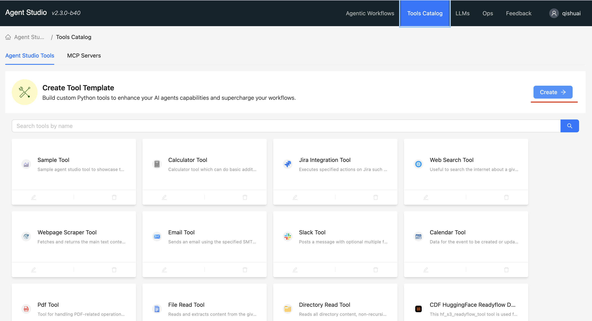

Click the **Create →** button in the top-right corner.

### Step C.2: Name the New Tool

A **Create Tool Template** dialog appears. Enter the tool name:

- **Name**: `PaddleOCR Tool`

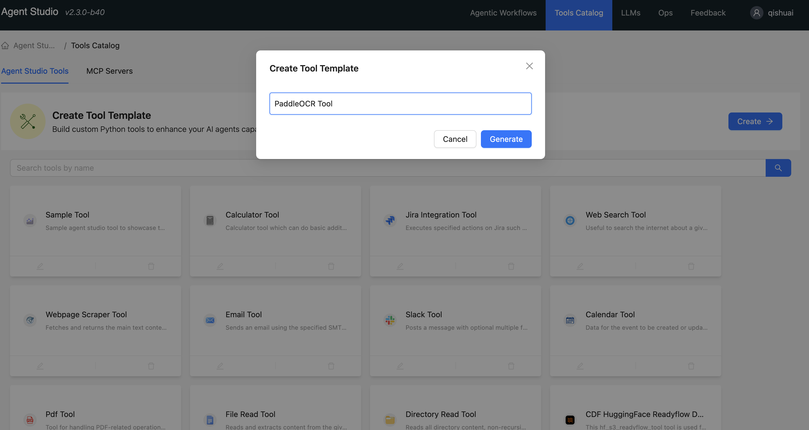

Click **Generate**. Agent Studio creates a scaffold with a `tool.py` and `requirements.txt` file.

### Step C.3: Open the Tool Editor

After the tool is created, you land on the **Edit Tool** page. You can see the tool name, description field, and a code preview on the right.

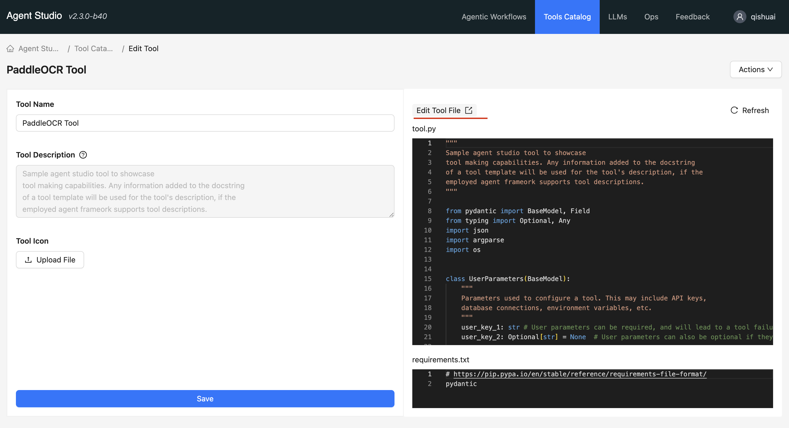

Click the **Edit Tool File** button (pencil icon next to the file name) to open the file editor.

### Step C.4: Open the File in a Session

The file view shows the tool's files (`tool.py` and `requirements.txt`) in the project file browser.

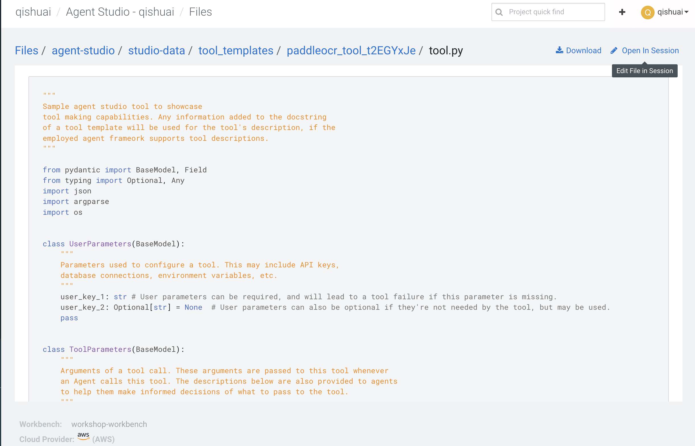

Click **Edit File in Session** (top-right) to open the files in a live workbench session. A **Start A New Session** dialog will appear — select the **Agent Studio** runtime and click **Start Session**.

### Step C.5: Edit `tool.py`

In the session file browser, you will see two files:

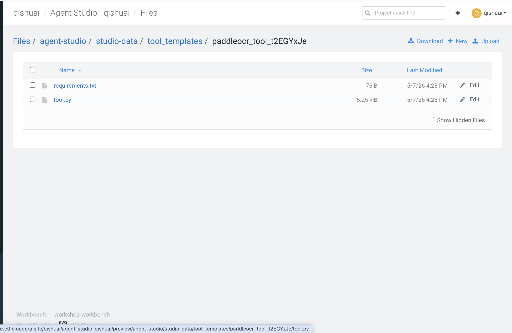

Click `tool.py` to open it. Replace the entire contents with the PaddleOCR tool implementation:

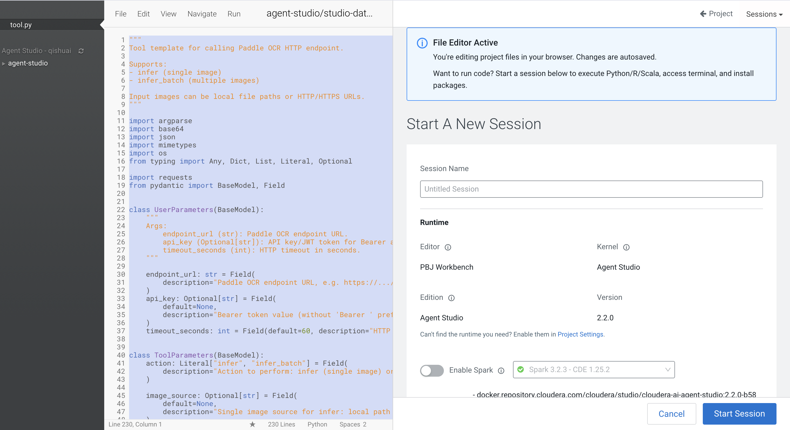

> The tool script must define three key elements (shown highlighted below):

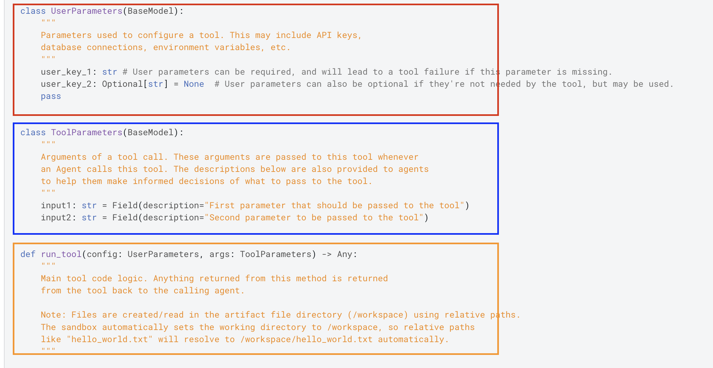

| Class / Function | Purpose |
|-----------------|---------|
| `UserParameters(BaseModel)` | Configuration the user provides (endpoint URL, API key, timeout) |
| `ToolParameters(BaseModel)` | Arguments passed each time an agent calls the tool (action, image source) |
| `run_tool(config, args)` | Main entry point — called by the agent framework |

<details>
<summary>Click to expand the full tool.py implementation</summary>

```python
"""
Tool template for calling Paddle OCR HTTP endpoint.

Supports:
- infer (single image)
- infer_batch (multiple images)

Input images can be local file paths or HTTP/HTTPS URLs.
"""

import argparse
import base64
import json
import mimetypes
import os
from typing import Any, Dict, List, Literal, Optional

import requests
from pydantic import BaseModel, Field


class UserParameters(BaseModel):
    """
    Args:
        endpoint_url (str): Paddle OCR endpoint URL.
        api_key (Optional[str]): API key/JWT token for Bearer auth.
        timeout_seconds (int): HTTP timeout in seconds.
    """

    endpoint_url: str = Field(
        description="Paddle OCR endpoint URL, e.g. https://.../paddle-ocr/v1/infer"
    )
    api_key: Optional[str] = Field(
        default=None,
        description="Bearer token value (without 'Bearer ' prefix)",
    )
    timeout_seconds: int = Field(default=60, description="HTTP timeout in seconds")


class ToolParameters(BaseModel):
    action: Literal["infer", "infer_batch"] = Field(
        description="Action to perform: infer (single image) or infer_batch (multiple images)"
    )
    image_source: Optional[str] = Field(
        default=None,
        description="Single image source for infer: local path or HTTP/HTTPS URL",
    )
    image_sources: Optional[List[str]] = Field(
        default=None,
        description="List of image sources for infer_batch",
    )
    output_mode: Literal["raw", "text", "lines"] = Field(
        default="text",
        description=(
            "Output format: raw (full response JSON), text (joined OCR text), "
            "lines (structured lines with confidence)"
        ),
    )


def _guess_mime(source: str) -> str:
    mime_type, _ = mimetypes.guess_type(source)
    return mime_type or "image/png"


def _load_image_bytes(image_source: str) -> bytes:
    if image_source.startswith(("http://", "https://")):
        response = requests.get(image_source, timeout=30)
        response.raise_for_status()
        return response.content
    with open(image_source, "rb") as f:
        return f.read()


def _to_data_url(image_source: str) -> str:
    image_bytes = _load_image_bytes(image_source)
    mime_type = _guess_mime(image_source)
    encoded = base64.b64encode(image_bytes).decode("utf-8")
    return f"data:{mime_type};base64,{encoded}"


def _build_headers(config: UserParameters) -> Dict[str, str]:
    headers: Dict[str, str] = {"Content-Type": "application/json", "accept": "application/json"}
    if config.api_key:
        headers["Authorization"] = f"Bearer {config.api_key}"
    return headers


def _extract_lines_from_paddle_response(result: Any) -> List[Dict[str, Any]]:
    lines: List[Dict[str, Any]] = []

    def add_line(text: Any, confidence: Any = None):
        text_str = str(text).strip() if text is not None else ""
        if not text_str:
            return
        line: Dict[str, Any] = {"text": text_str}
        if isinstance(confidence, (int, float)):
            line["confidence"] = float(confidence)
        lines.append(line)

    if isinstance(result, dict) and isinstance(result.get("data"), list):
        for item in result["data"]:
            if not isinstance(item, dict):
                continue
            text_detections = item.get("text_detections")
            if not isinstance(text_detections, list):
                continue
            for detection in text_detections:
                if not isinstance(detection, dict):
                    continue
                prediction = detection.get("text_prediction", {})
                if isinstance(prediction, dict):
                    add_line(prediction.get("text"), prediction.get("confidence"))
        return lines

    if isinstance(result, list):
        for item in result:
            if isinstance(item, dict) and "text" in item:
                add_line(item.get("text"), item.get("confidence"))
            elif isinstance(item, list) and len(item) >= 2:
                candidate = item[1]
                if isinstance(candidate, (list, tuple)) and len(candidate) >= 1:
                    confidence = candidate[1] if len(candidate) > 1 else None
                    add_line(candidate[0], confidence)
        return lines

    if isinstance(result, dict):
        if isinstance(result.get("output"), list):
            for item in result["output"]:
                if isinstance(item, dict) and "text" in item:
                    add_line(item.get("text"), item.get("confidence"))
        elif isinstance(result.get("text"), str):
            add_line(result.get("text"))
        elif isinstance(result.get("result"), str):
            add_line(result.get("result"))

    return lines


def _format_output(result: Any, output_mode: str) -> str:
    if output_mode == "raw":
        return json.dumps(result, indent=2, ensure_ascii=False)
    lines = _extract_lines_from_paddle_response(result)
    if output_mode == "lines":
        return json.dumps({"line_count": len(lines), "lines": lines}, indent=2, ensure_ascii=False)
    text = "\n".join(line["text"] for line in lines)
    return text if text else ""


def _call_paddle(config: UserParameters, image_sources: List[str]) -> Any:
    payload = {
        "input": [
            {"type": "image_url", "url": _to_data_url(source)}
            for source in image_sources
        ]
    }
    headers = _build_headers(config)
    response = requests.post(
        config.endpoint_url,
        headers=headers,
        json=payload,
        timeout=config.timeout_seconds,
    )
    response.raise_for_status()
    return response.json()


def run_tool(config: UserParameters, args: ToolParameters) -> str:
    try:
        if args.action == "infer":
            if not args.image_source:
                return "Error: 'image_source' is required for action='infer'."
            if not args.image_source.startswith(("http://", "https://")) and not os.path.exists(args.image_source):
                return f"Error: image file not found: {args.image_source}"
            result = _call_paddle(config, [args.image_source])
            return _format_output(result, args.output_mode)

        if args.action == "infer_batch":
            if not args.image_sources:
                return "Error: 'image_sources' is required for action='infer_batch'."
            for source in args.image_sources:
                if not source.startswith(("http://", "https://")) and not os.path.exists(source):
                    return f"Error: image file not found: {source}"
            result = _call_paddle(config, args.image_sources)
            return _format_output(result, args.output_mode)

        return f"Error: Unsupported action '{args.action}'."

    except requests.exceptions.RequestException as e:
        return f"Paddle OCR request failed: {str(e)}"
    except Exception as e:
        return f"Tool execution failed: {str(e)}"


OUTPUT_KEY = "tool_output"

if __name__ == "__main__":
    parser = argparse.ArgumentParser()
    parser.add_argument("--user-params", required=True)
    parser.add_argument("--tool-params", required=True)
    cli_args = parser.parse_args()
    config = UserParameters(**json.loads(cli_args.user_params))
    params = ToolParameters(**json.loads(cli_args.tool_params))
    output = run_tool(config, params)
    print(OUTPUT_KEY, output)
```

</details>

### Step C.6: Edit `requirements.txt`

In the same session, click `requirements.txt` and replace its contents with:

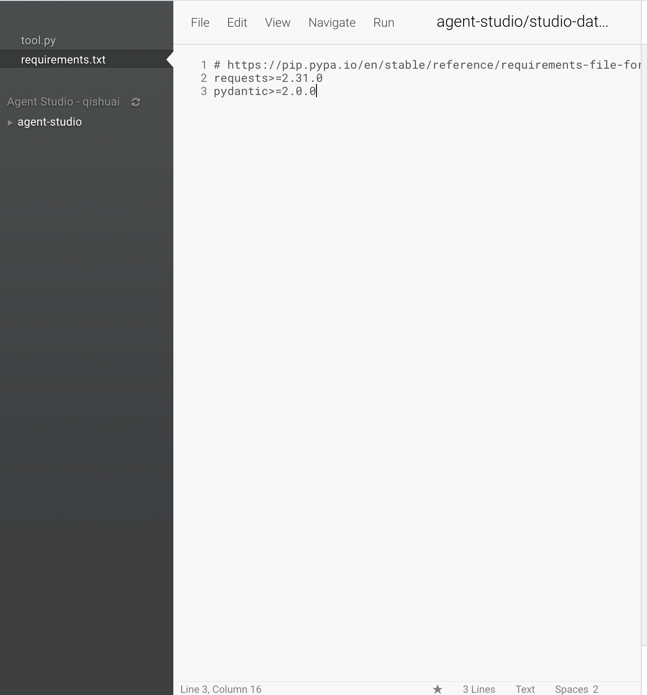

```
requests>=2.31.0
pydantic>=2.0.0
```

Save the file. You can now close the session tab.

### Step C.7: Save the Tool

Return to the **Edit Tool** page in Agent Studio. You should see the updated code previews for both `tool.py` and `requirements.txt`.

Add a description so agents know when to use this tool:

- **Tool Description**: `Tool for calling Paddle OCR HTTP endpoint to extract text from images. Supports: infer (single image), infer_batch (multiple images)`

Then click **Save**.

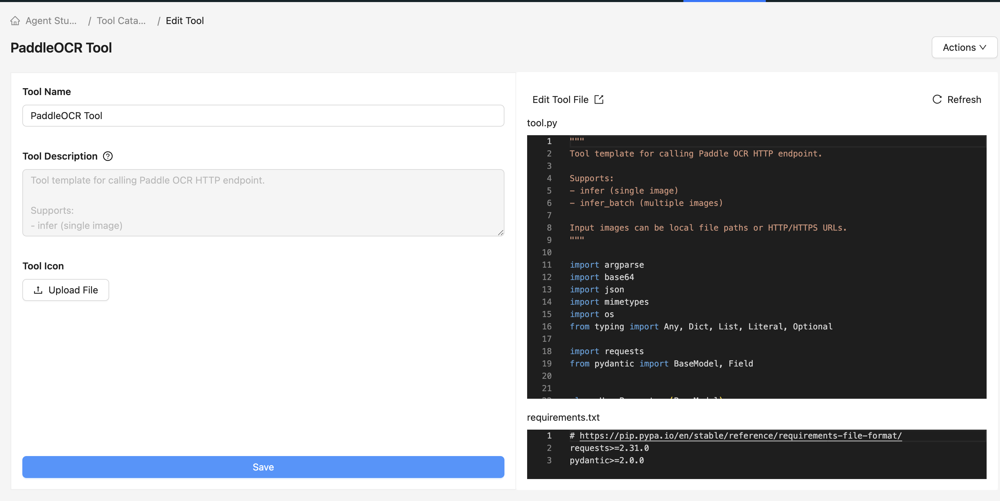

The PaddleOCR Tool is now available in the Tools Catalog and can be added to any agent in your workflows.

---

## Section D: Register the Iceberg MCP Server

The Iceberg MCP server lets agents query Apache Iceberg tables directly via Impala. Register it the same way as the LightMem MCP server.

### Step D.1: Open MCP Servers in Agent Studio

1. In Agent Studio, click **Tools Catalog** in the top navigation
2. Click the **MCP Servers** tab
3. Click **Register**

### Step D.2: Paste the MCP Server Configuration

In the **Register MCP Server** dialog, paste the following JSON:

```json
{
  "mcpServers": {
    "iceberg-mcp-server": {
      "command": "uvx",
      "args": [
        "--from",
        "git+https://github.com/cloudera/iceberg-mcp-server@main",
        "run-server"
      ],
      "env": {
        "IMPALA_HOST": "coordinator-default-impala.example.com",
        "IMPALA_PORT": "443",
        "IMPALA_USER": "username",
        "IMPALA_PASSWORD": "password",
        "IMPALA_DATABASE": "default"
      }
    }
  }
}
```

> **Note:** Replace the placeholder values with your actual Impala connection details. As with the LightMem MCP, Agent Studio does not store these values — actual credentials are entered when configuring a workflow.

**Environment Variable Reference:**

| Variable | Required | Purpose |
|----------|----------|---------|
| `IMPALA_HOST` | Yes | Hostname of your Impala coordinator (e.g. `coordinator-default-impala.example.com`) |
| `IMPALA_PORT` | Yes | Impala port — typically `443` for TLS connections |
| `IMPALA_USER` | Yes | Impala username for authentication |
| `IMPALA_PASSWORD` | Yes | Impala password for authentication |
| `IMPALA_DATABASE` | No | Default database to connect to (default: `default`) |

### Step D.3: Click Register

Click the **Register** button. The `iceberg-mcp-server` will appear in your MCP Servers catalog and is ready to be added to any agent in a workflow.

---

## Summary

After completing this part, you have:

| Component | Status | Used For |
|-----------|--------|----------|
| **ChromaDB Application** | Running as a CAI App | Persistent vector storage for agent memory |
| **LightMem MCP Server** | Registered in Agent Studio | `add_memory` / `retrieve_memory` in agents |
| **Iceberg MCP Server** | Registered in Agent Studio | Querying Apache Iceberg tables via Impala |
| **PaddleOCR Tool** | Added to Tools Catalog | Extracting text from invoice/receipt images |

These components are the foundation for building the agentic workflows in subsequent parts.

---

## Troubleshooting

| Issue | Solution |
|-------|----------|
| ChromaDB job fails | Check that the `chroma_cai_app/deploy_chroma.py` script path is correct |
| App name collision | Make sure your `app_suffix` is unique — another participant may be using the same value |
| LightMem MCP fails to start | Verify `OPENAI_API_KEY` and `CHROMA_HOST` are set correctly when configuring the workflow |
| Iceberg MCP fails to start | Verify `IMPALA_HOST`, `IMPALA_USER`, and `IMPALA_PASSWORD` are correct |
| PaddleOCR tool not visible in catalog | After saving, refresh the Tools Catalog page |
| Session won't start for tool editing | Ensure the **Agent Studio** runtime edition is selected in the Start Session dialog |
