# Part 3: Building the Digital Banking Chatbot Workflow

## Overview

In this part you build a **four-agent sequential pipeline** that powers an AI-assisted digital banking support service. Unlike the conversational workflow in Part 2, this is a **pipeline** — each agent runs in sequence, passing its output to the next.

The defining capability is **cross-session intelligence**: when the same customer contacts support days apart, the pipeline recognises them as a continuing case. Patterns that span sessions are surfaced automatically, enabling earlier escalation and more coherent support.

```
┌──────────────────────────────────────────────────────────────────────────────────┐
│                  BANKING CHATBOT — FOUR-AGENT SEQUENTIAL PIPELINE                │
├──────────────────────────────────────────────────────────────────────────────────┤
│                                                                                  │
│   User message {input}                                                           │
│          │                                                                       │
│          ▼                                                                       │
│  ┌──────────────────┐                                                            │
│  │   AGENT 1        │  ← LightMem: retrieve_memory                              │
│  │   Memory Scout   │    Classify intent · extract identifiers                  │
│  └────────┬─────────┘    Summarise prior context from memory                    │
│           │                                                                      │
│           ▼                                                                      │
│  ┌──────────────────┐                                                            │
│  │   AGENT 2        │  ← iceberg-mcp-server (live Impala queries)               │
│  │   Data Analyst   │    Accounts · transactions · cards · loans · cases        │
│  └────────┬─────────┘                                                            │
│           │                                                                      │
│           ▼                                                                      │
│  ┌──────────────────┐                                                            │
│  │   AGENT 3        │    Pure LLM reasoning over Agent 1 + Agent 2 outputs      │
│  │   Risk Analyst   │    Detect cross-session patterns · assign risk tier       │
│  └────────┬─────────┘    Determine escalation path · define response strategy   │
│           │                                                                      │
│           ▼                                                                      │
│  ┌──────────────────┐                                                            │
│  │   AGENT 4        │  ← LightMem: get_timestamp + add_memory                  │
│  │   Support Advisor│    Compose customer response · store memory note          │
│  └──────────────────┘                                                            │
└──────────────────────────────────────────────────────────────────────────────────┘
```

### Why Cross-Session Memory Matters

| Without Memory | With Memory |
|----------------|-------------|
| Session 2 is handled as a standalone scam report | Session 2 triggers a CRITICAL coordinated attack escalation |
| Agent sees no prior context | Agent connects two events 7 days apart — card compromise followed by impersonation call |
| New case logged in isolation | Fraud team receives a linked note identifying a two-stage attack pattern |

> **Experiment:** Use your **own ChromaDB URL and a unique `LIGHTMEM_COLLECTION_NAME`** (empty) to see the workflow with no memory, then switch to the shared ChromaDB (with existing data) to see cross-session retrieval in action.

---

## Prerequisites

- Part 1 completed: LightMem MCP (`lightmem-chroma`) and Iceberg MCP (`iceberg-mcp-server`) are registered in Agent Studio
- OpenAI API key (provided by instructor)

### MCP Connection Details

#### LightMem MCP — lightmem-chroma

| Parameter | Value |
|-----------|-------|
| **OPENAI_API_KEY** | Provided by instructor |
| **CHROMA_HOST** | Use your own ChromaDB URL from Part 1 **or** the shared URL: `https://chroma-db-1-dwaf-ayqo-3gwk-oaei.ml-e0565700-5cc.datalake.bdqdgc.c0.cloudera.site/` |
| **LIGHTMEM_COLLECTION_NAME** | Choose your own name (e.g. `banking_test`) to start with empty memory, or use `banking_chatbot_memory` to access shared pre-loaded memories |

> **Tip:** Starting with your own empty collection lets you observe how the pipeline behaves with **no prior memory**. After testing, switch `CHROMA_HOST` to the shared URL with an existing collection to experience **cross-session retrieval**.

#### Iceberg MCP — iceberg-mcp-server

| Parameter | Value |
|-----------|-------|
| **IMPALA_HOST** | `hue-impala-gateway.datalake.bdqdgc.c0.cloudera.site` |
| **IMPALA_PORT** | `443` |
| **IMPALA_USER** | `qishuai` |
| **IMPALA_PASSWORD** | Provided by instructor |
| **IMPALA_DATABASE** | `banking_chatbot_db` |

---

## Step 1: Create the Workflow

In Agent Studio, click **Agentic Workflows** > **Create Workflow**. Select **New Workflow**, then enter:

- **Workflow Name**: `Digital Banking Chatbot with Memory`

Click **Create Workflow**.

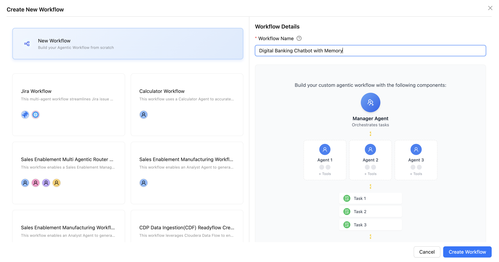

---

## Step 2: Configure Workflow Settings

In the **Add Agents** editor, configure the two toggles:

| Toggle | Setting | Why |
|--------|---------|-----|
| **Is Conversational** | **OFF** | Each customer message is a self-contained pipeline run |
| **Manager Agent** | **OFF** | Sequential pipeline — no routing manager needed |

Leave **Switch to Legacy** off.

---

## Step 3: Add All Four Agents

Click **+ Add Your First Agent** (or **Create or Edit Agents**) to open the agent panel. Create all four agents one by one using the definitions below.

> After filling in each agent's details, click **Create Agent**, then use the agent panel to create the next one before saving. Tools and MCP servers are attached in the same panel — scroll down to **Add Tools** and **Add MCP Servers** after entering each agent's details.

---

### Agent 1 — Memory Scout

| Field | Value |
|-------|-------|
| **Name** | `Memory Scout` |
| **Role** | `Prior Context Retrieval & Intent Classification Specialist` |
| **LLM Model** | `gpt-4o (Default)` |

**Backstory:**
```
You are the first point of contact in the support pipeline. Your job is to look back before anyone looks forward. You retrieve everything the bank knows about this customer from prior interactions, classify what they need now, and hand a fully contextualised brief to the agents that follow. You never compose responses — your only output is structured context.
```

**Goal:**
```
1. Retrieve prior customer memory via MCP (retrieve_memory) before anything else.
2. Classify the message intent.
3. Extract identifiers from the message or infer them from memory.
4. Produce a structured context brief for downstream agents.
```

**MCP to add:** `lightmem-chroma` — select only the **`retrieve_memory`** function.

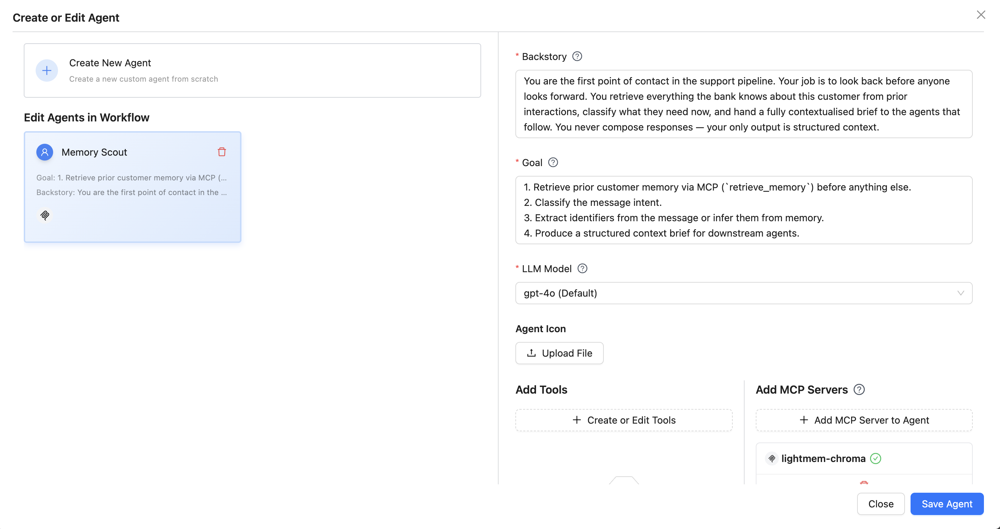

---

### Agent 2 — Data Analyst

| Field | Value |
|-------|-------|
| **Name** | `Data Analyst` |
| **Role** | `Live Banking Database Query Specialist` |
| **LLM Model** | `gpt-4o (Default)` |

**Backstory:**
```
You translate the Memory Scout's structured brief into precise database lookups. You know the schema and write efficient SQL. You do not analyse or interpret — you retrieve the freshest live data and hand it on.
```

**Goal:**
```
1. Use Agent 1's intent and extracted_identifiers to execute the right queries.
2. Retrieve complete, current records for all relevant entities.
3. Return structured query results for downstream analysis.
```

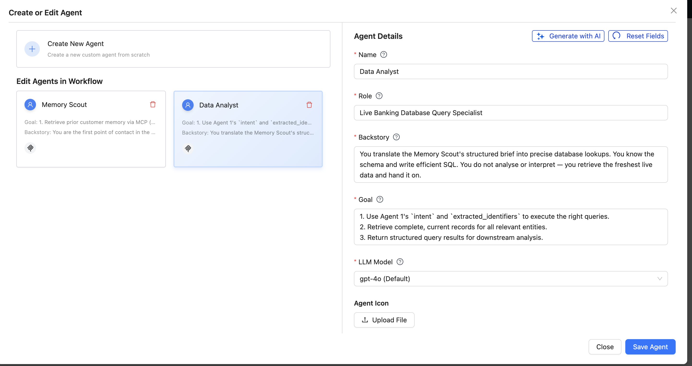

**MCP to add:** `iceberg-mcp-server` — add all available functions (`execute_query`, `get_schema`).

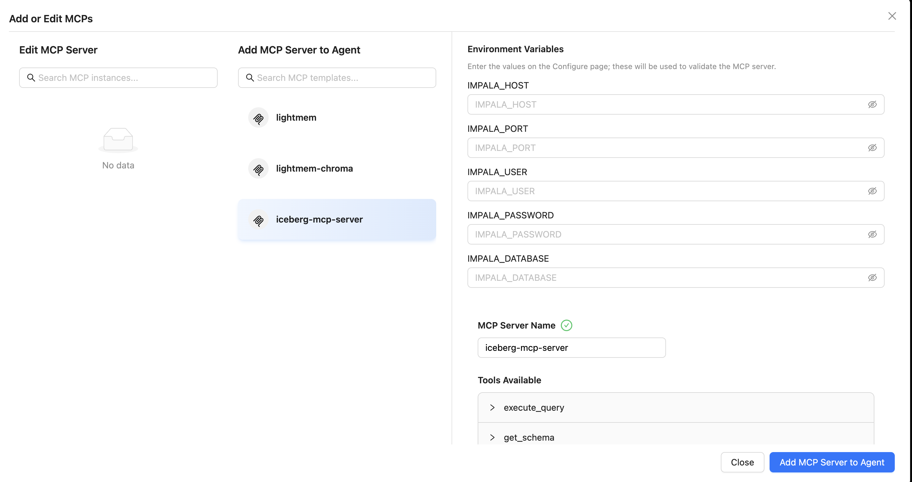

**Database tables available:**

| Table | Key Columns |
|-------|-------------|
| `customers` | `customer_id`, `full_name`, `email`, `phone`, `kyc_status` |
| `accounts` | `account_id`, `customer_id`, `account_type`, `account_number_masked`, `current_balance`, `available_balance`, `status`, `lock_reason` |
| `transactions` | `transaction_id`, `account_id`, `customer_id`, `amount`, `status`, `initiated_at`, `failure_reason`, `notes` |
| `loans` | `loan_id`, `customer_id`, `loan_type`, `outstanding_balance`, `monthly_payment`, `next_payment_date`, `payments_overdue`, `status` |
| `cards` | `card_id`, `account_id`, `customer_id`, `card_type`, `card_number_masked`, `status`, `block_reason`, `credit_limit` |
| `support_cases` | `case_id`, `customer_id`, `case_type`, `status`, `priority`, `account_id`, `created_at` |

---

### Agent 3 — Risk Analyst

| Field | Value |
|-------|-------|
| **Name** | `Risk Analyst` |
| **Role** | `Cross-Session Pattern Detection & Escalation Strategy Specialist` |
| **LLM Model** | `gpt-4o (Default)` |

**Backstory:**
```
You see what individual sessions cannot. By combining live data from the database with the customer's prior interaction history from memory, you detect whether the current issue is a new, isolated problem — or part of a larger pattern that has been building across sessions. Your risk assessments drive escalation decisions and shape how the Support Advisor responds.
```

**Goal:**
```
1. Synthesise Agent 1 (prior memory) with Agent 2 (live data) to detect cross-session patterns.
2. Assign a risk tier and identify the escalation path.
3. Produce a response strategy brief for the Support Advisor.
```

**Tools / MCP:** None — this agent uses pure LLM reasoning over the outputs of Agents 1 and 2.

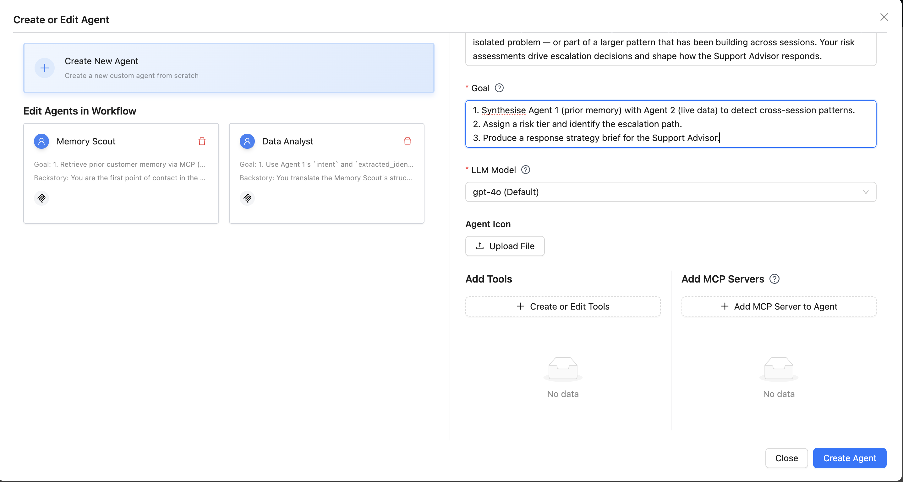

---

### Agent 4 — Support Advisor

| Field | Value |
|-------|-------|
| **Name** | `Support Advisor` |
| **Role** | `Customer Response Composition & Memory Persistence Specialist` |
| **LLM Model** | `gpt-4o (Default)` |

**Backstory:**
```
You are the voice of the bank. You take everything the pipeline has uncovered — prior history, live data, risk analysis — and turn it into a clear, empathetic, actionable response that protects the customer. You are also the pipeline's memory keeper: the last thing you do in every interaction is store a structured memory note so the next session starts with full context.
```

**Goal:**
```
1. Compose a customer response that integrates prior context, live data, and risk analysis.
2. Acknowledge prior interactions explicitly — the customer should feel remembered.
3. If a cross-session pattern was detected, surface it clearly and empathetically.
4. Store a structured memory note via MCP add_memory after every interaction.
```

**MCP to add:** `lightmem-chroma` — select **`get_timestamp`** and **`add_memory`** functions.

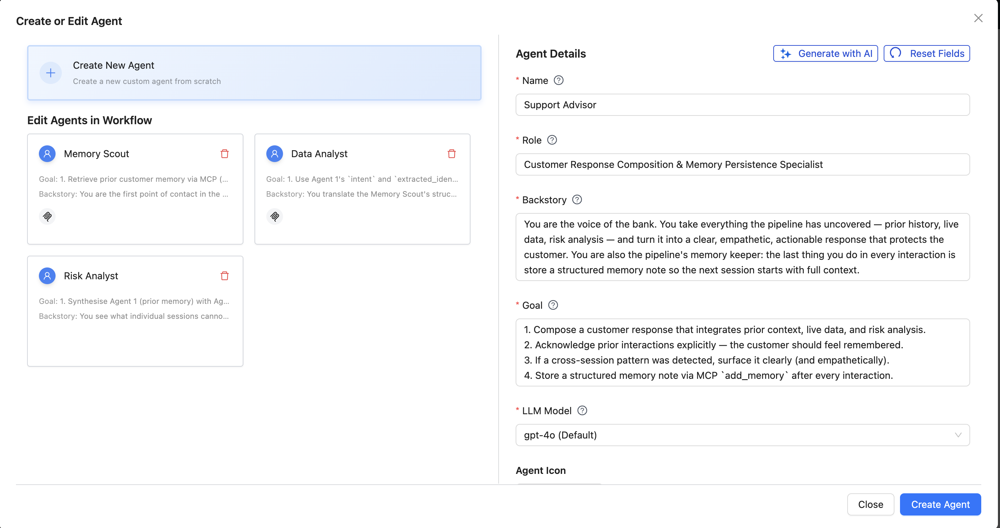

---

## Step 4: Add All Four Tasks

Click **Save & Next** to advance to **Step 2: Add Tasks**.

Since this is a **sequential (non-conversational) workflow**, each agent needs a task that defines what it does. Create one task per agent using the definitions below.

> Click **+ Add Task** for each task. Assign each task to its corresponding agent using the **Select Agent** dropdown.

---

### Task 1 — Memory Retrieval & Intent Classification
**Assigned to:** Memory Scout

```
Given the customer's message {input}, first extract the customer's identifying
information (name, customer ID, phone number, or email) from the message and
classify the intent. Call retrieve_memory using "<customer_name> <classified_intent_label>"
as the query — for example "Sarah Williams account access" or "Maria Garcia fraud report".

Never copy raw situation keywords verbatim from the customer's message
(e.g. "account locked", "card declined", "login failed") — these cause semantic
leakage, matching records from other customers who had similar situations.
The intent label must come from your own classification, not the customer's wording.

  Correct:  retrieve_memory(query="Sarah Williams account access", limit=5)
  Wrong:    retrieve_memory(query="Sarah Williams account locked login failed card declined")

After retrieval, verify identity before using any result: check that the CUSTOMER:
field in each returned note matches the customer who sent this message. Discard any
note where the name or customer ID does not match — do not use another customer's
context. If no matching note is found, set prior_context_flag = null and proceed
as a first-time contact.

Review verified prior notes to summarise past sessions, flagging any open or
unresolved cases. Classify the message into one of the five intent categories:
  - ACCOUNT_STATUS
  - TRANSACTION_INQUIRY
  - LOAN_INQUIRY
  - CARD_INQUIRY
  - FRAUD_REPORT

Extract all available identifiers from the message text; if absent, infer from
prior memory. Produce a structured context brief for the next agent.
```

**Expected output format:**
```json
{
  "intent": "FRAUD_REPORT",
  "extracted_identifiers": {
    "customer_id": "CUST-B003",
    "account_number_last4": null,
    "full_name": "Maria Garcia",
    "transaction_id": null,
    "loan_id": null,
    "card_number_last4": null
  },
  "prior_sessions": [
    {
      "session_date": "2026-03-12",
      "query_type": "ACCOUNT_STATUS",
      "summary": "Account ACC-100006 locked due to FRAUD_ALERT. Two unauthorized international transactions flagged. Escalated to fraud team. CASE-2026-0001 OPEN HIGH.",
      "case_ref": "CASE-2026-0001",
      "escalated": true,
      "resolved": false
    }
  ],
  "memories_retrieved": 2,
  "open_unresolved_cases": ["CASE-2026-0001"],
  "prior_context_flag": "ACTIVE_FRAUD_CASE"
}
```

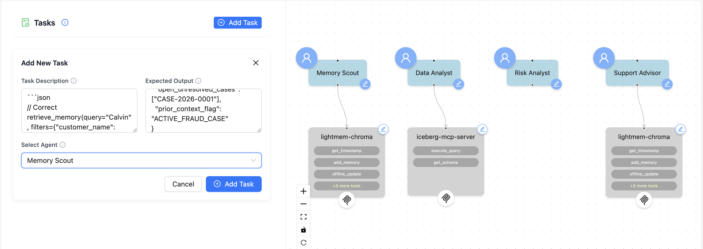

---

### Task 2 — Database Query
**Assigned to:** Data Analyst

```
Using the intent and identifiers from Agent 1, execute the appropriate queries
against iceberg-mcp-server (database: banking_chatbot_db):

  - ACCOUNT_STATUS:      query accounts + open support_cases
  - TRANSACTION_INQUIRY: retrieve the transaction(s) plus failure/dispute details
  - FRAUD_REPORT:        retrieve last 20 transactions + open fraud cases + account status
  - CARD_INQUIRY:        join cards with accounts
  - LOAN_INQUIRY:        retrieve loan records; compute arrears as
                         monthly_payment × payments_overdue

Return all results as structured data for downstream agents.
```

---

### Task 3 — Pattern Analysis & Risk Assessment
**Assigned to:** Risk Analyst

```
Synthesise Agent 1's prior session history with Agent 2's live data to detect
cross-session patterns — such as a prior fraud case followed by a social
engineering contact, or a prior account lock followed by a password-reset request.

Assign a risk tier: LOW, MEDIUM, HIGH, or CRITICAL.
Determine the appropriate escalation path.

Produce a response strategy brief for the Support Advisor specifying:
  - what facts to lead with
  - which prior context to reference explicitly
  - how to frame any cross-session connection
  - tone adjustments
  - any critical safety instructions the customer must receive
```

**Expected output format:**
```json
{
  "risk_tier": "CRITICAL",
  "cross_session_pattern_detected": true,
  "pattern_type": "COORDINATED_ATTACK",
  "pattern_description": "...",
  "escalation_path": "FRAUD_SPECIALIST_URGENT",
  "response_strategy": {
    "lead_with": "...",
    "reference_prior_context": "...",
    "tone": "Calm, urgent, protective."
  }
}
```

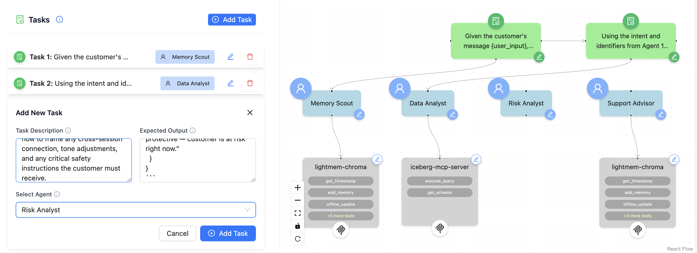

---

### Task 4 — Respond, Report & Store Memory
**Assigned to:** Support Advisor

```
Using all prior agent outputs, compose a warm, direct, and actionable
customer-facing response:
  - Lead with explicit safety instructions for any fraud or scam scenario
  - Reference prior case numbers and session dates when memory exists —
    the customer should never feel like they are starting from zero
  - Surface cross-session connections empathetically when Agent 3
    detected a pattern
  - Proactively offer escalation for any CRITICAL, HIGH, or fraud-related
    risk tier

After composing the customer response, store a memory note by following
these two steps in order — do not skip either step:

Step 1: Call get_timestamp with no arguments. Save the returned timestamp string.

Step 2: Immediately call add_memory using the timestamp from Step 1. Set:
  - user_input = "Customer: <full_name> (<customer_id>) - <intent> - <one-phrase issue summary>"
    LightMem indexes ONLY the user_input field for vector retrieval (messages_use: user_only).
    Both customer identity and classified intent must be here so future searches on
    "<name> <intent>" reliably surface this note.
  - assistant_reply = the stringized structured memory note (template below)
    Stored alongside user_input but NOT vector-indexed; returned as readable context
    on future retrievals.
  - timestamp = the value returned by Step 1
  - force_extract = true   (always — strengthens name/ID as searchable entities)
  - force_segment = false

Populate SUPERSEDES in the assistant_reply to chain back to the prior note on
follow-up sessions.

Memory note format:
  CUSTOMER: <full_name> (<customer_id>).
  SESSION: <YYYY-MM-DD>.
  INTENT: <ACCOUNT_STATUS | TRANSACTION_INQUIRY | LOAN_INQUIRY | CARD_INQUIRY | FRAUD_REPORT>.
  ISSUE: <one-sentence description of the customer's problem>.
  KEY DETAILS: <account IDs, masked numbers, amounts, dates — the facts a future agent needs>.
  ACTION TAKEN: <what was done or communicated in this session>.
  FOLLOW-UP EXPECTED: <Yes/No — and if Yes, what trigger to watch for>.
  CROSS-SESSION LINK: <None, or pattern type and linked session date/case reference>.
  RISK LEVEL: <LOW | MEDIUM | HIGH | CRITICAL>.
  ESCALATED: <Yes/No — if Yes, specify team and reason>.
  CASE REF: <case_id if one was opened or referenced, else omit>.
  SUPERSEDES: <prior note date and account if this is a follow-up, else omit>.
```

Once all four tasks are added, the workflow diagram shows each task node connected to its agent and the full sequential pipeline:

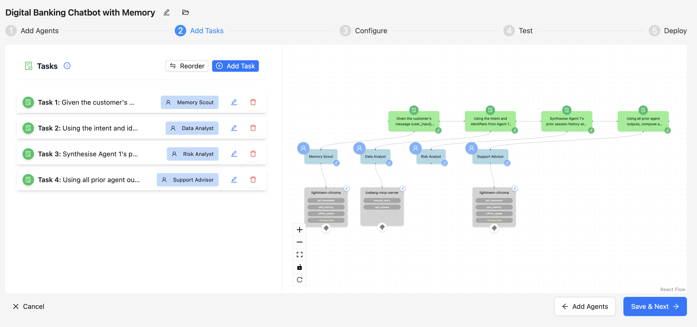

---

## Step 5: Configure MCP Parameters

Click **Save & Next** to advance to **Step 3: Configure**.

### Iceberg MCP — iceberg-mcp-server (Agent 2)

| Parameter | Value |
|-----------|-------|
| **IMPALA_HOST** | `hue-impala-gateway.datalake.bdqdgc.c0.cloudera.site` |
| **IMPALA_PORT** | `443` |
| **IMPALA_USER** | `qishuai` |
| **IMPALA_PASSWORD** | Provided by instructor |
| **IMPALA_DATABASE** | `banking_chatbot_db` |

### LightMem MCP — lightmem-chroma (Agents 1 and 4)

Fill in the same values for both agents that use this MCP:

| Parameter | Value |
|-----------|-------|
| **OPENAI_API_KEY** | Provided by instructor |
| **CHROMA_HOST** | Your own ChromaDB URL from Part 1 (for empty-memory testing) **or** the shared URL for pre-loaded memories |
| **LIGHTMEM_COLLECTION_NAME** | Your chosen collection name (e.g. `banking_test`) — use a unique name to start fresh, or `banking_chatbot_memory` for existing data |

> **Testing cross-session memory:**
> - **No memory (your own ChromaDB):** The pipeline completes but Agent 1 finds no prior context. All sessions are treated as first-contact.
> - **With memory (shared ChromaDB + `banking_chatbot_memory`):** Agent 1 retrieves prior notes, Agent 3 detects patterns across sessions, and the Support Advisor's response references previous interactions.

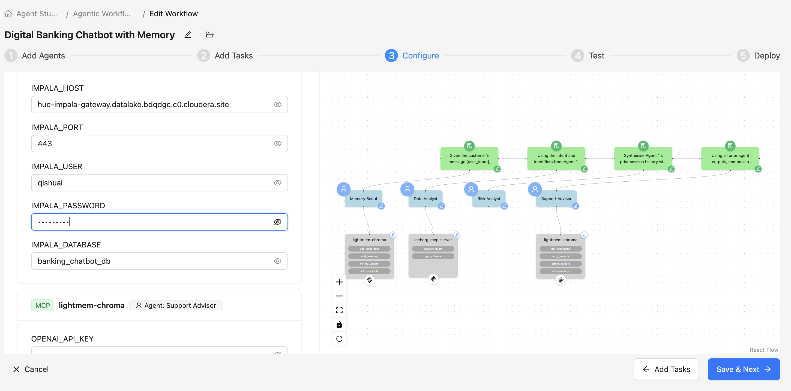

Click **Save & Next** to proceed to **Test**.

---

## Step 6: Test the Workflow

### Test Scenario A — First Contact (DB Query)

Use this message to simulate a customer's first contact:

```
Hi, I'm Maria Garcia. My debit card just got declined at the supermarket
and I can't see my checking account balance in the app. What's happening?
```

**Expected behaviour:**
- Agent 1 retrieves no prior memory (returns empty or no results)
- Agent 2 queries the database and finds `ACC-100006` locked due to `FRAUD_ALERT`, with two suspicious transactions
- Agent 3 assigns risk tier `HIGH` (no cross-session pattern — first contact)
- Agent 4 explains the account lock, names the suspicious transactions, provides a case reference, and stores a memory note

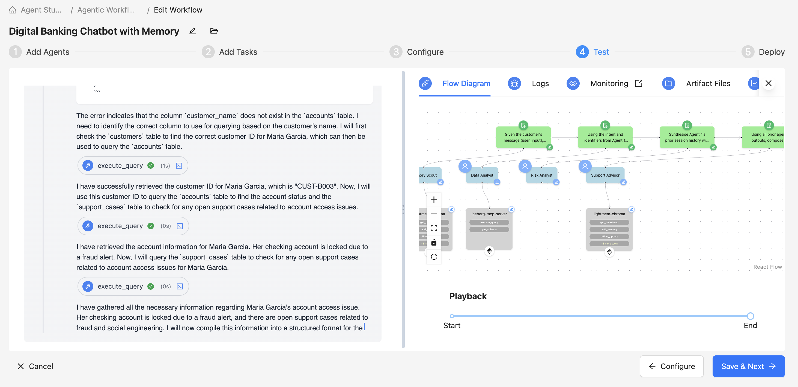

---

### Test Scenario B — Cross-Session Follow-up (With Prior Memory)

To experience cross-session detection, **first switch to the shared ChromaDB** (with pre-loaded memories), then use this follow-up message from the same customer:

```
Hi, I just got a call from someone saying they're from the bank's fraud department.
They said my account is still under investigation and they need me to transfer $500
to a "safe account" to protect my money. It felt weird. Should I do it?
```

**Expected behaviour:**
- Agent 1 retrieves the prior note for Maria Garcia (from Session A — FRAUD_ALERT, CASE-2026-0001)
- Agent 2 confirms the account is still locked and the prior case is `IN_PROGRESS`
- Agent 3 detects a **`COORDINATED_ATTACK`** pattern — card compromise followed 7 days later by impersonation call — and assigns `CRITICAL` risk tier
- Agent 4 leads with immediate safety instructions, explicitly references CASE-2026-0001, explains the two-event pattern, escalates urgently, and stores a new memory note with `SUPERSEDES` linking back to Session A

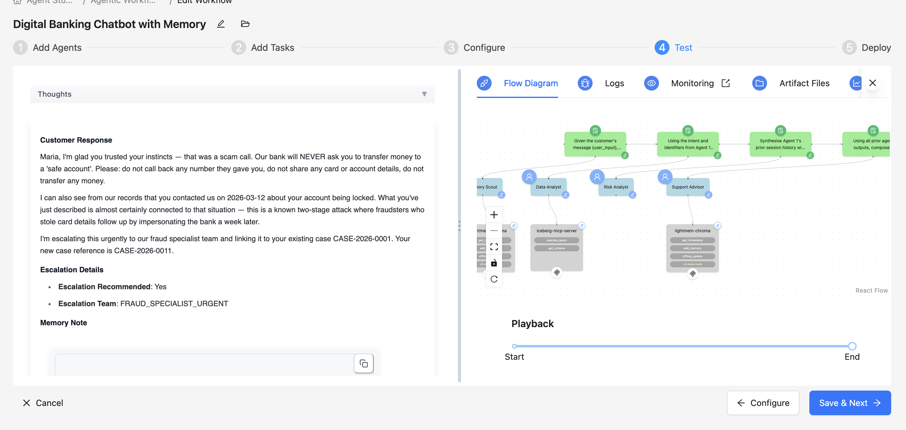

---

### Test Scenario C — Account Locked After Failed Logins

```
Hi, my name is Sarah Williams. I've been trying to log into my account
for the past hour and it keeps saying my password is wrong. Now I'm getting
a message that my account is locked. My debit card is also being declined.
I haven't done anything suspicious — I just forgot my password and kept retrying.
```

---

## Step 7: Deploy the Workflow

Once testing is satisfactory, click **Save & Next** > **Deploy** to publish the workflow as a live agent application.

---

## Workflow Summary

| Agent | Responsibility | Tools / MCP |
|-------|---------------|-------------|
| **Memory Scout** | Retrieve prior context, classify intent, extract identifiers | `lightmem-chroma` → `retrieve_memory` |
| **Data Analyst** | Execute live database queries | `iceberg-mcp-server` |
| **Risk Analyst** | Cross-session pattern detection, risk tier, escalation strategy | None (LLM reasoning) |
| **Support Advisor** | Compose response, store memory note | `lightmem-chroma` → `get_timestamp`, `add_memory` |

---

## Key Takeaways

1. **Sequential vs Hierarchical**: This workflow is a pipeline — no manager agent routes requests; each agent runs in order and passes output to the next
2. **Memory bookends the pipeline**: Agent 1 reads from memory before any data query; Agent 4 writes to memory after every interaction
3. **Identity + classified intent label**: Agent 1 queries memory with `"<customer_name> <classified_intent_label>"` (e.g. `"Maria Garcia fraud report"`) — never raw situation keywords copied from the customer's message. After retrieval, verify the `CUSTOMER:` field in each returned note matches the current customer; discard any note where the name or ID does not match
4. **Cross-session intelligence**: The same `LIGHTMEM_COLLECTION_NAME` across sessions is what enables pattern detection — a different collection name starts fresh
5. **Force extract**: For FRAUD, CRITICAL, or HIGH risk, `force_extract: true` ensures the memory note is stored even if LightMem's summarisation threshold is not met

---

## Tracing and Monitoring Agent Execution

Agent Studio provides built-in tracing and monitoring so you can inspect exactly what each agent did, in what order, and what was passed between steps. This is accessible from the **Test** panel during development and remains available after deployment.

### The Test Panel Tabs

When you run a test, the right-hand panel exposes four tabs:

| Tab | What it shows |
|-----|--------------|
| **Flow Diagram** | A live visual of the pipeline — nodes light up as each agent activates, giving you a real-time view of execution progress |
| **Logs** | Raw step-by-step execution logs: tool calls made, MCP requests sent, LLM prompts and responses, errors |
| **Monitoring** | Link to the external monitoring dashboard for deeper metrics (latency, token usage, tool call counts) |
| **Artifact Files** | Files written by agents during the run (e.g. state snapshots, plan files, PDF outputs) |

### Trajectory Playback

At the bottom of the **Flow Diagram** tab, a **Playback** bar shows the full execution trajectory from **Start** to **End**. Each step in the pipeline is recorded as a checkpoint:

```
Start ──► Memory Scout ──► Data Analyst ──► Risk Analyst ──► Support Advisor ──► End
          (retrieve_memory)  (iceberg queries)  (LLM reasoning)   (add_memory)
```

You can scrub through the playback to replay the trajectory and inspect the state at any point — useful for verifying that Agent 1 correctly retrieved memory before Agent 2 ran its queries, or confirming that Agent 4 called `add_memory` at the end.

### Trace Details View

The **Trace Details** panel gives a step-by-step breakdown of every tool call and agent completion, with latency for each step. This is the primary tool for debugging slow runs or unexpected outputs.

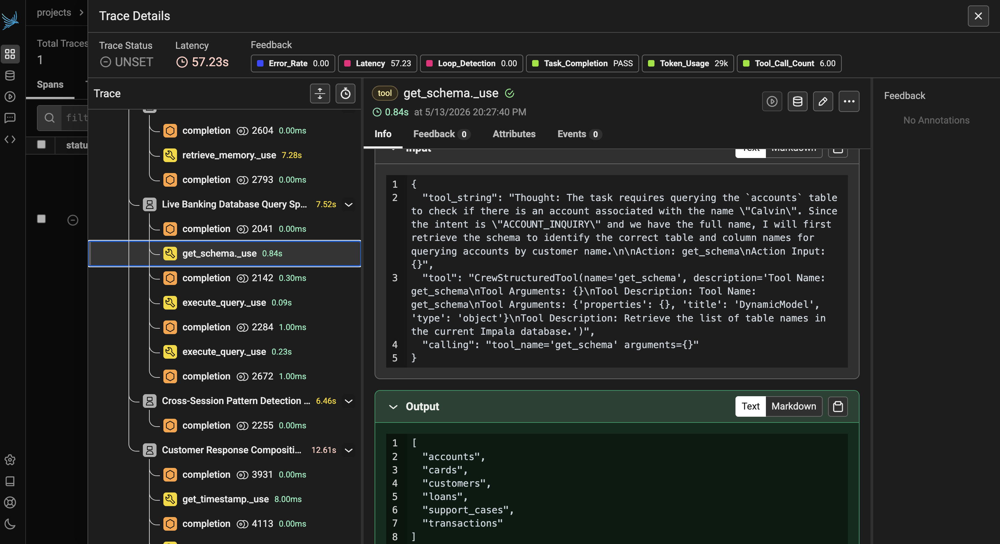

Each trace entry shows:
- **Step name** — e.g. `retrieve_memory_use`, `get_schema_use`, `execute_query`, `completion`
- **Latency** — time taken for that individual step (e.g. `retrieve_memory_use: 7.39s`, `Live Banking Database Query: 7.5s`)
- **Tool input / output** — expand any step to see the exact arguments passed and the result returned (e.g. `get_schema` returning the list of available tables: `accounts`, `cards`, `customers`, `loans`, `support_cases`, `transactions`)
- **Token usage** — total tokens consumed across the run

The trace in the screenshot shows the full pipeline execution at a glance:

| Trace Step | Agent | Latency |
|-----------|-------|---------|
| `retrieve_memory_use` | Memory Scout | ~7.4s |
| `Live Banking Database Query` (get_schema + execute_query × 2) | Data Analyst | ~7.5s |
| `Cross-Session Pattern Detection` | Risk Analyst | ~6.4s |
| `Customer Response Composition` (completion + get_timestamp + add_memory) | Support Advisor | ~12.4s |

### What to Look For in the Logs

When debugging or verifying the pipeline, check the Logs tab for:

| What to check | Where to look |
|--------------|---------------|
| Did Agent 1 call `retrieve_memory`? | `retrieve_memory_use` step — inspect query and filters values |
| Were the right database tables queried? | `get_schema_use` and `execute_query` steps — check table names and SQL |
| Did Agent 3 detect a cross-session pattern? | `Cross-Session Pattern Detection` completion — look for `risk_tier` and `pattern_type` in the output |
| Was memory stored at the end? | `get_timestamp` followed by `add_memory` in the Support Advisor trace |
| Why did an agent fail? | Look for `ERROR` lines or inspect the LLM completion output for that agent's step |

### Using Monitoring for Production Workflows

Once deployed, the **Monitoring** tab links to a live dashboard where you can track:

- **Per-agent latency** — identify which step in the pipeline is slowest
- **Token usage** — understand the cost profile of each run
- **Tool call success/failure rates** — monitor MCP reliability over time
- **End-to-end throughput** — track how many customer sessions are processed per hour

---

## Troubleshooting

| Issue | Solution |
|-------|----------|
| Agent 1 returns no memory | Expected if using your own empty ChromaDB — switch to shared URL with pre-loaded collection to test retrieval |
| Agent 2 query fails | Verify `IMPALA_HOST`, `IMPALA_USER`, and `IMPALA_PASSWORD` are correct; check `IMPALA_DATABASE` is `banking_chatbot_db` |
| Memory retrieved for wrong customer | Agent 1 must use `"<name> <intent_label>"` as the query — never raw situation keywords. Also verify the `CUSTOMER:` field in each returned note post-retrieval and discard any note where name or ID does not match |
| Agent 4 does not store memory | Check `OPENAI_API_KEY` and `CHROMA_HOST` are set for Agent 4's MCP configuration |
| Cross-session pattern not detected | Ensure both sessions use the same `CHROMA_HOST` and `LIGHTMEM_COLLECTION_NAME` |
