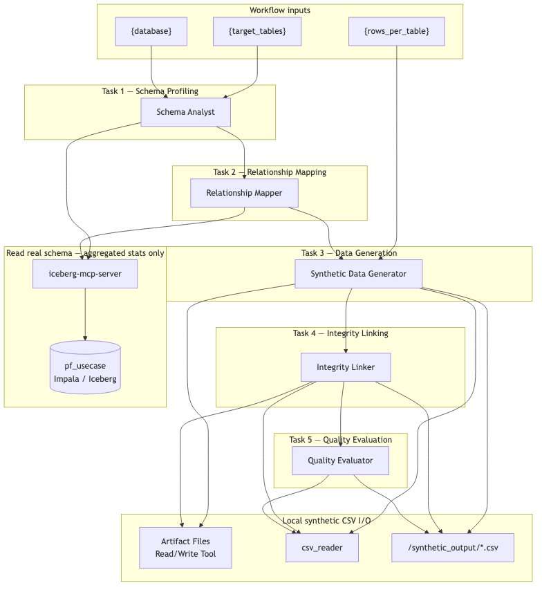
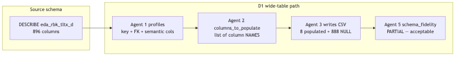
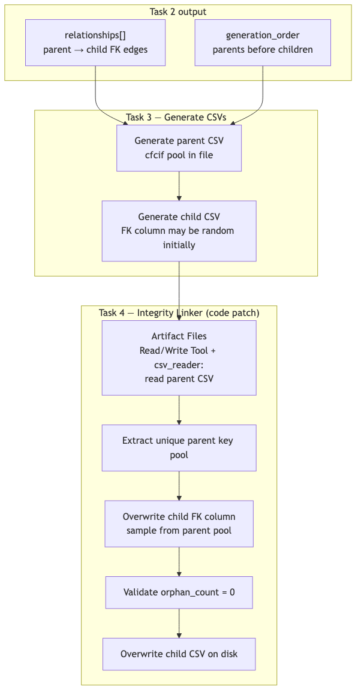

# Building the Synthetic Data Generation Workflow (Direction 1)

## Overview

In this lab you build a **five-agent sequential pipeline** that generates PII-free
synthetic training data for the `pf_usecase` lakehouse **entirely inside Agent Studio**
— no Synthetic Data Studio, no external generation service.

The pipeline scans live Impala schemas, infers FK relationships with SQL validation,
generates CSV files locally, **patches child FK columns by rewriting CSVs** (Agent 4),
and produces a statistical quality scorecard.

```
┌────────────────────────────────────────────────────────────────────────────────┐
│        SYNTHETIC DATA GENERATION — PURELY AGENT STUDIO (D1)                    │
├────────────────────────────────────────────────────────────────────────────────┤
│                                                                                │
│  Input: {target_tables}, {rows_per_table}, {database}                         │
│          │                                                                     │
│          ▼                                                                     │
│  ┌──────────────────┐                                                          │
│  │   AGENT 1        │  ← iceberg-mcp-server                                   │
│  │  Schema Analyst  │    DESCRIBE, COUNT, profile key columns, PII flags       │
│  └────────┬─────────┘    Output: schema manifest JSON                          │
│           ▼                                                                    │
│  ┌──────────────────┐                                                          │
│  │   AGENT 2        │  ← iceberg-mcp-server                                   │
│  │  Relationship    │    FK inference + JOIN validation + generation order    │
│  │  Mapper          │    Output: relationships + wide_tables manifest         │
│  └────────┬─────────┘                                                         │
│           ▼                                                                    │
│  ┌──────────────────┐                                                          │
│  │   AGENT 3        │  ← Artifact Files Read/Write Tool, csv_reader             │
│  │  Synthetic Data  │    Generate rows per column rules → CSV on disk          │
│  │  Generator       │    Output: /synthetic_output/<table>_synthetic.csv      │
│  └────────┬─────────┘                                                         │
│           ▼                                                                    │
│  ┌──────────────────┐                                                          │
│  │   AGENT 4        │  ← Artifact Files Read/Write Tool, csv_reader             │
│  │  Integrity       │    Read parent CSV → patch child FK → validate orphans  │
│  │  Linker          │    Output: corrected CSVs + fk_validation report         │
│  └────────┬─────────┘                                                         │
│           ▼                                                                    │
│  ┌──────────────────┐                                                          │
│  │   AGENT 5        │  ← Artifact Files Read/Write Tool, csv_reader             │
│  │  Quality         │    Read session CSVs → schema/distribution/PII/FK checks  │
│  │  Evaluator       │    Output: per-table scorecard                            │
│  └──────────────────┘                                                         │
│                                                                                │
└────────────────────────────────────────────────────────────────────────────────┘
```



**How to read Figure 1**

| Region in the diagram | What it represents | Runs on |
|---|---|---|
| **Workflow inputs** | `{target_tables}`, `{rows_per_table}`, `{database}` — set at run time | Agent Studio UI |
| **Tasks 1–2 → iceberg-mcp-server → pf_usecase** | Schema profiling and FK validation via SQL (`DESCRIBE`, `COUNT`, join-count queries). Reads aggregated stats only — never exports real row values | Agent Studio + Impala |
| **Task 3 → Artifact Files Read/Write Tool + csv_reader** | LLM-driven row generation written as session artifact CSVs | Agent Studio session store |
| **Task 4 → Artifact Files Read/Write Tool + csv_reader** | **Deterministic FK patch** — reads parent CSV, overwrites child FK column, validates zero orphans | Agent Studio session store |
| **Task 5 → Artifact Files Read/Write Tool + csv_reader** | Read session CSVs; statistical evaluation against schema manifest and FK report | Agent Studio session store |

Unlike D2, there is **no SDS integration surface**. All generation and FK enforcement
happens on the Agent Studio side via CSV read/write.

Diagram PNGs are pre-rendered under `../images/synthetic_data_workflow_d1/`.

Full agent/task copy-paste blocks are in **Step 3 (agents)** and **Step 4 (tasks)** below.
YAML import: [`../extra_materials/synthetic_data_workflow_d1/agents.yaml`](../extra_materials/synthetic_data_workflow_d1/agents.yaml) + [`tasks.yaml`](../extra_materials/synthetic_data_workflow_d1/tasks.yaml).

---

## ⚠️ Understand the Scope Before You Build

Read this section before touching Agent Studio. D1 is an **ML training path inside
Agent Studio**, not a stakeholder SDS demo and not a production batch pipeline.

| | D1 |
|---|---|
| **IS** | Agent Studio–only path — 1k–10k rows, FK patch via CSV overwrite, statistical evaluation. No SDS dependency. |
| **IS NOT** | Full 896-column parity on wide tables in one pass. Guaranteed reproducibility. Unlimited scale. |
| **Best for** | ML engineers who need scoped training data with FK integrity and PII-safe surrogates. |
| **For SDS demos** | Use **Direction 2** — [`synthetic_data_d2_workflow.md`](synthetic_data_d2_workflow.md) |
| **For production volume** | Use **Direction 3** — [`synthetic_data_d3_workflow.md`](synthetic_data_d3_workflow.md) |

### Limitation 1 — Wide tables use populate + default (not full DESCRIBE parity)

`eda_rbk_tltx_d` has ~896 columns. D1 profiles a semantic subset and generates only
columns listed in `wide_tables[].columns_to_populate`; the rest are NULL-defaulted.



Agent 5 reports `schema_fidelity: PARTIAL` for wide tables — **that is expected and
acceptable** for D1. Full column parity is **Direction 3** scope.

### Limitation 2 — FK columns must exist in the CSV before Agent 4 can patch

Agent 4 reads and overwrites CSV files. If Agent 3 never wrote the child FK column,
Agent 4 cannot fix it. Agent 2 must list **every FK column from `relationships`** in
`columns_to_populate` for wide tables.

### Limitation 3 — Confirm join column names with SQL (do not assume `acct_no`)

Banking schemas use varied account-key stems (`cfanos`, `tlxtno`, etc.). Agent 2 must
validate each candidate FK with:

```sql
SELECT COUNT(DISTINCT a.<parent_col>)
FROM pf_usecase.<parent> a
JOIN pf_usecase.<child> b ON a.<parent_col> = b.<child_col>
```

### Limitation 4 — LLM non-determinism and Agent Studio timeouts

Row values differ between runs. Running `{target_tables}=all` at `{rows_per_table}=1000`
may hit timeouts. **Start scoped:**

| Variable | First-run value |
|---|---|
| `target_tables` | `eda_bwc_cfmast_d_sg,eda_bwc_cfacct_d_sg,eda_rbk_tltx_d` |
| `rows_per_table` | `100` |
| `database` | `pf_usecase` |

### What makes an acceptable D1 run

| Bar | Required |
|---|---|
| FK columns in CSV headers | Every column in `relationships` appears in generated CSV |
| FK orphan count = 0 | Agent 4 `fk_validation`: all `orphan_count_after: 0` |
| PII safety PASS | No NRIC/email/phone regex hits |
| `schema_fidelity` | PASS on master/account; PARTIAL acceptable on wide transaction table |
| Row count | Matches `{rows_per_table}` (lookup tables 50–200 exempt) |

---

## Diagram quick reference

| Figure | File | Consult when |
|---|---|---|
| **Figure 1** | `architecture.png` | Full pipeline — which agent uses Impala vs file I/O |
| **Figure 2** | `wide_table_strategy.png` | Explaining partial column fill on `eda_rbk_tltx_d` |
| **Figure 3** | `fk_integrity_flow.png` | How Agent 4 patches FKs by rewriting CSVs |
| **Figure 4** | `final_workflow.png` | Verifying Agent Studio UI wiring — 5 tasks, context links |

**Suggested demo narrative:**

1. **Figure 1** — "Five agents, one Impala read path, local CSVs — no SDS."
2. **Figure 4** — "Sequential tasks with context chaining."
3. **Figure 3** — "D1's advantage over D2: Agent 4 rewrites child CSVs, not prompt hints."
4. **Figure 2** — "Wide tables are intentionally partial — D3 for full parity."

---

## Prerequisites

### 1. Iceberg MCP — iceberg-mcp-server

Registered in Agent Studio from Part 1 of the workshop.

| Parameter | Value |
|---|---|
| **IMPALA_HOST** | `hue-impala-gateway.datalake.bdqdgc.c0.cloudera.site` |
| **IMPALA_PORT** | `443` |
| **IMPALA_USER** | Provided by instructor |
| **IMPALA_PASSWORD** | Provided by instructor |
| **IMPALA_DATABASE** | `pf_usecase` |

Verify connectivity (optional):

```bash
python scripts/test_impala_connection.py
```

### 2. File I/O tools — Artifact Files Read/Write Tool and csv_reader

| Tool | Used by | Purpose |
|---|---|---|
| **Artifact Files Read/Write Tool** | Agents 3, 4, 5 | Write/read CSV artifacts in the current workflow session |
| **csv_reader** | Agents 3, 4, 5 | Parse CSV contents after the artifact tool returns a path |

Attach **Artifact Files Read/Write Tool** to Agents 3, 4, and 5.

### 3. YAML reference (optional import)

| File | Location |
|---|---|
| `agents.yaml` | `../extra_materials/synthetic_data_workflow_d1/agents.yaml` |
| `tasks.yaml` | `../extra_materials/synthetic_data_workflow_d1/tasks.yaml` |

You may import via `crewai_yaml_importer` or build manually in the UI (Steps below).

---

## Step 1: Create the Workflow

In Agent Studio: **Agentic Workflows** → **Create Workflow** → **New Workflow**

| Field | Value |
|---|---|
| **Workflow Name** | `Synthetic Data Generation D1` |
| **Process type** | **Sequential** |

---

## Step 2: Configure Workflow Settings

| Toggle | Setting |
|---|---|
| **Is Conversational** | **OFF** |
| **Manager Agent** | **OFF** |

### Workflow input variables

Add **exactly three** variables:

| Variable | Default | Description |
|---|---|---|
| `target_tables` | `eda_bwc_cfmast_d_sg,eda_bwc_cfacct_d_sg,eda_rbk_tltx_d` | Comma-separated table names |
| `rows_per_table` | `100` | Rows per table (start at 100) |
| `database` | `pf_usecase` | Impala database |

> Only `{target_tables}`, `{rows_per_table}`, and `{database}` may appear as `{word}`
> templates in task text.

---

## Step 3: Add All Five Agents

Create each agent below. Attach tools before moving to the next agent.

### Agent 1 — Schema Analyst

| Field | Value |
|---|---|
| **Name** | `Schema Analyst` |
| **Role** | `Database Schema Profiling Specialist` |
| **LLM Model** | `gpt-4o (Default)` |

**Backstory:**
```
You are an expert data analyst for banking data warehouses. You read Impala schemas
via iceberg-mcp-server, run lightweight statistical queries, and produce schema profiles.
Flag PII-risk columns (cif, name, email, phone, addr, mobile, nric). Never export real
row values — only aggregated statistics and representative codes.
```

**Goal:**
```
Profile every table in {target_tables}: DESCRIBE, COUNT, MIN/MAX/AVG, GROUP BY top-20.
For wide tables (>200 cols) profile key columns plus id/no/date/amt/ccy/status/type/code.
Output a JSON schema manifest.
```

**MCP:** `iceberg-mcp-server` — add `get_schema` and `execute_query`.

---

### Agent 2 — Relationship Mapper

| Field | Value |
|---|---|
| **Name** | `Relationship Mapper` |
| **Role** | `Data Modelling and FK Inference Specialist` |
| **LLM Model** | `gpt-4o (Default)` |

**Backstory:**
```
You infer FK relationships from column names and validate every candidate with a JOIN
COUNT query. Never assume acct_no for RBK transaction tables — confirm cfanos, tlxtno, or
other stems via DESCRIBE + SQL. Produce generation_order (parents before children) and
wide_tables.columns_to_populate as a list of column NAMES (not a count).
```

**Goal:**
```
Using the schema manifest from Task 1: infer FKs, validate with SQL, classify table
types, output generation_order + relationships + wide_tables manifest.
```

**MCP:** `iceberg-mcp-server`

---

### Agent 3 — Synthetic Data Generator

| Field | Value |
|---|---|
| **Name** | `Synthetic Data Generator` |
| **Role** | `PII-Free Tabular Data Generation Specialist` |
| **LLM Model** | `gpt-4o (Default)` |

**Backstory:**
```
You generate PII-free banking synthetic data following generation_order. Use SYN-CIF-*
for customer IDs, log-normal amounts within profiled ranges, sample categoricals from
top_values. For wide tables populate ONLY columns_to_populate; NULL the rest. Write each
table to /synthetic_output/<table>_synthetic.csv and verify with csv_reader.
```

**Goal:**
```
Generate {rows_per_table} rows per table in generation_order. Write CSVs to
/synthetic_output/. Log columns_populated vs columns_defaulted per table.
```

**Tools:** `Artifact Files Read/Write Tool`, `csv_reader`

---

### Agent 4 — Integrity Linker

| Field | Value |
|---|---|
| **Name** | `Integrity Linker` |
| **Role** | `Referential Integrity Enforcement Specialist` |
| **LLM Model** | `gpt-4o (Default)` |

**Backstory:**
```
You enforce FK integrity by reading parent CSVs, extracting key pools, overwriting child
FK columns, and validating orphan_count=0. You read and rewrite actual CSV files using
Artifact Files Read/Write Tool and csv_reader — do not rely on prompt instructions alone.
```

**Goal:**
```
For each relationship: read parent CSV → extract pool → patch child FK column → validate
→ overwrite child CSV. Output fk_validation report with orphan_count_after=0 for PASS.
```

**Tools:** `Artifact Files Read/Write Tool`, `csv_reader`



**How to read Figure 3**

| Step | Action |
|---|---|
| Task 3 | Parent and child CSVs written to `/synthetic_output/` |
| Task 4 read | Agent 4 reads parent CSV via `Artifact Files Read/Write Tool` / `csv_reader` |
| Task 4 patch | Child FK column overwritten with samples from parent key pool |
| Task 4 validate | `orphan_count_after` must be `0` for every relationship |
| Task 4 save | Corrected child CSV written back to disk |

This is **stronger than D2** (prompt-only FK hints) but still agent-driven — not compiled
code like D3's `enforce_fk()`.

---

### Agent 5 — Quality Evaluator

| Field | Value |
|---|---|
| **Name** | `Quality Evaluator` |
| **Role** | `Synthetic Data Statistical Quality Evaluator` |
| **LLM Model** | `gpt-4o (Default)` |

**Backstory:**
```
You evaluate synthetic CSVs against the schema manifest and FK validation report. Check
schema fidelity, distribution fidelity, PII safety (NRIC/email/phone regex), referential
integrity, and row counts. PARTIAL schema_fidelity is acceptable on wide tables when
only columns_to_populate were written.
```

**Goal:**
```
Produce per-table scorecards and overall PASS/FAIL. Set dataset_ready_for_training=true
only if all tables PASS (PARTIAL on wide-table schema_fidelity is OK).
```

**Tools:** `csv_reader`

---

## Step 4: Add All Five Tasks

Create tasks in order. Set **Context** as shown.

### Task 1 — Schema Profiling
**Agent:** Schema Analyst | **Context:** *(none)*

```
For each table in {target_tables} in {database}, use iceberg-mcp-server:
1. DESCRIBE {database}.<table> — columns, types, nullability
2. SELECT COUNT(*) — row count
3. GROUP BY top-20 on categoricals; MIN/MAX/AVG on numerics
4. Flag PII-risk columns (cif, name, email, phone, addr, mobile, nric)

For wide tables (>200 columns): profile key columns plus any column containing
id, no, date, amt, ccy, status, type, code — but list ALL columns from DESCRIBE
in the manifest.

Output JSON schema manifest. Echo {rows_per_table} in output.
```

---

### Task 2 — Relationship Mapping
**Agent:** Relationship Mapper | **Context:** Task 1

```
Using the schema manifest from Task 1:
1. Infer FK candidates from exact column name matches and banking naming conventions
2. Validate EACH candidate with JOIN COUNT SQL — do not assume column names
3. Classify tables: master, child, transaction, lookup
4. Produce generation_order (parents before children)
5. For wide_tables: columns_to_populate MUST list every FK column from relationships
   plus semantic core (>=4 master, >=6 account, >=7 transaction column names)

Example wide_tables entry:
{"table":"eda_rbk_tltx_d","total_columns":896,
 "columns_to_populate":["cfanos","cfcif","tlxtno","txn_dt","txn_amt","ccy_cd","txn_type","status_cd"]}
```

---

### Task 3 — Data Generation
**Agent:** Synthetic Data Generator | **Context:** Tasks 1, 2

```
Following generation_order from Task 2, generate {rows_per_table} synthetic rows per table.

Column rules:
- PII IDs: SYN-CIF-000001 format
- Amounts: log-normal within profiled [min,max]
- Categoricals: sample from top_values frequencies
- Wide tables: populate ONLY wide_tables[].columns_to_populate; NULL all others

Write each CSV to /synthetic_output/<table>_synthetic.csv.
Verify each file with csv_reader. Log columns_populated vs columns_defaulted.
```

---

### Task 4 — Integrity Linking
**Agent:** Integrity Linker | **Context:** Tasks 2, 3

```
For every entry in relationships from Task 2:
1. Read parent CSV from /synthetic_output/<parent>_synthetic.csv
2. Extract unique parent_column values into a key pool
3. Read child CSV; overwrite child_column with random samples from pool
4. Validate orphan_count = 0
5. Overwrite child CSV using Artifact Files Read/Write Tool

Output fk_validation JSON with orphan_count_before, orphan_count_after, status per edge.
overall_status must be PASS for zero orphans on all edges.
```

---

### Task 5 — Quality Evaluation
**Agent:** Quality Evaluator | **Context:** Tasks 1, 3, 4

```
Read all CSVs in /synthetic_output/. For each table assess:
1. schema_fidelity — PASS / PARTIAL (wide) / FAIL
2. distribution_fidelity — top-3 categoricals, numeric mean within 20% of profile
3. pii_safety — no NRIC/email/phone patterns in string cells
4. referential_integrity — use Task 4 fk_validation (any FAIL → dataset FAIL)
5. row_count_check — matches {rows_per_table} (lookup 50-200 exempt)

Output evaluation_summary + table_scorecards.
dataset_ready_for_training=true only if all tables PASS overall.
```

Once all five tasks are added:


**How to read Figure 4**

| Element | Verify |
|---|---|
| Sequential, non-conversational | Fixed task order |
| Task 2 context → Task 1 | Schema manifest available for FK inference |
| Task 3 context → Tasks 1+2 | Generation uses manifest + relationships |
| Task 4 context → Tasks 2+3 | FK patch uses relationships + generated CSVs |
| Task 5 context → Tasks 1+3+4 | Evaluation uses manifest, CSVs, FK report |
| Agents 1–2 + iceberg-mcp-server | Only schema tasks touch Impala |
| Agents 3–5 + Artifact Files Read/Write Tool | CSV write/read and FK patch on session artifact store |

---

## Step 5: Configure Tool Parameters

### iceberg-mcp-server (Agents 1 and 2)

Same Impala credentials as D2 prerequisites.

### Artifact Files Read/Write Tool / csv_reader (Agents 3, 4, 5)

Ensure `/synthetic_output/` is writable on the Agent Studio host. No extra UserParameters
unless your deployment requires a base path override.

---

## Step 6: Run the Workflow

```
target_tables  = eda_bwc_cfmast_d_sg,eda_bwc_cfacct_d_sg,eda_rbk_tltx_d
rows_per_table = 100
database       = pf_usecase
```

A scoped first run typically takes **5–15 minutes** (five LLM tasks + Impala queries +
CSV generation). Sequence: Task 1 → 2 → 3 → 4 → 5.

---

## Step 7: Verify the FK Chain

After Task 4 completes, verify programmatic FK integrity — D1's key differentiator vs D2.

### Beat 1 — Task 2 `relationships` array

Confirm edges like:

```
eda_bwc_cfmast_d_sg.cfcif  →  eda_bwc_cfacct_d_sg.cfcif
eda_bwc_cfacct_d_sg.cfanos →  eda_rbk_tltx_d.cfanos   (confirm actual column names)
```

### Beat 2 — Task 4 `fk_validation`

Every entry must show:

```json
{"orphan_count_after": 0, "status": "PASS"}
```

If `orphan_count_after > 0`, re-run Task 4 or fix Task 2 join column names.

### Beat 3 — Spot-check CSVs

Open child CSV and confirm every FK value appears in the parent CSV for that column.

### Beat 4 — Task 5 scorecard

| Table | Expected |
|---|---|
| `eda_bwc_cfmast_d_sg` | schema_fidelity PASS |
| `eda_bwc_cfacct_d_sg` | schema_fidelity PASS, referential_integrity PASS |
| `eda_rbk_tltx_d` | schema_fidelity **PARTIAL** (expected), referential_integrity PASS |

---

## Troubleshooting

| Symptom | Likely cause | Fix |
|---|---|---|
| Agent 4 cannot patch FK | FK column missing from child CSV header | Add column to Task 2 `columns_to_populate`; re-run Task 3 |
| orphan_count_after > 0 | Wrong parent/child column in relationships | Re-run Task 2 with JOIN validation SQL |
| Wide table FAIL schema | Too few columns in CSV | Expand `columns_to_populate` in Task 2 |
| PII regex hits in Task 5 | Real-looking NRIC/email in generated text | Regenerate with SYN-* surrogate rules in Task 3 |
| Timeout on `target_tables=all` | Too many tables for one session | Stay scoped or move to D3 |

---

## When to use D2 or D3 instead

| Need | Direction |
|---|---|
| Stakeholder SDS demo, ≤25 rows, LLM judge | **D2** — [`synthetic_data_d2_workflow.md`](synthetic_data_d2_workflow.md) |
| Full schema parity, 10k+ rows, reproducible CML Jobs | **D3** — [`synthetic_data_d3_workflow.md`](synthetic_data_d3_workflow.md) |

---

## Related files

| File | Purpose |
|---|---|
| [`../extra_materials/synthetic_data_workflow_d1/agents.yaml`](../extra_materials/synthetic_data_workflow_d1/agents.yaml) | Agent definitions (YAML import) |
| [`../extra_materials/synthetic_data_workflow_d1/tasks.yaml`](../extra_materials/synthetic_data_workflow_d1/tasks.yaml) | Task definitions (YAML import) |
| `../extra_materials/synthetic_data_workflow_d1/agents.yaml` | Agent Studio import |
| `../extra_materials/synthetic_data_workflow_d1/tasks.yaml` | Task definitions |
| `../images/synthetic_data_workflow_d1/*.png` | Rendered diagrams |
