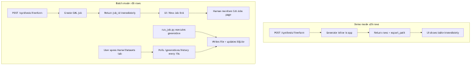
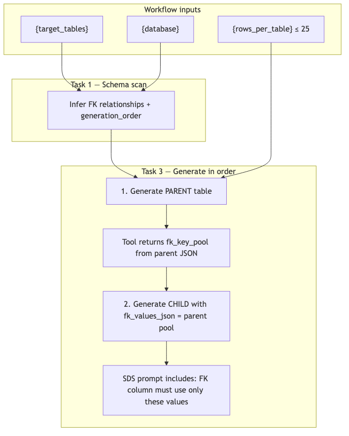
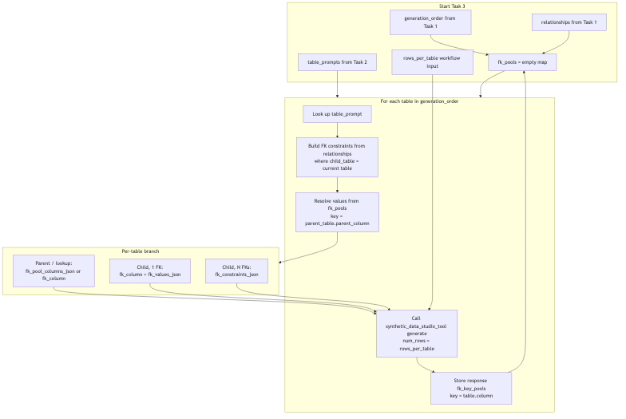
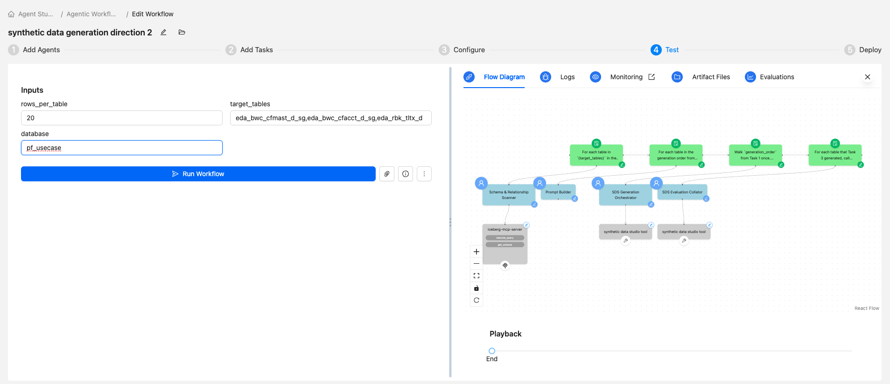

# Building the Synthetic Data Generation Workflow (Direction 2)

## Overview

In this lab you build a **four-agent sequential pipeline** that generates PII-free
synthetic data for the `pf_usecase` lakehouse by orchestrating **Cloudera Synthetic
Data Studio (SDS)** — a deployed CAI Application — via a custom REST API tool.

The pipeline scans live Impala schemas, builds generation prompts, calls SDS to produce
synthetic rows, enforces referential integrity across tables via FK key pools, and
finally asks SDS's built-in LLM-as-judge to score each row 1–5 for quality.

```
┌────────────────────────────────────────────────────────────────────────────────┐
│     SYNTHETIC DATA GENERATION — AGENT STUDIO + SYNTHETIC DATA STUDIO (D2)    │
├────────────────────────────────────────────────────────────────────────────────┤
│                                                                                │
│  Input: {target_tables}, {rows_per_table}, {database}                         │
│          │                                                                     │
│          ▼                                                                     │
│  ┌──────────────────┐                                                          │
│  │   AGENT 1        │  ← iceberg-mcp-server                                   │
│  │  Schema &        │    DESCRIBE, COUNT, profile key columns, FK inference   │
│  │  Relationship    │    Output: schema manifest + relationship map             │
│  │  Scanner         │                                                         │
│  └────────┬─────────┘                                                         │
│           │                                                                    │
│           ▼                                                                    │
│  ┌──────────────────┐                                                          │
│  │   AGENT 2        │  ← LLM only (no tools)                                  │
│  │  Prompt Builder  │    Build schema_json + sample_values_json + prompt      │
│  └────────┬─────────┘    Output: table_prompts[] per table                     │
│           │                                                                    │
│           ▼                                                                    │
│  ┌──────────────────┐                                                          │
│  │   AGENT 3        │  ← synthetic_data_studio_tool only                       │
│  │  SDS Generation  │    POST /synthesis/freeform per table in FK order        │
│  │  Orchestrator    │    Maintains internal fk_pools map across tables         │
│  └────────┬─────────┘    Output: /synthetic_output/<table>_synthetic.json     │
│           │                                                                    │
│           ▼                                                                    │
│  ┌──────────────────┐                                                          │
│  │   AGENT 4        │  ← synthetic_data_studio_tool                           │
│  │  SDS Evaluation  │    POST /synthesis/evaluate_freeform per JSON file       │
│  │  Collator        │    Output: 1-5 row scores + ML readiness verdict        │
│  └──────────────────┘                                                         │
│                                                                                │
└────────────────────────────────────────────────────────────────────────────────┘
```


**How to read Figure 1**

| Region in the diagram | What it represents | Runs on |
|---|---|---|
| **Workflow inputs** (`target_tables`, `rows_per_table`, `database`) | The only three variables you set at run time | Agent Studio UI |
| **Task 1 → iceberg-mcp-server → pf_usecase** | Live schema discovery — `DESCRIBE`, `COUNT`, profiling. Reads real metadata; never exports real row values | Agent Studio + Impala |
| **Task 2 — Prompt Builder** | Pure LLM step — converts Task 1 manifest into `schema_json`, `sample_values_json`, `custom_prompt` per table | Agent Studio (no tools) |
| **Task 3 → synthetic_data_studio_tool → POST /synthesis/freeform** | Generation loop in FK order; tool builds SDS prompt and calls SDS demo mode | Agent Studio tool host → SDS CAI app |
| **Task 4 → synthetic_data_studio_tool → POST /synthesis/evaluate_freeform** | LLM-as-judge scoring; SDS reads its **own** export file (see Limitation 4) | Agent Studio tool host → SDS CAI app |
| **`/synthetic_output/*.json`** | Local copy written by the tool on the Agent Studio side — useful for debugging, **not** for SDS evaluate | Agent Studio host |

The diagram shows **two separate integration surfaces**: Impala (read-only schema) and SDS
(generate + evaluate). Agent Studio sits in the middle and orchestrates both.

Diagram PNGs are pre-rendered under `../images/synthetic_data_workflow_d2/`.

---

## ⚠️ Understand the Limitations Before You Build

This is the most important section in the lab. Read it before touching Agent Studio.

Every constraint below is **real and intentional** — not a bug you can fix by tweaking a
setting. They come from three different layers. Understanding *which layer* causes each
limitation helps you choose the right path (stay in D2 for a demo, or move to D3 for
training data).

| Layer | What it is | Examples in this lab |
|---|---|---|
| **① SDS product design** | How Cloudera Synthetic Data Studio is built and deployed | Demo vs batch mode, two-filesystem export, freeform = prompt-driven columns |
| **② D2 integration design** | How *this* Agent Studio workflow wires Agent Studio to SDS | `is_demo: true` always sent, 25-row cap in custom tool, FK via prompt not code |
| **③ LLM / inference physics** | Hard limits of LLM tabular generation at scale | Context window, `max_tokens`, non-determinism, wide-table prompt collapse |

None of these are Impala or `pf_usecase` schema defects. The source tables are fine. The
constraints are in the **generation path** you are using.

---

### What D2 is — and is not

| | D2 |
|---|---|
| **IS** | An **interactive demo and SDS showcase** — shows Agent Studio orchestrating SDS, a live FK chain with matching IDs across tables, PII surrogate generation, and LLM-as-judge quality scoring. |
| **IS NOT** | A training data pipeline, a schema-cloning tool, or a batch ETL job. |

**Design intent:** D2 was scoped as a **stakeholder-facing integration demo** — prove that
Agent Studio can discover schemas, orchestrate SDS, enforce FK relationships, and score
output quality in one synchronous run. That scope deliberately trades volume, schema parity,
and reproducibility for live interactivity.

---

### Limitation 1 — Hard 25-row cap per call (demo mode)

#### Root cause

**Primary: SDS product design (layer ①)**  
Synthetic Data Studio exposes two execution paths:

| Mode | SDS flag | Behaviour |
|---|---|---|
| **Demo** | `is_demo: true` | Synchronous — SDS generates rows inside the HTTP request and returns them in the response body. Capped at ~25 rows so the call completes in seconds, not hours. |
| **Batch** | `is_demo: false` | Asynchronous — SDS creates a **CML job**, returns a job ID immediately, and finishes later on the cluster. No webhook or callback when done. |

**Secondary: D2 integration design (layer ②)**  
The custom tool `synthetic_data_studio_tool` **always** sends `is_demo: true` on every
generate and evaluate call. It also enforces `DEMO_MODE_MAX_ROWS = 25` locally before
calling SDS. This is deliberate — the tool was built for unattended Agent Studio runs,
not for a human babysitting the CML Jobs page between agent steps.

```python
# synthetic_data_studio_tool/tool.py — always demo mode
payload = {
    ...
    "is_demo": True,
    "num_questions": num_rows,  # capped at 25 by _demo_row_count()
}
```

#### Why this design exists

- **Agent Studio is synchronous.** Each task waits for the previous one. A batch SDS job
  that returns immediately and finishes 20 minutes later has no place to "resume" in the
  pipeline — there is no job-polling step in D2.
- **Demo audiences need instant feedback.** Waiting on a CML job breaks the live-demo
  narrative.
- **SDS batch mode is a separate product workflow** (open SDS UI → generate → monitor Jobs
  page). D2 does not reimplement that workflow inside Agent Studio.

#### What this means for you

| Setting | Result |
|---|---|
| `rows_per_table = 10` | Works — 10 rows returned synchronously |
| `rows_per_table = 25` | Works — at the demo ceiling |
| `rows_per_table = 26+` | Tool caps at 25 and sets `warning` in the response |
| `rows_per_table = 500` | HTTP timeout (~4–5 min), often **zero rows** — do not do this |



**How to read Figure 2**

| Path | Left: Demo mode | Right: Batch mode |
|---|---|---|
| **Trigger** | `is_demo: true` in POST body | `is_demo: false` |
| **What happens** | SDS generates rows **inside the HTTP request** | SDS creates a **CML job** and returns immediately |
| **When you get data** | Seconds — rows in API response + SDS export file | Minutes to hours — must poll Jobs page or SDS Datasets tab |
| **Human step required?** | No — fits Agent Studio sequential tasks | **Yes** — monitor job, then find output file |
| **Used in D2?** | **Yes** — tool always sends demo mode | **No** — no job-polling agent in this workflow |

The D2 custom tool is wired to the **left path only**. That is a deliberate integration
choice: Agent Studio tasks run synchronously and cannot pause mid-pipeline waiting for a
CML job to finish.

#### Workaround for training volume

Use **Direction 3** (`generate_synthetic_data.py` as a CML Job) or call SDS batch mode
directly from the SDS UI — not through this Agent Studio workflow.

> **Bottom line:** the 25-row cap is **by design** at both the SDS and D2 tool layers.
> It is not a configuration you can override inside this workflow without changing the tool
> source code and accepting async job orchestration.

---

### Limitation 2 — Column scope is controlled by the prompt, not Impala

#### Root cause

**Primary: SDS freeform technique design (layer ①)**  
D2 uses SDS `technique: "freeform"` — the LLM generates a JSON array of row objects from
a **text prompt**. The prompt lists column names and rules. SDS has no connection to
Impala at generation time; it does not read `DESCRIBE` output unless Agent 2 puts that
information into `schema_json` and the prompt.

The custom tool reinforces this explicitly:

```
Hard rules (built into every generate prompt):
- Each object MUST use exactly the column names listed below as keys.
```

So the SDS preview table shows **prompt columns only** — never the full Impala schema.

**Secondary: LLM / inference physics (layer ③)**  
Even if you listed all 896 columns of `eda_rbk_tltx_d` in the prompt:

| Constraint | Typical limit | Effect on wide tables |
|---|---|---|
| LLM context window | ~128k tokens (model-dependent) | 896 column definitions + 25 row objects may exceed usable space |
| `max_tokens` in tool payload | `8192` (fixed in tool) | Response may truncate mid-JSON — incomplete or invalid rows |
| LLM attention | Degrades with very long structured lists | Model may drop columns, merge fields, or return only the first few keys |

This is why **full-schema generation of wide tables via SDS freeform is not technically
viable** in D2, even if you remove the demo row cap.

**Tertiary: D2 workflow design (layer ②)**  
Task 2 (Prompt Builder) is an LLM agent that chooses which columns to include in
`schema_json`. If Task 2 omits columns — intentionally or by mistake — SDS cannot
recover them. There is no post-generation schema merge step in D2.

The earlier run that showed **only `tlxtno`** for `eda_rbk_tltx_d` was a **Task 2 scope
failure** (Agent 2 sent a 1-column `schema_json`), not an SDS bug. SDS did exactly what
it was asked.

#### Why this design exists

- Freeform mode is flexible for **demos and rubric-driven evaluation** — you control exactly
  which business fields appear without needing a trained SDV model per table.
- Wide banking ledger tables (800+ audit/system columns) are rarely needed for a **story
  demo**; semantic core + FK columns are enough to show referential integrity.
- Full column parity requires **programmatic column-by-column generation** (D3) or
  **SDV/statistical synthesizers** trained on column metadata — not a single LLM prompt.

Task 2 sits between Impala and SDS in **Figure 1**: it translates `DESCRIBE` metadata
into the `schema_json` list that SDS freeform will honour. If that list is too short,
the SDS preview will be too short — regardless of how many columns exist in Impala.

#### What this means for you

| Expectation | D2 can deliver? | Why |
|---|---|---|
| Show FK chain with 7–15 meaningful columns | **Yes** — if Task 2 follows mandatory column rules | Prompt-sized, within token limits |
| Match all 896 Impala columns for `eda_rbk_tltx_d` | **No** | LLM token limits + freeform technique |
| SDS preview matches `DESCRIBE` column count | **No** — by design | Preview = prompt scope, not source schema |

#### Workaround for full-schema parity

1. **Direction 3** — `describe_to_manifest.py` builds a manifest from live `DESCRIBE`;
   `generate_synthetic_data.py` emits every column (active synthesis + type-valid defaults
   for the rest).
2. Do **not** expect D2 + SDS freeform to clone wide-table schemas — that is outside the
   technique's design envelope.

---

### Limitation 3 — Not suitable for ML training

#### Root cause

This limitation is the **combined effect** of Limitations 1 and 2 plus evaluation design.
It is not a single switch — it follows from architectural choices at every layer.

| Gap for ML training | Caused by | Layer |
|---|---|---|
| Too few rows (≤ 25) | SDS demo mode + tool cap | ① + ② |
| Incomplete column set | SDS freeform + Task 2 prompt scope | ① + ② + ③ |
| Non-reproducible rows | LLM sampling (`temperature: 0.7`) | ③ |
| FK integrity not guaranteed at scale | FK enforced via prompt text, not deterministic code | ② + ③ |
| No statistical fidelity tests | D2 evaluation = SDS LLM-as-judge (1–5), not KS/chi-square | ② |

#### Why this design exists

D2 optimizes for **live demo quality**, not **ML dataset certification**:

- Stakeholders need to *see* the pipeline run end-to-end in one session.
- SDS's LLM judge gives human-readable justifications ("Score 4/5 — plausible SG banking
  codes") — good for demos, insufficient for model-training sign-off.
- ML training requires reproducible, high-volume, full-schema, statistically validated
  data — a different product requirement solved by **Direction 3**.

#### What this means for you

| | D2 demo | Training-ready (D3) |
|---|---|---|
| Rows | ≤ 25 per table | 10k–100k+ (`--rows` CLI / CML Job) |
| Column set | Semantic core (7–15 cols) | All source columns from `DESCRIBE` |
| Reproducibility | Non-deterministic (LLM) | Fixed seed (`--seed 42`) |
| FK integrity | Prompt-constrained (best-effort) | `pandas` `enforce_fk()` (deterministic) |
| Evaluation | LLM 1–5 score (qualitative) | KS, chi-square, null-rate, PII regex, FK completeness |
| `dataset_ready_for_training: true` in D2 | Means "passes SDS rubric in demo context" | **Does not** mean ML-ready — misleading if read literally |

> **Important:** when Task 4 reports `dataset_ready_for_training: true`, that verdict comes
> from the SDS LLM judge scoring plausibility on ≤ 25 rows. It does **not** certify column
> parity, volume, statistical fidelity, or programmatic FK integrity. Treat it as a **demo
> quality gate**, not a training sign-off.

#### Workaround

Use **Direction 3** (`../synthetic_data_workflow_d3/`):
`describe_to_manifest.py` → `generate_synthetic_data.py` → `evaluate_synthetic_data.py`
→ load to Iceberg → CML training job.

---

### Limitation 4 — Two-filesystem evaluation (generate vs evaluate paths)

#### Root cause

**Primary: Platform deployment architecture (layer ① + ②)**  
Agent Studio and Synthetic Data Studio run as **separate CAI Applications on separate
hosts**. They do not share a filesystem.

When you call generate:

```
Agent Studio host                          SDS application host
─────────────────                          ────────────────────
/synthetic_output/                         (SDS internal path)
  eda_bwc_cfmast_d_sg_synthetic.json  ←── tool writes here (local copy)
                                           freeform_data_gpt-4o-mini_<ts>_test.json
                                           ↑ SDS writes here (export_path)
```

The custom tool returns both paths in its response:

| Field | Location | Used by |
|---|---|---|
| `output_path` | Agent Studio host | You (debugging), not SDS |
| `sds_export_path` / `eval_import_path` | SDS host | SDS evaluate API **only** |

**Secondary: SDS API design (layer ①)**  
`POST /synthesis/evaluate_freeform` reads `import_path` **on the SDS server's disk**.
It cannot reach Agent Studio's `/synthetic_output/`. There is no file-upload parameter in
the evaluate API — path must be SDS-local.

#### Why this design exists

- CAI Applications are isolated for security and resource management — shared volumes
  between apps are not assumed.
- SDS owns its export lifecycle (generate → save → evaluate → score) on its own disk.
- The tool writes a **local JSON copy** on the Agent Studio side for debugging and trace
  visibility, but that copy is not part of SDS's evaluate contract.

#### What this means for you

| Path you pass to evaluate | Result |
|---|---|
| `eval_import_path` from generate response (e.g. `freeform_data_..._test.json`) | **Works** — SDS finds the file |
| `output_path` (e.g. `/synthetic_output/eda_bwc_cfmast_d_sg_synthetic.json`) | **404 Not Found** — file is on the wrong host |

This is a **deployment architecture constraint**, not an Agent Studio bug. Task 4 must
read `eval_import_path` from Task 3's generate response for each table.

See **Figure 1** — Task 3 writes to `/synthetic_output/` (local) while SDS evaluate
(Task 4) reads from the SDS app box (`POST /synthesis/evaluate_freeform`). The diagram
shows both paths diverging after the tool call.

---

### Limitation 5 — FK integrity is prompt-based, not programmatic (D2-specific)

#### Root cause

**D2 integration design (layer ②)**  
In Direction 3, FK values are enforced after generation with deterministic code:

```python
child_df[child_col] = [rng.choice(parent_pool) for _ in range(len(child_df))]
```

In D2, FK integrity is enforced by **injecting allowed values into the SDS prompt**:

```
Column 'cfcif' MUST use only values from this list: ["SYN-CIF-000001", ...]
```

The LLM is *asked* to comply. It usually does for small row counts and simple FKs. It is
not guaranteed — especially under token pressure or with many columns.

#### Why this design exists

- D2 deliberately avoids post-generation JSON patching — the agent orchestrator passes
  FK pools into SDS once and trusts the model.
- This keeps the demo simple (one generate call per table, no file rewrite step).
- Deterministic FK enforcement requires a code path (D3) or a dedicated SDS technique
  beyond freeform.

#### What this means for you

For a **10-row demo**, prompt-based FK linking is usually sufficient and visually verifiable.
For **production training data**, use D3's programmatic `enforce_fk()`.



**How to read Figure 3**

| Step in diagram | What happens | D2 mechanism |
|---|---|---|
| **Task 1** | Infers `relationships` + `generation_order` | iceberg-mcp-server + naming conventions |
| **1. Generate PARENT** | e.g. `eda_bwc_cfmast_d_sg` first | Agent 3 calls tool with `fk_pool_columns_json` |
| **Tool returns fk_key_pool** | Distinct values from parent JSON, e.g. `["SYN-CIF-000001", ...]` | Parsed from generated rows — not from Impala |
| **2. Generate CHILD with fk_values_json** | e.g. `eda_bwc_cfacct_d_sg` | Agent 3 passes parent pool into tool |
| **SDS prompt includes FK constraint** | "Column `cfcif` MUST use only values from this list: [...]" | Tool appends constraint lines — **no JSON patching after generate** |

This is the **centrepiece demo story**: synthetic IDs born in the master table propagate
to children because Agent 3 **feeds the pool forward**, not because SDS reads Impala FK
constraints.

---

### Summary — which limitation comes from where

| Limitation | SDS product | D2 workflow design | LLM / inference |
|---|:---:|:---:|:---:|
| 25-row cap | ✓ demo mode | ✓ tool sends `is_demo: true` | |
| Batch mode not in pipeline | ✓ async CML jobs | ✓ no job-polling agent | |
| Columns = prompt scope | ✓ freeform technique | ✓ Task 2 chooses columns | ✓ token limits |
| No full wide-table schema | | ✓ demo semantic subset | ✓ 896 cols impractical |
| Not ML-training ready | ✓ LLM judge only | ✓ no stats eval | ✓ non-deterministic |
| Two-filesystem evaluate | ✓ evaluate reads local path | ✓ separate CAI apps | |
| FK best-effort | ✓ freeform = prompt | ✓ no post-patch | ✓ LLM compliance |

---

### Acceptable demo output bar

A demo that produces only 1–2 columns is **not acceptable** — that indicates Task 2 failed
the mandatory column rules (a workflow configuration issue you can fix), not an inherent
SDS limitation.

Before accepting the output, verify:

| Check | Required | If it fails |
|---|---|---|
| FK columns present | Both sides of every relationship in each table's JSON | Re-paste Task 2 description; check `relationships` from Task 1 |
| Minimum column count | ≥ 4 master, ≥ 6 account, ≥ 7 transaction | Agent 2 omitted semantic core — fix Task 2 output |
| FK values match | Child FK values ⊆ parent pool | Agent 3 did not pass `fk_values_json` — check Task 3 trace |
| Evaluation scores | Average ≥ 3.5/5 per table | Review `schema_json` types and PII surrogate format |
| PII surrogates | `SYN-CIF-*` / `SYN-ACCT-*` format | Adjust Task 2 custom_prompt rules |

---

## Diagram quick reference

Diagram PNGs are pre-rendered under `../images/synthetic_data_workflow_d2/`.
Instruction embeds use PNGs from `../images/synthetic_data_workflow_d2/`.

| Figure | File | Consult when |
|---|---|---|
| **Figure 1** | `architecture.png` | Understanding the full pipeline — which agent talks to Impala vs SDS |
| **Figure 2** | `sds_demo_vs_batch.png` | Explaining the 25-row cap and why batch mode is out of scope for D2 |
| **Figure 3** | `fk_integrity_flow.png` | Explaining how FK values propagate parent → child via SDS prompts |
| **Figure 4** | `agent3_orchestration_state.png` | Debugging Agent 3 — fk_pools map, generate order, parent vs child branches |
| **Figure 5** | `final_workflow.png` | Verifying Agent Studio UI wiring — agents, tasks, context links |

**Demo narrative using the figures (suggested order for presenting):**

1. **Figure 1** — "Four agents, two external systems: Impala for schema, SDS for generate/evaluate."
2. **Figure 2** — "We use demo mode only — synchronous, ≤25 rows. Batch is a different product workflow."
3. **Figure 5** — "Here is what you build in Agent Studio — sequential tasks with context."
4. **Figure 4 + Figure 3** — "Agent 3 walks tables in order, stores parent ID pools, injects them into child prompts."
5. Re-run and open JSON files — spot-check that child FK values ⊆ parent pool (Beats in Step 7).

---

## Prerequisites

### 1. Synthetic Data Studio — deployed CAI Application

| Setting | Value |
|---|---|
| **SDS application URL** | `https://synthetic-data-generator-6gbl1e.ml-e0565700-5cc.datalake.bdqdgc.c0.cloudera.site` |
| **Swagger docs** | Append `/docs` to the URL above (requires CAI login) |
| **Auth** | `Authorization: Bearer <CDSW_APIV2_KEY>` |
| **OPENAI_API_KEY** | Set in the SDS Project → Settings → Environment Variables |

Verify the SDS app is running before building the workflow:

```bash
export SDS_URL=https://synthetic-data-generator-6gbl1e.ml-e0565700-5cc.datalake.bdqdgc.c0.cloudera.site
export CDSW_APIV2_KEY=<your-key>
curl -s "$SDS_URL/health" -H "Authorization: Bearer $CDSW_APIV2_KEY" | python -m json.tool
```

A healthy response returns `{"status": "ok"}`.

### 2. Iceberg MCP — iceberg-mcp-server

Already registered in Agent Studio from Part 1.

| Parameter | Value |
|---|---|
| **IMPALA_HOST** | `hue-impala-gateway.datalake.bdqdgc.c0.cloudera.site` |
| **IMPALA_PORT** | `443` |
| **IMPALA_USER** | Provided by instructor |
| **IMPALA_PASSWORD** | Provided by instructor |
| **IMPALA_DATABASE** | `pf_usecase` |

### 3. Custom tool — `synthetic_data_studio_tool`

The tool is registered in the Agent Studio Tools Catalog at `synthetic_data_studio_tool/`.
Set these **UserParameters** on the tool:

| Parameter | Value |
|---|---|
| **sds_base_url** | `https://synthetic-data-generator-6gbl1e.ml-e0565700-5cc.datalake.bdqdgc.c0.cloudera.site` |
| **api_key** | Your `CDSW_APIV2_KEY` |
| **model_id** | `gpt-4o-mini` |
| **inference_type** | `openai` |
| **timeout_seconds** | `300` |

> **Do not** use `inference_type: CAII` with a `caii_endpoint` pointing at OpenAI.
> CAII authenticates with a `CDP_TOKEN`, not an OpenAI key. For direct OpenAI access
> set `inference_type: openai` only.

---

## Step 1: Create the Workflow

In Agent Studio, click **Agentic Workflows** → **Create Workflow**. Select **New Workflow** and enter:

- **Workflow Name**: `Synthetic Data Generation D2`
- **Process type**: **Sequential**

Click **Create Workflow**.

---

## Step 2: Configure Workflow Settings

In the workflow editor, configure:

| Toggle | Setting | Why |
|--------|---------|-----|
| **Is Conversational** | **OFF** | This is a pipeline — not a chat |
| **Manager Agent** | **OFF** | Sequential order, no routing needed |

### Add workflow input variables

Add **exactly three** input variables. Do not add `parent`, `column`, `parent_table`,
`parent_column`, or any FK-related variable — FK linking is internal to Agent 3.

| Variable name | Default value | Description |
|---|---|---|
| `target_tables` | `eda_bwc_cfmast_d_sg,eda_bwc_cfacct_d_sg,eda_rbk_tltx_d` | Comma-separated table names |
| `rows_per_table` | `10` | Rows to generate per table (**max 25**) |
| `database` | `pf_usecase` | Impala database |

> **Template rule:** Agent Studio treats every `{word}` in agent/task text as a workflow
> variable. Only `{target_tables}`, `{rows_per_table}`, and `{database}` are allowed.
> Never write `{parent_table}`, `{parent_column}`, or `{column}` anywhere — if you do,
> Agent Studio will create a fourth variable and the run will fail with
> `Template variable 'parent_table' not found`.

---

## Step 3: Add All Four Agents

Click **+ Add Your First Agent** to open the agent panel. Create all four agents using
the definitions below. After filling in each agent's details, click **Create Agent**, then
attach tools before moving to the next agent.

---

### Agent 1 — Schema & Relationship Scanner

| Field | Value |
|---|---|
| **Name** | `Schema & Relationship Scanner` |
| **Role** | `Banking Lakehouse Schema Profiler and FK Inference Specialist` |
| **LLM Model** | `gpt-4o (Default)` |

**Backstory:**
```
You are a banking data analyst who reads Impala schemas via the iceberg-mcp-server,
runs lightweight statistical queries (DESCRIBE, COUNT, GROUP BY top-20, MIN/MAX/AVG),
and infers foreign-key relationships from column-name conventions. BWC tables share
cfcif/cif_no as the customer key; RBK tables share acct_no; REM tables share
txn_ref_no; AMH tables share msg_ref_no. You flag PII-risk columns and never export
real values — only aggregated statistics and representative codes.
```

**Goal:**
```
1. Profile every table in {target_tables} — column types, nullability, distributions, ranges.
2. Infer FK relationships from column-name conventions (no JOIN validation needed for the demo).
3. Produce a topological generation order (parents before children).
4. Output a combined schema manifest + relationship map JSON.
```

**MCP to add:** `iceberg-mcp-server` — add **`get_schema`** and **`execute_query`**.

---

### Agent 2 — Prompt Builder

| Field | Value |
|---|---|
| **Name** | `Prompt Builder` |
| **Role** | `Synthetic Data Prompt Engineer` |
| **LLM Model** | `gpt-4o (Default)` |

**Backstory:**
```
You are a prompt engineer specialised in tabular synthetic data. You translate a
column profile into explicit per-column generation rules, describe the table's business
context from its source-system prefix, and provide 3-5 synthetic example rows
constructed from observed distributions (never real rows). You ensure the prompt
instructs SDS to emit JSON row objects (one object per row).
```

**Goal:**
```
For each table in the generation order, produce schema_json, sample_values_json,
and custom_prompt payloads ready for synthetic_data_studio_tool.
```

**Tools / MCP:** None — LLM reasoning only.

---

### Agent 3 — SDS Generation Orchestrator

| Field | Value |
|---|---|
| **Name** | `SDS Generation Orchestrator` |
| **Role** | `SDS Generation Orchestrator` |
| **LLM Model** | `gpt-4o (Default)` |

**Backstory:**
```
Walk generation_order from Task 1 once (3 tables or 80+). Maintain an internal
fk_pools map — keys look like eda_bwc_cfmast_d_sg.cfcif (parent table name, dot,
parent column name). After each parent generate, store fk_key_pools from the tool
response. Before each child generate, look up relationships from Task 1 and pass
parent key values into the SDS prompt via fk_values_json (single FK) or
fk_constraints_json (multiple FKs). The tool writes JSON to /synthetic_output/.
Never ask the user for parent table or column names — those come from Task 1 output.
Do not patch JSON after generation. Keep num_rows <= 25 for demo mode.
```

**Goal:**
```
1. Call SDS generate once per table with num_rows={rows_per_table} (<= 25).
2. Maintain and reuse the internal fk_pools map across the full generation order.
3. Pass parent key pools into child SDS prompts via fk_values_json or fk_constraints_json.
4. Log generation summary including which fk_pools keys were populated.
```

**Tool to add:** `synthetic_data_studio_tool`



**How to read Figure 4**

Agent 3 is a **stateful loop** — not three independent generate calls. The diagram shows
the internal state machine the agent must maintain:

| Node / region | Agent 3 action | State update |
|---|---|---|
| **Start Task 3** | Load `generation_order`, `relationships`, `table_prompts` from Tasks 1–2 | `fk_pools = {}` (empty map) |
| **For each table in generation_order** | Process tables in FK-safe order (parents before children) | — |
| **Look up table_prompt** | Match current table to Task 2 `table_prompts[]` entry | — |
| **Build FK constraints** | Find `relationships` rows where `child_table` = current table | Resolve values from `fk_pools` |
| **Per-table branch — Parent** | Pass `fk_column` or `fk_pool_columns_json` | After generate: `fk_pools["table.col"] = fk_key_pools` |
| **Per-table branch — Child (1 FK)** | Pass `fk_column` + `fk_values_json` from parent pool | `fk_constraints_applied: 1` in log |
| **Per-table branch — Child (N FKs)** | Pass `fk_constraints_json` array | Multiple constraints in one prompt |
| **Call synthetic_data_studio_tool generate** | One HTTP call per table; `num_rows = {rows_per_table}` | Capture `eval_import_path` for Task 4 |
| **Store fk_key_pools** | Write tool response pools back into map | Sibling children reuse same parent entry |

If Agent 3 skips the **Store** step or generates children before parents, the FK chain
breaks — even if Task 1 and Task 2 are correct.

---

### Agent 4 — SDS Evaluation Collator

| Field | Value |
|---|---|
| **Name** | `SDS Evaluation Collator` |
| **Role** | `SDS LLM-as-Judge Quality Lead` |
| **LLM Model** | `gpt-4o (Default)` |

**Backstory:**
```
You call synthetic_data_studio_tool with action=evaluate per table. SDS reads the
file from its own filesystem, so you pass each table's eval_import_path (the
sds_export_path returned by Task 3's generate call) — never the Agent Studio local
output_path. You pass schema_json and sample_values_json from Task 2 so the tool
builds a schema-aware rubric, aggregate SDS row-level scores (1-5), flag tables whose
average is below 3, and summarise whether the dataset is ready for ML training.
```

**Goal:**
```
Evaluate every generated table through SDS (using the SDS-side file path) and produce
a collated quality report.
```

**Tool to add:** `synthetic_data_studio_tool`

---

## Step 4: Add All Four Tasks

Click **Save & Next** to advance to **Add Tasks**. Create one task per agent in order.
Assign each task to its corresponding agent using the **Select Agent** dropdown.

---

### Task 1 — Schema & Relationship Scan
**Assigned to:** Schema & Relationship Scanner  
**Context:** *(none — this is the first task)*

Copy the following text into the task **Description** field:

```
For each table in {target_tables} in the {database} database, use iceberg-mcp-server:

1. Call get_schema() to confirm the target tables exist and read their column lists.
2. For each table: DESCRIBE {database}.<table> (columns, types, nullability), then
   SELECT COUNT(*) FROM {database}.<table> (row count).
3. Always emit every column returned by DESCRIBE in the manifest columns list
   (name, type, nullable). Profile key columns — identifiers, dates, amounts,
   currencies, status/type/code fields — with GROUP BY top-20 for categoricals and
   MIN/MAX/AVG for numerics. On wide tables (>200 columns) you may skip profiling
   non-key columns but must not drop them from the column list.
4. Flag PII-risk columns (cif, name, email, phone, addr, mobile, nric).

Infer FK relationships from column-name matches and naming conventions
(BWC: cfcif, RBK: acct_no, REM: txn_ref_no, AMH: msg_ref_no). For this demo you
may skip JOIN validation and set confidence to inferred from column names alone.

Produce a topological generation order (parents before children) with fk_pools per
table entry. Classify each table as master, child, transaction, or lookup.
Echo the workflow input {rows_per_table} in the output JSON.
```

**Expected output:**
```json
{
  "database": "pf_usecase",
  "rows_per_table": 10,
  "tables": {
    "eda_bwc_cfmast_d_sg": {
      "row_count": 45000,
      "columns": [
        {"name": "cfcif", "type": "string", "nullable": false, "pii_risk": true, "top_values": null, "null_rate": 0.0},
        {"name": "cfbrnn", "type": "string", "nullable": true, "pii_risk": false, "top_values": ["001","002","003","SGP"], "null_rate": 0.02},
        {"name": "cfname", "type": "string", "nullable": true, "pii_risk": true, "null_rate": 0.01},
        {"name": "cfcost", "type": "string", "nullable": true, "pii_risk": false, "top_values": ["CC-0001","CC-0002"], "null_rate": 0.05},
        {"name": "cfopen_dt", "type": "timestamp", "nullable": true, "pii_risk": false, "min": "2015-01-01", "max": "2024-12-31", "null_rate": 0.03}
      ]
    }
  },
  "generation_order": [
    {"table": "eda_bwc_cfmast_d_sg", "type": "master", "depends_on": [], "fk_pools": ["cfcif"]},
    {"table": "eda_bwc_cfacct_d_sg", "type": "child", "depends_on": ["eda_bwc_cfmast_d_sg"], "fk": "cfcif", "fk_pools": ["cfcif","acct_no"]},
    {"table": "eda_rbk_tltx_d", "type": "transaction", "depends_on": ["eda_bwc_cfacct_d_sg"], "fk": "acct_no"}
  ],
  "relationships": [
    {"parent_table": "eda_bwc_cfmast_d_sg", "parent_column": "cfcif", "child_table": "eda_bwc_cfacct_d_sg", "child_column": "cfcif", "confidence": "inferred"},
    {"parent_table": "eda_bwc_cfacct_d_sg", "parent_column": "acct_no", "child_table": "eda_rbk_tltx_d", "child_column": "acct_no", "confidence": "inferred"}
  ],
  "master_tables": ["eda_bwc_cfmast_d_sg"],
  "transaction_tables": ["eda_rbk_tltx_d"],
  "lookup_tables": [],
  "wide_tables": []
}
```

> **Important:** `eda_rbk_tltx_d` has ~896 columns in Impala. Task 1 should still list
> the full column set in the manifest, but may profile only the key columns (join key,
> txn id, amount, currency, date, type, status). Task 2 will select the demo subset.
> Confirm the **real FK join column name** with `DESCRIBE pf_usecase.eda_rbk_tltx_d`
> — RBK extracts do not always use a literal `acct_no`.

---

### Task 2 — Prompt Building
**Assigned to:** Prompt Builder  
**Context:** Task 1

Copy the following text into the task **Description** field:

```
For each table in the generation order from Task 1, construct a generation prompt that:

1. Describes the table's business context (inferred from source-system prefix and column names).
2. Specifies column-by-column generation rules from the schema profile.
3. Provides 3-5 synthetic example row objects from observed distributions (never real rows).
4. Instructs SDS to return a JSON array of row objects (one object per row).

MANDATORY COLUMN SELECTION RULES — do not skip any of these:

A. FK columns are non-negotiable. Any column that appears in the relationships list
   from Task 1 — either as parent_column or child_column — MUST be in schema_json.
   For eda_bwc_cfacct_d_sg that means both cfcif (FK child) and acct_no (PK pool).
   For eda_rbk_tltx_d that means the actual account join column from Task 1.

B. Minimum semantic core per table type:
   - Master (cfmast):      PK + name/branch + open date — at least 4 columns
   - Account (cfacct):     PK + FK + type + balance + currency + status — at least 6 columns
   - Transaction (tltx):   FK + txn id + amount + currency + date + type + status — at least 7 columns
   - Lookup:               all columns (typically 2-5)

C. fk_pool_columns_json for parent tables. For tables that expose keys downstream
   (cfmast exposes cfcif; cfacct exposes both cfcif and acct_no), include all pool
   columns in fk_pool_columns_json.

Do NOT embed parent FK key lists in the prompts — Agent 3 passes those at generate time
via fk_values_json or fk_constraints_json.
Emit schema_json and sample_values_json per table. Set num_rows to {rows_per_table}.
```

**Expected output:**
```json
{
  "rows_per_table": 10,
  "table_prompts": [
    {
      "table": "eda_bwc_cfmast_d_sg",
      "schema_json": "[{\"name\":\"cfcif\",\"type\":\"string\",\"pii_risk\":true},{\"name\":\"cfbrnn\",\"type\":\"string\",\"pii_risk\":false},{\"name\":\"cfname\",\"type\":\"string\",\"pii_risk\":true},{\"name\":\"cfcost\",\"type\":\"string\",\"pii_risk\":false},{\"name\":\"cfopen_dt\",\"type\":\"timestamp\",\"pii_risk\":false}]",
      "sample_values_json": "{\"cfbrnn\":{\"top_values\":[\"001\",\"002\",\"003\",\"SGP\"],\"null_rate\":0.02},\"cfopen_dt\":{\"min\":\"2015-01-01\",\"max\":\"2024-12-31\"}}",
      "fk_pool_columns_json": "[\"cfcif\"]",
      "num_rows": 10,
      "custom_prompt": "Generate synthetic PII-free customer master records for a Singapore retail bank. Each record represents one customer. cfcif: surrogate format SYN-CIF-000001. Output JSON array of row objects."
    },
    {
      "table": "eda_bwc_cfacct_d_sg",
      "schema_json": "[{\"name\":\"acct_no\",\"type\":\"string\",\"pii_risk\":true},{\"name\":\"cfcif\",\"type\":\"string\",\"pii_risk\":true},{\"name\":\"acct_type\",\"type\":\"string\",\"pii_risk\":false},{\"name\":\"bal_amt\",\"type\":\"decimal\",\"pii_risk\":false},{\"name\":\"ccy\",\"type\":\"string\",\"pii_risk\":false},{\"name\":\"status\",\"type\":\"string\",\"pii_risk\":false}]",
      "fk_pool_columns_json": "[\"acct_no\"]",
      "num_rows": 10,
      "custom_prompt": "Generate synthetic PII-free account records for a Singapore retail bank. cfcif must use values from the FK pool provided. acct_no: surrogate format SYN-ACCT-0000000001."
    },
    {
      "table": "eda_rbk_tltx_d",
      "schema_json": "[{\"name\":\"<fk_join_col>\",\"type\":\"string\",\"pii_risk\":true},{\"name\":\"txn_id\",\"type\":\"string\",\"pii_risk\":false},{\"name\":\"txn_amt\",\"type\":\"decimal\",\"pii_risk\":false},{\"name\":\"ccy\",\"type\":\"string\",\"pii_risk\":false},{\"name\":\"txn_dt\",\"type\":\"timestamp\",\"pii_risk\":false},{\"name\":\"txn_type\",\"type\":\"string\",\"pii_risk\":false},{\"name\":\"status\",\"type\":\"string\",\"pii_risk\":false}]",
      "num_rows": 10,
      "custom_prompt": "Generate synthetic PII-free transaction records. The account FK column must use only values from the FK pool provided. txn_id: surrogate format SYN-TXN-0000000001. Output JSON array only — do not invent extra columns."
    }
  ]
}
```

> Replace `<fk_join_col>` with the actual column name from Task 1's `relationships`.
> Verify every FK column appears in `schema_json` before accepting this output.

---

### Task 3 — SDS Generation
**Assigned to:** SDS Generation Orchestrator  
**Context:** Task 1, Task 2

Copy the following text into the task **Description** field:

```
Walk generation_order from Task 1 once. Maintain an in-memory fk_pools map
(internally — not a workflow input). Map key format: parent table name + "." +
parent column name (example key: eda_bwc_cfmast_d_sg.cfcif).

For each table in generation order:

1. Look up the matching entry in table_prompts from Task 2.
2. Call synthetic_data_studio_tool with action="generate", num_rows={rows_per_table}
   (<= 25), plus table_name, schema_json, sample_values_json, and custom_prompt.
   The tool writes /synthetic_output/<table>_synthetic.json — do NOT write CSV and do
   NOT call Artifact Files Read/Write Tool or csv_reader.
3. Parent or lookup table: pass fk_column (single pool column) or fk_pool_columns_json
   (multiple columns from the Task 1 fk_pools list on that table entry). After generate,
   store the tool response fk_key_pools in the internal map under keys like
   <table>.<column>.
4. Child table: find rows in the relationships list from Task 1 where child_table equals
   the current table name. For each match, look up the parent pool in the internal map
   using the composite key: parent table name + "." + parent column name.
   - One FK: pass fk_column + fk_values_json (JSON array string of allowed values).
   - Multiple FKs: pass fk_constraints_json — JSON array of objects with column and
     values fields.
5. Sibling children of the same parent reuse the same map entry — do not re-generate the
   parent.

Do not re-call generate for the same table unless the first call failed.
Capture each table's eval_import_path from the generate response — Task 4 needs it.
```

> **Cross-reference:** See **Figure 3** (FK data flow) and **Figure 4** (Agent 3 state
> machine) for visual walkthroughs of this task's logic.

**Expected output:**
```json
{
  "rows_per_table": 10,
  "fk_pools_keys": ["eda_bwc_cfmast_d_sg.cfcif", "eda_bwc_cfacct_d_sg.acct_no"],
  "generated_tables": [
    {
      "table": "eda_bwc_cfmast_d_sg",
      "rows": 10,
      "file": "/synthetic_output/eda_bwc_cfmast_d_sg_synthetic.json",
      "eval_import_path": "freeform_data_gpt-4o-mini_<ts>_test.json",
      "fk_pools_stored": ["cfcif"],
      "fk_constraints_applied": 0
    },
    {
      "table": "eda_bwc_cfacct_d_sg",
      "rows": 10,
      "file": "/synthetic_output/eda_bwc_cfacct_d_sg_synthetic.json",
      "eval_import_path": "freeform_data_gpt-4o-mini_<ts>_test.json",
      "fk_pools_stored": ["cfcif", "acct_no"],
      "fk_constraints_applied": 1
    },
    {
      "table": "eda_rbk_tltx_d",
      "rows": 10,
      "file": "/synthetic_output/eda_rbk_tltx_d_synthetic.json",
      "eval_import_path": "freeform_data_gpt-4o-mini_<ts>_test.json",
      "fk_pools_stored": [],
      "fk_constraints_applied": 1
    }
  ],
  "generation_log": "Generated 3 tables. FK constraints applied on 2 child tables from fk_pools map."
}
```

> **Capture `eval_import_path` per table.** This is the file path on the SDS filesystem
> — it is different from `file` (the local Agent Studio copy). Task 4 must use
> `eval_import_path`, not `file`. If Agent 4 uses the wrong path, SDS returns
> `Error: Not Found`. See **Figure 1** (evaluate path stays on SDS host).

> **Diagrams:** **Figure 3** shows the parent→child FK data flow; **Figure 4** shows
> Agent 3's `fk_pools` state machine that implements this task.

---

### Task 4 — SDS Evaluation
**Assigned to:** SDS Evaluation Collator  
**Context:** Task 2, Task 3

Copy the following text into the task **Description** field:

```
For each table that Task 3 generated, call synthetic_data_studio_tool with
action="evaluate":

1. Set import_path to that table's eval_import_path from Task 3 (the SDS-side file,
   e.g. freeform_data_..._test.json). Do NOT use /synthetic_output/<table>_synthetic.json
   — that file lives on the Agent Studio host and SDS cannot open it.
2. Pass the matching schema_json and sample_values_json from Task 2 for that table.
3. Optionally pass eval_custom_prompt or eval_examples_json to override the default rubric.

The tool calls SDS POST /synthesis/evaluate_freeform (one score per row).
Aggregate row scores into per-table scorecards. Flag any table whose average is below 3.
Collate into a final report and state whether the dataset is ready for ML training.
Note: an evaluation score of PASS / dataset_ready_for_training: true indicates
data quality for a demo context only — this does not mean the data is sufficient
for ML model training (column parity and statistical fidelity are not assessed here).
```

**Expected output:**
```json
{
  "evaluation_summary": {
    "overall_verdict": "PASS",
    "tables_evaluated": 3,
    "tables_passed": 3,
    "tables_flagged": 0,
    "dataset_ready_for_training": true
  },
  "table_scorecards": [
    {
      "table": "eda_bwc_cfmast_d_sg",
      "rows_evaluated": 10,
      "average_score": 4.2,
      "min_score": 3,
      "max_score": 5,
      "flagged": false,
      "sample_justifications": [
        "Score 4/5. Strong synthetic row: cfcif uses SYN-CIF-000001 format, cfbrnn sampled from observed branches. SG banking realism is good."
      ]
    }
  ]
}
```

> **Note on `dataset_ready_for_training`:** the SDS LLM judge assesses plausibility and
> PII safety — it does not measure statistical fidelity, column parity, or FK completeness
> at scale. For training-grade validation, run Direction 3's
> `evaluate_synthetic_data.py` which applies KS tests, chi-square, null-rate fidelity,
> and a programmatic FK integrity check.

Once all four tasks are added, the workflow diagram shows the full sequential pipeline:



**How to read Figure 5**

| Element in the screenshot | What to verify |
|---|---|
| **Sequential (non-conversational)** | Tasks run in fixed order — no manager agent |
| **Task 1 → Task 2 → Task 3 → Task 4** | Context arrows: Task 2 receives Task 1 output; Task 3 receives Tasks 1+2; Task 4 receives Tasks 2+3 |
| **Agent 1 + iceberg-mcp-server** | Only Task 1 touches Impala |
| **Agent 3 & 4 + synthetic_data_studio_tool** | Both generation and evaluation go through the same custom tool |
| **Three workflow inputs only** | `target_tables`, `rows_per_table`, `database` — no FK-related inputs |

Your built workflow should match this topology before the first test run.

---

## Step 5: Configure Tool Parameters

Click **Save & Next** to advance to **Configure**.

### synthetic_data_studio_tool (Agents 3 and 4)

Set the UserParameters on the tool. Both agents use the same tool with the same
configuration:

| Parameter | Value |
|---|---|
| **sds_base_url** | `https://synthetic-data-generator-6gbl1e.ml-e0565700-5cc.datalake.bdqdgc.c0.cloudera.site` |
| **api_key** | Your `CDSW_APIV2_KEY` |
| **model_id** | `gpt-4o-mini` |
| **inference_type** | `openai` |
| **timeout_seconds** | `300` |

### iceberg-mcp-server (Agent 1)

| Parameter | Value |
|---|---|
| **IMPALA_HOST** | `hue-impala-gateway.datalake.bdqdgc.c0.cloudera.site` |
| **IMPALA_PORT** | `443` |
| **IMPALA_USER** | Provided by instructor |
| **IMPALA_PASSWORD** | Provided by instructor |
| **IMPALA_DATABASE** | `pf_usecase` |

Click **Save & Next** to proceed to **Test**.

---

## Step 6: Run the Workflow

### First run inputs

```
target_tables  = eda_bwc_cfmast_d_sg,eda_bwc_cfacct_d_sg,eda_rbk_tltx_d
rows_per_table = 10
database       = pf_usecase
```

Click **Run**. A full run takes approximately 2–5 minutes. The pipeline executes
sequentially: Task 1 (schema scan) → Task 2 (prompt building) → Task 3 (generation × 3
tables) → Task 4 (evaluation × 3 tables).

---

## Step 7: Verify the FK Chain

This is the centrepiece of the D2 demo. After Task 3 completes, walk through these
four beats with your audience. Map each beat to **Figure 3** and **Figure 4**.


### Beat 1 — Task 1 establishes the FK edges (Figure 3, top: Task 1 box)

In the Task 1 output, find the `relationships` array. You should see two edges:

```
eda_bwc_cfmast_d_sg.cfcif  →  eda_bwc_cfacct_d_sg.cfcif
eda_bwc_cfacct_d_sg.acct_no  →  eda_rbk_tltx_d.<join_col>
```

These are the synthetic data's "referential contracts" — every downstream table's FK
values must be drawn from the upstream table's generated pool.

### Beat 2 — Task 3 generates master and extracts the CIF pool (Figure 3: "Generate PARENT" → "fk_key_pool")

In the Task 3 output for `eda_bwc_cfmast_d_sg`, confirm:
- `fk_pools_stored: ["cfcif"]`
- The pool values are `SYN-CIF-000001`, `SYN-CIF-000002`, etc.

In **Figure 4**, this is the **Parent branch → Store fk_key_pools** step for
`eda_bwc_cfmast_d_sg.cfcif`.

### Beat 3 — Account table respects the CIF pool (Figure 3: "Generate CHILD with fk_values_json")

Open `/synthetic_output/eda_bwc_cfacct_d_sg_synthetic.json`. Every `cfcif` value in
that file must be one of the values from Beat 2's pool. If they match — the FK chain is
working.

In **Figure 4**, this is the **Child (1 FK)** branch — Agent 3 resolved
`fk_pools["eda_bwc_cfmast_d_sg.cfcif"]` and passed it as `fk_values_json`.

### Beat 4 — Transaction table respects the account pool (Figure 3: second child hop)

Open `/synthetic_output/eda_rbk_tltx_d_synthetic.json`. Every value in the account FK
column must be one of the `acct_no` values from the account generate response.

> **Quick manual spot-check** (in Hue or impala-shell, to confirm the *live* schema
> supports this join — the synthetic data mirrors the same relational contract):
> ```sql
> SELECT COUNT(*) FROM pf_usecase.eda_bwc_cfacct_d_sg a
> JOIN pf_usecase.eda_rbk_tltx_d b ON a.acct_no = b.<actual_fk_col>;
> ```
> A non-zero result confirms the join key convention is valid in the source data.


## Tracing and Monitoring

The **Logs** tab in the Test panel shows every tool call, MCP request, and LLM prompt
in real time. Use it to verify:

| What to check | What to look for in Logs |
|---|---|
| Did Task 1 query the right tables? | `DESCRIBE pf_usecase.eda_bwc_cfmast_d_sg` and `SELECT COUNT(*)` calls |
| Did Agent 2 include FK columns? | Look for `cfcif` and `acct_no` in `schema_json` for cfacct; check `fk_pool_columns_json` |
| Did Task 3 apply FK constraints? | `fk_constraints_applied: 1` on child tables; `fk_pools_stored` non-empty on parents |
| Is evaluation using the right path? | `import_path` in the evaluate call should match `eval_import_path` from generate, not `output_path` |
| Generation took too long | If a generate call exceeds ~4 minutes, `rows_per_table` may be too high; reduce to ≤ 15 |

---

## Workflow Summary

| Agent | Responsibility | Tools |
|---|---|---|
| **Schema & Relationship Scanner** | DESCRIBE tables, infer FK edges, produce manifest | `iceberg-mcp-server` |
| **Prompt Builder** | Build per-table schema_json, sample_values_json, custom_prompt | None (LLM reasoning) |
| **SDS Generation Orchestrator** | Call SDS generate in FK order, maintain fk_pools map | `synthetic_data_studio_tool` |
| **SDS Evaluation Collator** | Call SDS evaluate per table, collate 1–5 scores | `synthetic_data_studio_tool` |

---

## Key Takeaways

1. **Three layers of constraints** — SDS product design (demo/batch, freeform, two-filesystem),
   D2 integration design (tool always sends `is_demo: true`, FK via prompt), and LLM physics
   (token limits, non-determinism). None are Impala schema bugs.
2. **SDS generates what the prompt asks for** — output columns = `schema_json`. Task 2 is
   the gate. A 1-column preview is a Task 2 scope failure, not an SDS defect.
3. **25 rows is a designed ceiling** — SDS demo mode + tool cap + Agent Studio synchronous
   model. Batch mode exists in SDS but is incompatible with unattended agent pipelines.
4. **Full-schema wide tables are out of scope for D2** — even without the row cap, LLM
   token limits make 896-column freeform generation impractical. Use D3 for column parity.
5. **Two filesystems by deployment design** — evaluate must use `eval_import_path`
   (SDS host), not `output_path` (Agent Studio host).
6. **FK integrity is best-effort in D2** — prompt-constrained, not programmatic. Fine for
   10-row demos; use D3 `enforce_fk()` for training data.
7. **`dataset_ready_for_training: true` is a demo rubric pass** — not ML sign-off. D3
   statistical evaluation required for training pipelines.

---

## Troubleshooting

| Symptom | Likely cause | Fix |
|---|---|---|
| `Template variable 'parent_table' not found` | Agent 3 or Task 3 text contains literal `{parent_table}` | Delete that brace expression; re-paste task descriptions from Step 4 above |
| SDS returns only 1 column in the output | Agent 2 put only one column in `schema_json` | Re-paste Task 2 description; verify mandatory FK + semantic-core rules are met |
| `evaluate_freeform: Error: Not Found` | Agent 4 passed the Agent Studio local `output_path` to SDS instead of `eval_import_path` | Agent 4 must read `eval_import_path` from Task 3 output, not `file` or `output_path` |
| Generation times out (~4–5 min, no rows) | `rows_per_table > 25` triggered batch mode | Set `rows_per_table ≤ 25`; tool caps at 25 but the HTTP call itself may time out first |
| `Synthetic Data Studio request failed: 401` | Wrong or expired `CDSW_APIV2_KEY` | Refresh API key in tool UserParameters |
| `Synthetic Data Studio request failed: 404` | Wrong `sds_base_url` (trailing slash or wrong path) | Verify URL — no trailing `/` |
| `Token is valid but has no access to this environment` | `inference_type: CAII` (or `caii_endpoint` set) while calling OpenAI | Use `inference_type: openai` and **omit** `caii_endpoint`; set `OPENAI_API_KEY` on the **SDS app** env. Do not point CAII at `https://api.openai.com/...` |
| FK values in child do not match parent | Agent 3 did not pass `fk_values_json` or used wrong key name | Check Task 3 output for `fk_constraints_applied`; ensure `fk_pools` map key format is `<table>.<column>` |
| Impala `execute_query: NoneType` error | Workload password not set for iceberg-mcp | Verify `IMPALA_USER` and `IMPALA_PASSWORD` in MCP config; confirm CDP workload password is activated |
| Evaluation score < 3 on all rows | `schema_json` malformed or wrong column types | Check Task 2 output; ensure column types match what Impala DESCRIBE returns |
