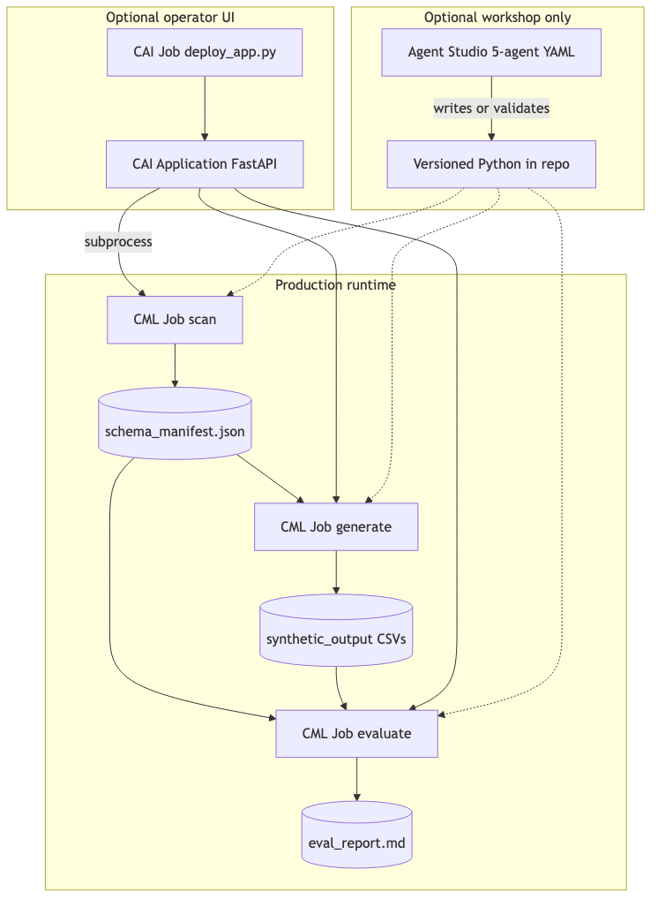

# Synthetic Data Generation — Direction 3 Hands-On Lab

Production path for **ML training data**: two complementary execution modes in the same CAI Application.

| Mode | Trigger | LLM? | Best for |
|---|---|---|---|
| **Deterministic** | `run_pipeline.py` / `/pipeline/*` | No | Scripts exist; known schema; reproducible |
| **Agentic** (new) | `synthetic_data_crew.py` / `/agent/*` | Yes (CrewAI) | Unknown schema; new database; automated script authoring |

The agentic mode is **database-agnostic** — the crew reads any schema, authors generation and evaluation scripts tailored to it, and dispatches CML Jobs to run them. You do not need to know the column names in advance.

## Diagrams





Companion docs:
- [`../synthetic_data_workflow_d3/D3_AGENTIC_REDESIGN_PLAN.md`](../synthetic_data_workflow_d3/D3_AGENTIC_REDESIGN_PLAN.md) — agentic redesign plan
- [`../synthetic_data_workflow_d3/CML_JOBS.md`](../synthetic_data_workflow_d3/CML_JOBS.md) — Job definitions
- [`../synthetic_data_app/README.md`](../synthetic_data_app/README.md) — CAI App deploy

---

## Overview

| Step | Script | Output |
|---|---|---|
| 1. Scan | `describe_to_manifest.py` | `schema_manifest.json` |
| 2. Generate | `generate_synthetic_data.py` | `synthetic_output/*.csv` |
| 3. Evaluate | `evaluate_synthetic_data.py` | `eval_report.md` |

Orchestrator (deterministic): `run_pipeline.py scan | generate | evaluate | all | batch-generate`

**Agentic flow** (all five steps handled by the crew):

| Agent | Role | Tool |
|---|---|---|
| 1. Schema Scanner | DESCRIBE + FK validation | `ImpalaQueryTool` |
| 2. Generation Strategist | Pick faker / SDV strategy | LLM reasoning |
| 3. Evaluation Strategist | Design KS/chi²/PII tests | LLM reasoning |
| 4. Code Writer | Write scripts to disk | `WriteFileTool` |
| 5. Script Verifier | Verify + dispatch CML Jobs | `ReadFileTool` + `CmlJobTool` |

---

## Prerequisites

1. **CAI Workbench project** with Python 3.11 runtime.
2. **Impala credentials**: `IMPALA_HOST`, `IMPALA_USER`, `IMPALA_PASS`, `IMPALA_DB` (for live scan and agentic mode).
3. **For agentic mode**: `CAI_BASE_URL`, `CAI_API_KEY`, `CAI_MODEL`, `CAI_WORKBENCH_HOST`, `CAI_WORKBENCH_PROJECT_ID`.
4. **Local-only demo (deterministic):** bundled `schema_manifest.sample.json` (no Impala or LLM required).

```bash
# Deterministic mode deps
cd synthetic_data_workflow_d3
pip install -r requirements.txt

# Agentic mode adds crewai
cd synthetic_data_app
pip install -r requirements.txt
```

---

## Lab 1 — Local demo (3-table FK chain)

### Step 1: Generate

```bash
python run_pipeline.py generate \
  --manifest schema_manifest.sample.json \
  --target-tables eda_bwc_cfmast_d_sg,eda_bwc_cfacct_d_sg,eda_rbk_tltx_d \
  --rows 1000 --seed 42 \
  --output ./artifacts/synthetic_output
```

### Step 2: Evaluate

```bash
python run_pipeline.py evaluate \
  --manifest schema_manifest.sample.json \
  --output ./artifacts/synthetic_output \
  --report ./artifacts/eval_report.md \
  --target-tables eda_bwc_cfmast_d_sg,eda_bwc_cfacct_d_sg,eda_rbk_tltx_d \
  --strict --use-scipy
```

### Acceptance criteria

- 3/3 tables **PASS**
- FK orphan count = 0 on `cfcif` and `acct_no` edges
- `eda_rbk_tltx_d` schema **PARTIAL** (10 populated / 10 defaulted — expected for wide-table demo)
- Re-run with same `--seed 42` → identical CSVs

---

## Lab 2 — Live Impala scan + pipeline

Set environment variables in your CAI project, then:

```bash
export TARGET_TABLES=eda_bwc_cfmast_d_sg,eda_bwc_cfacct_d_sg,eda_rbk_tltx_d
export ROWS=1000
export SEED=42
export MANIFEST_PATH=./artifacts/schema_manifest.json
export OUTPUT_DIR=./artifacts/synthetic_output
export REPORT_PATH=./artifacts/eval_report.md

python run_pipeline.py all --validate-fks --profile-stats --strict
```

Review inferred FK relationships in the manifest before trusting generate output.

---

## Lab 3 — Deploy CAI Application (deterministic + agentic)

1. Ensure `synthetic_data_app/` and `synthetic_data_workflow_d3/` are in your project root.
2. Set env vars — see `synthetic_data_app/README.md` for the full list (includes LLM + Workbench vars for agentic mode).
3. Create a **Job** running `synthetic_data_app/deploy_app.py`. Confirm the Job log shows `App Script : /home/cdsw/synthetic_data_app/run_app.py`.
4. Open the Application URL — the UI shows both **Deterministic Pipeline** and **Agentic Pipeline** sections.

Deterministic endpoint:

```bash
curl -X POST "$APP_URL/pipeline/all" \
  -H "Content-Type: application/json" \
  -d '{"target_tables": "eda_bwc_cfmast_d_sg,eda_bwc_cfacct_d_sg,eda_rbk_tltx_d", "rows": 1000}'
```

Agentic endpoint (database-agnostic — works with any schema):

```bash
# Start crew async
curl -X POST "$APP_URL/agent/kickoff" \
  -H "Content-Type: application/json" \
  -d '{"target_database": "my_custom_db", "target_tables": "all", "rows_per_table": 1000}'

# Poll events
curl "$APP_URL/agent/events?since=0"
```

---

## Lab 3b — Agentic crew without the Application

Run the crew directly as a CLI or CML Job:

```bash
cd synthetic_data_app
export CAI_BASE_URL=https://...
export CAI_API_KEY=...
export IMPALA_HOST=...

python synthetic_data_crew.py \
  --database pf_usecase \
  --tables eda_bwc_cfmast_d_sg,eda_bwc_cfacct_d_sg,eda_rbk_tltx_d \
  --rows 1000 --seed 42 \
  --scripts-dir ./generated_scripts \
  --output-dir ./synthetic_output
```

The crew will: scan schema → plan generation → plan evaluation → write scripts → verify → dispatch CML Jobs (if Workbench env vars are set) or print instructions for manual Job creation.

---

## Lab 4 — Full pf_usecase scale-out (73 tables)

```bash
export TARGET_TABLES=all
python run_pipeline.py scan --validate-fks --profile-stats

# Run as parallel CML Jobs (one per prefix):
python run_pipeline.py batch-generate

python run_pipeline.py evaluate --strict --use-scipy
```

See `CML_JOBS.md` for per-prefix Job definitions (`eda_bwc_`, `eda_rbk_`, …).

---

## Choosing between deterministic and agentic mode

| Question | Answer | Mode |
|---|---|---|
| Are scripts already written and working for this schema? | Yes | Deterministic |
| Is this a new database you have not profiled before? | Yes | Agentic |
| Do you need fully reproducible bit-identical output? | Yes | Deterministic |
| Do you need the LLM to handle column naming it has never seen? | Yes | Agentic |
| Do you have LLM / Workbench API credentials? | No | Deterministic only |

The agentic crew writes scripts into `output_scripts_dir`. After the crew runs once, you can **switch to deterministic mode** and run those scripts directly with `run_pipeline.py` for faster, reproducible subsequent runs.

## Optional — Agent Studio authoring workshop

The 5-agent YAML in `synthetic_data_workflow_d3/agents.yaml` + `tasks.yaml` describes the original script design. The **agentic mode in `synthetic_data_crew.py` supersedes Agent Studio** for production — it runs as a Python crew inside the CAI Application, not in the Agent Studio UI.

---

## Troubleshooting

| Symptom | Fix |
|---|---|
| Evaluate FAIL on missing 4th table | Pass `--target-tables` matching what you generated |
| FK orphans | Re-scan with `--validate-fks`; fix `relationships` join column |
| Wide table schema FAIL | Expected: `PARTIAL` when using `columns_to_populate` |
| Job exit code 1 | Check `--strict` evaluate output; missing CSV or FK failure |
| Agentic: `crewai not installed` | `pip install -r synthetic_data_app/requirements.txt` |
| Agentic: `ImpalaQueryTool ERROR` | Set `IMPALA_HOST`, `IMPALA_USER`, `IMPALA_PASS` env vars |
| Agentic: `CmlJobTool: missing credentials` | Set `CAI_WORKBENCH_HOST`, `CAI_WORKBENCH_API_KEY`, `CAI_WORKBENCH_PROJECT_ID`; or run scripts manually |
| Agentic: crew stalls on code_writing task | LLM may need a larger context model; check `CAI_MODEL` |
| Application: `Startup script 'run_app.py' does not exist` | Re-run deploy Job (`synthetic_data_app/deploy_app.py`). App script must be `/home/cdsw/synthetic_data_app/run_app.py`. |
| pip dependency conflict warnings (`packaging`, `protobuf`, `requests`) | Re-sync `synthetic_data_app/constraints-cai.txt` and restart. Harmless if the app prints `Dependencies ready.` and starts. |
| `ModuleNotFoundError: No module named 'synthetic_data_api'` | Re-sync `run_app.py` and re-run deploy Job so `APP_DIR=/home/cdsw/synthetic_data_app` is set. |
